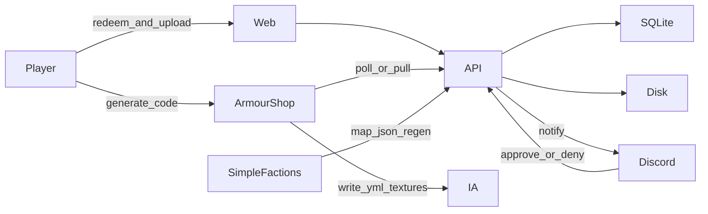
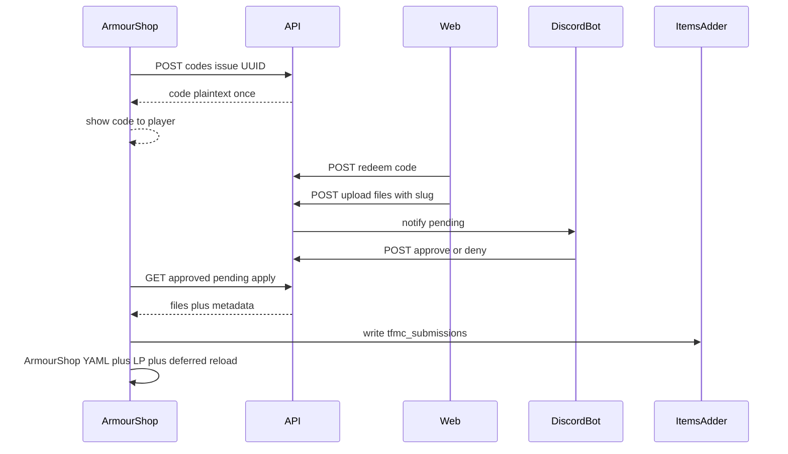

# 02 — Target architecture

End-state shape of the **TFMC platform**: modular website hub plus SimpleFactions (map), ArmourShop/ItemsAdder (skins), and tfmc_bot (Discord).

Component journeys: [12-end-to-end-flows.md](./12-end-to-end-flows.md). Deep dives: [09](./09-map-system.md) map, [10](./10-armourshop-itemsadder.md) apply, [11](./11-discord-bot.md) bot.

## Product shape

```text
tfminecraft.net/
  /              Hub (brand, nav, short intro, links into modules)
  /map/[mapId]   Interactive maps (existing capability, cleaned up)
  /skins         Redeem code + upload + status
  /…             Future modules (e.g. brewery helper) — same shell
```

Backend stays FastAPI. Frontend stays Next.js. New capabilities are **modules** (routes + routers + data), not more logic stuffed into `MapViewer`.

## System diagram



| Actor | Responsibility |
|-------|----------------|
| **Web (Next)** | UX: hub, map, skins forms; talks to API |
| **API (FastAPI)** | Map pipeline + skins module + contracts for bot / ArmourShop |
| **SQLite** | Codes, submissions, status, audit — not PNG blobs |
| **Disk** | Map `output/`; pending skins under `backend/src/data/skins/` |
| **Discord bot** | Skins approve/deny; ban/warn DMs; Discord banned-role mute (not MC bans) |
| **ArmourShop** | Mint UUID-bound codes; pull approved; write `tfmc_submissions` + category YAML; LP permission; deferred IA reload |
| **SimpleFactions** | Map upload / province lookup / regen only |
| **ItemsAdder** | Serves `tfmc_submissions` pack content ArmourShop wrote |

## Frontend modules

```text
frontend/app/
  layout.tsx              Shared shell: nav, fonts, atmosphere
  page.tsx                Hub
  map/[mapId]/page.tsx    Thin wrapper → MapViewer
  skins/page.tsx          Redeem + upload + status
  components/
    shell/                Header, footer, nav
    map/                  MapViewer split over time
    skins/                Upload form (fixed slots per kind), status card
```

Rules:

- One shared layout; map is a **page**, not the whole site.
- Map performance work stays inside map components/hooks.
- New tools get a route + component folder; they do not import MapEngine.
- Skins UI enforces [naming conventions](./07-naming-conventions.md) before upload.

## Backend modules

```text
backend/
  server.py                 App + CORS + router include
  src/api/
    map_*.py / file_*.py    Existing map surface (keep, tidy)
    skins_routes.py         Codes, upload, status, staff actions, plugin pull
  src/db/
    sqlite.py               Connection, migrations
    models / schema.sql     Tables
  src/data/skins/           Runtime files (gitignored except .gitkeep)
  src/scripts/…             Mapgen unchanged in role
```

Map and skins share Docker and process space but not business logic.

## Data stores

### SQLite (metadata)

Path example: `backend/src/data/province.db` (volume-mounted in compose).

| Table | Purpose |
|-------|---------|
| `codes` | Issued codes (hashed), player UUID, expiry, redeemed flag |
| `submissions` | kind, slug, display_name, grip_preset, status, paths, deny reason |
| `audit_log` | Approvals, denials, ArmourShop apply events |

### Filesystem (pending blobs on API)

```text
backend/src/data/skins/
  {submission_id}/
    meta.json                 # slug, kind, display_name, uuid, grip_preset?
    # armor_set (fixed stems — see 07): icons 16x16, layers 64x32
    {slug}_helmet.png
    {slug}_chestplate.png
    {slug}_leggings.png
    {slug}_boots.png
    {slug}_layer_1.png
    {slug}_layer_2.png
    # item / handheld / large_handheld:
    {slug}.png
    # item_3d / shield (later):
    {slug}.png
    {slug}.json
```

### ItemsAdder (after ArmourShop apply)

```text
plugins/ItemsAdder/contents/tfmc_submissions/
  configs/{slug}.yml
  resourcepack/assets/tfmc_submissions/textures/...
```

Map assets remain under `backend/src/output/{map}/…` as today.

**Why not store PNGs in SQLite?** Backups, serving, and pack export are simpler with files. SQLite holds pointers and workflow state.

## Auth model

| Surface | Mechanism |
|---------|-----------|
| Map plugin regen / queue | Existing shared secret in path (prefer env later) |
| Skins player actions | Redeem **code** → short-lived session tied to issuer UUID |
| Skins staff (Discord) | Server-side staff API key; never `NEXT_PUBLIC_*` |
| Skins ArmourShop pull | Plugin secret; only **approved** payloads |

No website passwords. Codes are **not shareable by design**: ArmourShop grants the cosmetic to the **issuer UUID** only.

## Contracts with external systems



ProvinceSystem owns HTTP contracts. ArmourShop, SimpleFactions, and `tfmc_bot` live outside this repo.

## Future modules (stubs only)

1. Frontend route under the shell  
2. FastAPI router  
3. Optional SQLite tables / disk folder  
4. Optional plugin or Discord hooks  

Example: BreweryX generator — pure web tool first; no pack bridge required.

## Where details live

| Topic | Doc |
|-------|-----|
| Map SF ↔ API ↔ web | [09-map-system.md](./09-map-system.md) |
| ArmourShop + `tfmc_submissions` | [10-armourshop-itemsadder.md](./10-armourshop-itemsadder.md) |
| tfmc_bot skins + ban role | [11-discord-bot.md](./11-discord-bot.md) |
| Full journeys | [12-end-to-end-flows.md](./12-end-to-end-flows.md) |
| Naming | [07-naming-conventions.md](./07-naming-conventions.md) |

## Non-goals of this architecture

- Rewriting mapgen in another language (optimize later if needed)
- User accounts / OAuth on the site
- Putting Discord or Java plugins inside ProvinceSystem git (document contracts only)
- Manual `tfmc_pack` CMD overrides for new submissions
- Merging `main` as source of truth — stay on `dev`
- Bot executing in-game bans
