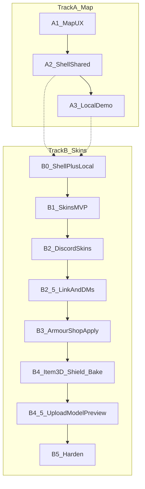

# 03 — Roadmap (start → end product)

Branch: **`dev`**.

Work proceeds on **two parallel tracks** so skins can ship end-to-end without waiting for every map perf polish, while map UX still improves.

**Track A** = map feel + shared shell (**repos:** `ProvinceSystem`; SimpleFactions only if touching REST config/secrets — see [09](./09-map-system.md)).  
**Track B** = skins E2E (**repos:** `ProvinceSystem` → `tfmc_bot` → `Workspace/armourshop` + ItemsAdder `tfmc_submissions` — see [05](./05-skins-system.md), [10](./10-armourshop-itemsadder.md), [11](./11-discord-bot.md)).

Shell + local demo (A2/A3) unblock skins UI; cropped overlays can continue in parallel with B1+.

See also [08-implementation-checklist.md](./08-implementation-checklist.md) (cross-repo) and [12-end-to-end-flows.md](./12-end-to-end-flows.md).

---

## Track A — Map

### A1 — Stabilize map UX

**Repo:** `ProvinceSystem` (map pipeline overview: [09-map-system.md](./09-map-system.md))

| Work | Detail |
|------|--------|
| Restore realm card fields | Wire size/subjects in [`useRegionHover.ts`](../frontend/app/hooks/useRegionHover.ts) |
| Cropped region PNGs | [04-map-performance.md](./04-map-performance.md) |
| Hover perf | rAF throttle, RGB→id map, optional pixel buffer |
| Basic mobile | Stack panels; shorter hero; tap-friendly |

**Done when:** Realm size shows; map usable on phone; overlays lighter.

### A2 — Site shell

| Work | Detail |
|------|--------|
| Shared layout | Nav: Home, Map, Skins, Discord/Patreon |
| Hub page | Brand-forward landing |
| Visual tune-up | TFMC earthy palette; gradients on hub |
| Split MapViewer | Extract header/panels so skins does not inherit the mess |

**Done when:** `/` is a hub; `/map/...` works; `/skins` route exists (stub or real).

### A3 — Local / demo path

See [06-local-development.md](./06-local-development.md).

**Done when:** Fresh clone + short steps → map visible with sample worlds.

---

## Track B — Skins

### B0 — Prerequisites

Shell nav + local API (`NEXT_PUBLIC_API_URL`) + `backend/src/data` volume. Naming rules locked in [07-naming-conventions.md](./07-naming-conventions.md).

### B1 — Skins MVP (no Discord yet)

See [05-skins-system.md](./05-skins-system.md).

| Work | Detail |
|------|--------|
| SQLite + disk | Migrations; fixed file stems per kind; `grip_preset` |
| APIs | Issue (mock), redeem, upload, status, staff approve/deny, **review-sheet PNG** |
| Web UI | Redeem; **armor_set** (6 slots); **item** / **handheld** / **large_handheld** (1 slot + grip for large); slug + display name |
| Validation | PNG magic; **exact** sizes (icons 16×16, layers 64×32, item/handheld 16×16, large 32×32); naming regex |
| Mock codes | Seed script |

**Done when:** Local armor_set + item kinds upload at correct sizes; review-sheet works; approve via curl.

### B2 — Discord staff + ban role

**Repo:** `tfmc_bot` — [11-discord-bot.md](./11-discord-bot.md)

| Work | Detail |
|------|--------|
| Skins cog | Pending notify → `#bot-feed`, **attach raw PNGs**, Approve / Deny + reason → staff API (review-sheet later) |
| Ban cog update | **After** skins Discord MVP: on `/minecraftban` add Discord **banned** role; `/minecraftunban` to remove |
| Scope | Discord mute/notify only — **in-game bans stay in-game commands** |

**Done when:** Submission review works in Discord with raw images in `#bot-feed` (ban role is a follow-on).

### B2.5 — Discord link + player DMs

**Repos:** ProvinceSystem + `tfmc_bot` + ArmourShop — [batches/step-5](./batches/step-5/00-index.md)

| Work | Detail |
|------|--------|
| Link API | `/linkdiscord` in game → start; Discord `/linkdiscord <code>` → complete; durable UUID ↔ Discord id |
| Upload gate | Submissions require link; stamp `discord_user_id` |
| Player DMs | Submitted (outbox poll); approved / denied (+ reason) from cog |

**Done when:** Link + upload + three DMs work on staging without typing ids on the site.

### B3 — ArmourShop bridge

**Repo:** `Workspace/armourshop` + ItemsAdder — [10-armourshop-itemsadder.md](./10-armourshop-itemsadder.md)

Mint codes are done ([step-6](./batches/step-6/00-index.md)). Remaining B3 splits into:

| Phase | Batches | Detail |
|-------|---------|--------|
| Pack writer | [step-7](./batches/step-7/00-index.md) | Write `tfmc_submissions` from fixtures; grip templates; harness (no live poll) |
| Plugin integrate | [step-8](./batches/step-8/00-index.md) | `base_set` pairing; pull; shop; LP; reload; bow writers (8.07) |

| Work | Detail |
|------|--------|
| Mint codes | Done — TFMCWeb `/token create skin` (perm `tfmcweb.token.create`) |
| Pack writer | YAML + textures; armor/handheld/large (Step 7); bow/large_bow/crossbow in 8.07 |
| Target select | Kind + filtered `base_set` (armor tier or type); no `item`; guns/shields/helmets deferred ([step-8](./batches/step-8/00-index.md)) |
| Pull approved | Fetch payloads (`kind`, `grip_preset`, `base_set`, files) |
| Shop + LP | `ps_armor` / `ps_items`; `armourshop.submission.{slug}` |
| Deferred reload | IA reload when empty or on restart; ack when reload done |

**Done when:** Code → upload → Discord approve → skin usable in ArmourShop for that UUID without manual file copy.

### B4 — Item 3D + shield + helmet 3D ([step-13](./batches/step-13/00-index.md))

| Work | Detail |
|------|--------|
| Kind `item_3d` | PNG + JSON; display autofill; `generate: false` + `model_path` |
| Kind `shield` | One model+texture; ArmourShop auto **round blocking** display clone |
| Kind `helmet_3d` | Standalone 3D helmet (`set: helmets`); also per-tier on `armor_set` via `helmet_3d_tiers` |
| Size caps | PNG ≤ 2 MiB; JSON ≤ 512 KiB |
| Review bake | **Deferred** — multi-view PNG sheet / site viewer later |
| ArmourShop apply | Write model + texture under `tfmc_submissions` |

**Done when:** 3D/shield/helmet path matches 2D workflow (upload → approve → apply). Multi-view bake later.

### B4.5 — Upload model preview ([step-16](./batches/step-16/00-index.md))

**Repo:** `ProvinceSystem` frontend

| Phase | Batch | Detail |
|-------|-------|--------|
| Docs | [16.01](./batches/step-16/01-planning-lock.md) | Planning lock |
| JSON render | [16.02](./batches/step-16/02-json-model-render.md) | Reliable cubes + UVs + PNG; model only (no mannequin) |
| Display slots | [16.03](./batches/step-16/03-display-slots.md) | Steve held view + thirdperson_righthand |
| Kind variants | [16.04](./batches/step-16/04-kind-variants.md) | Gun / bow / armor asset switcher |
| Upload UI | [16.05](./batches/step-16/05-upload-ui.md) | Embed on `/skins` |
| Verify | [16.06](./batches/step-16/06-docs-verify.md) | Checklist |

**Out of B4.5:** Discord multi-view review-sheet bake; poseable bow/crossbow arms; editing transforms.

**Done when:** Upload form can preview a Java JSON model + texture live (including Steve in-hand); kind variant controls follow.

### B5 — Harden and expand

Quotas, retention, module template, optional brewery stub.

---

## Track C — TFMCWeb identity + Discord gate

**Status:** Implemented ([step-17](./batches/step-17/00-index.md) 17.01–17.08). Tick staging on [08-docs-verify](./batches/step-17/08-docs-verify.md).  
**Repos:** `Workspace/tfmcweb` · ProvinceSystem · `tfmc_bot` · `Workspace/rpcharacters` · ArmourShop pack-only  
**Playbook:** [13-tfmcweb.md](./13-tfmcweb.md)

| Phase | Detail |
|-------|--------|
| C1 RPC freeze | Done — `FreezeReason.DISCORD_REQUIRED` + `setDiscordGate` |
| C2 Identity + grace | Done — guild left → 1h grace; rejoin clears; expiry unlinks |
| C3 Bot leave/join | Done — `on_member_remove` / `on_member_join` → identity API |
| C4 TFMCWeb scaffold | Done — link cache, `/linkdiscord`, `/token`, `/web`, Survival gate |
| C5 ArmourShop cutover | Done — pack apply only; AS mint redirects to `/token create skin` |
| C6 Warn + ban mirror | Done — `/warning`; Essentials ban → Discord + Banned role |

**Out of Track C:** Character creator UI — owned by Track E / [14](./14-character-creator.md) (token stub exists here).

**Done when:** Survival requires Discord link (with 1h leave grace); staff non-Survival not gated; TFMCWeb owns identity/tokens.

---

## Track D — Staff curated skins

**Status:** **Implemented** (D1–D5 code in [step-18](./batches/step-18/00-index.md); tick staging in [STAGING.md](../STAGING.md) / [06-docs-verify](./batches/step-18/06-docs-verify.md)).  
**Repos:** ArmourShop · ProvinceSystem · TFMCWeb · frontend

| Phase | Detail |
|-------|--------|
| D1 Catalog sync | Categories + sets + scrolls → API on AS load |
| D2 Staff token API | Auto-approve; category/scroll on submit |
| D3 TFMCWeb mint | `/token create skin staff` |
| D4 Pack apply | `tfmc_armorshop` + real category YAML (all kinds incl. guns) |
| D5 Web UI | Dropdowns from catalog |

**Out of Track D:** Migrating legacy `tfmc_armor`; changing player Discord review.

---

## Track E — Web character creator

**Status:** **E1 / Step 19 Phase 1 done** (staging verified). **E2 / Step 20** + **E3 / Step 21** kits **done** (21.05 docs closed; 21.07 superseded). **E3b / Step 22** web character sheet parity **done** (22.03 docs closed). **E3c / Step 23** kit lore editor polish **done** (23.04 docs closed). **E3d / Step 24** sheet traits/attrs/background parity **done** (24.04 docs closed). E4 wardrobe deferred.  
**Repos:** RPCharacters · ProvinceSystem · TFMCWeb · frontend · (E3) ArmourShop

| Phase | Detail |
|-------|--------|
| E1 / Step 19 | Attribute point-buy; creation catalog sync; redeem + Remember me; create/list; `/character` UI — **done** |
| E2 / Step 20 | Kits in RPC — plumbing done; grant = `/rpcharacter kit <id>`; per-kit cooldown + once-per-character ([21.08](./batches/step-21/08-kits-yml-and-kit-service.md)) |
| E3 / Step 21 | Character → Kits → Edit editable items; hold claim while `pending_skin`; NBT preview — **done** ([21.09](./batches/step-21/09-kits-web-character-ui.md) / [21.05](./batches/step-21/05-docs-verify.md)) |
| E3b / Step 22 | Read-only web character sheet + shared margins — **done** ([step-22](./batches/step-22/00-index.md) / [22.03](./batches/step-22/03-docs-verify.md)) |
| E3c / Step 23 | Kit lore editor polish (colours, lore codes, pick thumbs, 3D) — **done** ([step-23](./batches/step-23/00-index.md) / [23.04](./batches/step-23/04-docs-verify.md)) |
| E3d / Step 24 | Sheet traits (personality/evil), merged attrs, profession EXP, writable-book background, empty-lore fix — **done** ([step-24](./batches/step-24/00-index.md) / [24.04](./batches/step-24/04-docs-verify.md)) |
| E4 | Character skin wardrobe (optional Mojang/masked) |

**Locked (Phase 1):** Session 1h / Remember me 30d. Attribute formula lives in catalog / `stages.yml` (shipped values).  
**Locked (Phase 2–3):** See [14-character-creator.md](./14-character-creator.md) (generic kits; character kits UI; Discord owns player messaging).

**Out of Track E Phase 1:** Kit, lore editor, player skins.  
**Out of Step 20:** Lore-item / multi-kit UI (E3).

---

## Priority for “finished product ASAP”

1. **B0 + B1** — API and `/skins` with naming + sizes (unblocks everything)  
2. **B2 skins cog** — staff can review with PNG sheets without curl  
3. **B3 ArmourShop** — pack writer (step-7) then live apply (step-8)  
4. **A1 realm card + mobile** in parallel whenever free  
5. **Track C / step-17** — **done** (staging checklist for humans)  
6. **Step 18 / Track D** — **code done**; human staging verify on live  
7. **Track E / step-19 Phase 1** — **done** (staging verified)  
8. **Track E / kits** — claim + multi-kit **21.08** + web kits UI **21.09** + docs **21.05 done**  
9. **Track E / step-22–24** — sheet + kit editor polish + sheet parity **done**; E4 / overlays as capacity allows; run [STAGING](../STAGING.md) Step 20–24 when ready  

Do not block skins MVP on cropped map overlays. Prefer Track C staging green before pre-launch donator character create.
