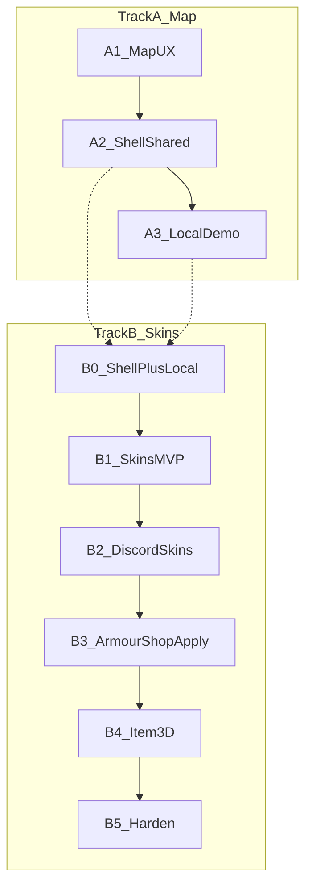

# 03 — Roadmap (start → end product)

Branch: **`dev`**.

Work proceeds on **two parallel tracks** so skins can ship end-to-end without waiting for every map perf polish, while map UX still improves.

**Track A** = map feel + shared shell (**repos:** `ProvinceSystem`; SimpleFactions only if touching REST config/secrets — see [09](./09-map-system.md)).  
**Track B** = skins E2E (**repos:** `ProvinceSystem` → `tfmc_bot` → `Workspace/armourshop` + ItemsAdder `tfmc_submissions` — see [05](./05-skins-system.md), [10](./10-armourshop-itemsadder.md), [11](./11-discord-bot.md)).

Shell + local demo (A2/A3) unblock skins UI; cropped overlays can continue in parallel with B1+.

See also [08-implementation-checklist.md](./08-implementation-checklist.md) (cross-repo) and [12-end-to-end-flows.md](./12-end-to-end-flows.md).

---

## Track A — Map

### A1 — Stabilize map UX

**Repo:** `ProvinceSystem` (map pipeline overview: [09-map-system.md](./09-map-system.md))

| Work | Detail |
|------|--------|
| Restore realm card fields | Wire size/subjects in [`useRegionHover.ts`](../frontend/app/hooks/useRegionHover.ts) |
| Cropped region PNGs | [04-map-performance.md](./04-map-performance.md) |
| Hover perf | rAF throttle, RGB→id map, optional pixel buffer |
| Basic mobile | Stack panels; shorter hero; tap-friendly |

**Done when:** Realm size shows; map usable on phone; overlays lighter.

### A2 — Site shell

| Work | Detail |
|------|--------|
| Shared layout | Nav: Home, Map, Skins, Discord/Patreon |
| Hub page | Brand-forward landing |
| Visual tune-up | TFMC earthy palette; gradients on hub |
| Split MapViewer | Extract header/panels so skins does not inherit the mess |

**Done when:** `/` is a hub; `/map/...` works; `/skins` route exists (stub or real).

### A3 — Local / demo path

See [06-local-development.md](./06-local-development.md).

**Done when:** Fresh clone + short steps → map visible with sample worlds.

---

## Track B — Skins

### B0 — Prerequisites

Shell nav + local API (`NEXT_PUBLIC_API_URL`) + `backend/src/data` volume. Naming rules locked in [07-naming-conventions.md](./07-naming-conventions.md).

### B1 — Skins MVP (no Discord yet)

See [05-skins-system.md](./05-skins-system.md).

| Work | Detail |
|------|--------|
| SQLite + disk | Migrations; fixed file stems per kind |
| APIs | Issue (mock), redeem, upload, status, staff approve/deny via API key |
| Web UI | Redeem; **armor_set** (6 file slots) and **item_2d** (1 slot); slug + display name |
| Validation | PNG magic, size limits, naming regex |
| Mock codes | Seed script |

**Done when:** Local armor_set + item_2d upload; approve via curl; files on disk with correct stems.

### B2 — Discord staff + ban role

**Repo:** `tfmc_bot` — [11-discord-bot.md](./11-discord-bot.md)

| Work | Detail |
|------|--------|
| Skins cog | Pending notify, Approve / Deny + reason → staff API |
| Ban cog update | On `/minecraftban` (or paired command): add Discord **banned** role; add `/minecraftunban` (or clear) to remove it |
| Scope | Discord mute/notify only — **in-game bans stay in-game commands** |

**Done when:** Submission review works in Discord; banned role toggles for channel mute.

### B3 — ArmourShop bridge

**Repo:** `Workspace/armourshop` + ItemsAdder — [10-armourshop-itemsadder.md](./10-armourshop-itemsadder.md)

| Work | Detail |
|------|--------|
| Mint codes | In-game command; UUID bound; show once |
| Pull approved | Fetch payloads from API |
| Write pack | `contents/tfmc_submissions/` YAML + textures (IA auto CMD, not `tfmc_pack`) |
| Shop + LP | Category/set YAML; `armourshop.submission.{slug}` |
| Deferred reload | IA reload when empty or on restart; queue otherwise |

**Done when:** Code → upload → Discord approve → skin usable in ArmourShop for that UUID without manual file copy.

### B4 — Item 3D

| Work | Detail |
|------|--------|
| Kind `item_3d` | PNG + JSON; cooking-style `generate: false` + `model_path` |
| Helmets | Single-item 3D skins, **not** armor sets |
| ArmourShop apply | Write model + texture under `tfmc_submissions` |

**Done when:** 3D item path matches 2D workflow.

### B5 — Harden and expand

Quotas, retention, module template, optional brewery stub.

---

## Priority for “finished product ASAP”

1. **B0 + B1** — API and `/skins` with naming (unblocks everything)  
2. **B2 skins cog** — staff can review without curl  
3. **B3 ArmourShop** — real server apply  
4. **A1 realm card + mobile** in parallel whenever free  
5. **B4 / A1 cropped overlays / B5** as capacity allows  

Do not block skins MVP on cropped map overlays. Do not block ArmourShop on item_3d.
