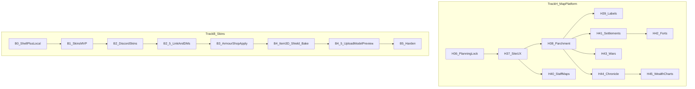

# 03 — Roadmap (start → end product)

Branch: **`dev`**.

Cosmetics and character tracks (B–F, G) are **code complete**; **Track H — Map platform** (steps 36–45) is the primary remaining site work.

**Track H** = map platform (**repos:** `ProvinceSystem` + `Workspace/simplefactions`; playbook [16-map-platform.md](./16-map-platform.md)).  
**Track B** = skins E2E (**repos:** `ProvinceSystem` → `tfmc_bot` → `Workspace/armourshop` + ItemsAdder `tfmc_submissions` — see [05](./05-skins-system.md), [10](./10-armourshop-itemsadder.md), [11](./11-discord-bot.md)) — **done**.

Site shell (step 3) shipped; map platform replaces the old thin Track A polish list.

See also [08-implementation-checklist.md](./08-implementation-checklist.md) (cross-repo) and [12-end-to-end-flows.md](./12-end-to-end-flows.md).

---

## Track H — Map platform

**Status:** **H2b / Step 39 code done.** Next: **step-40 curved labels.** Steps 41–46 planned.  
**Repos:** ProvinceSystem · SimpleFactions · TFMCWeb (staff map gate)  
**Playbook:** [16-map-platform.md](./16-map-platform.md)

| Phase | Step | Detail |
|-------|------|--------|
| H0 | [36](./batches/step-36/00-index.md) | Planning lock + export schema — **done** |
| H1 | [37](./batches/step-37/00-index.md) | Site UX, click modal, drill, cropped overlays, mobile — **done (code)** |
| H2 | [38](./batches/step-38/00-index.md) | Xaero → parchment base; muted fantasy nation layers — **done (code)** |
| H2b | [39](./batches/step-39/00-index.md) | Ink cartography: colour base default, parchment washes, uniform borders — **done (code)** |
| H3 | [40](./batches/step-40/00-index.md) | Paradox curved labels (backend) — **next** |
| H4 | [41](./batches/step-41/00-index.md) | Staff-only maps (configurable) |
| H5 | [42](./batches/step-42/00-index.md) | Named capitals / guild settlements (SF export) |
| H6 | [43](./batches/step-43/00-index.md) | Forts + zone of control (SF forts) |
| H7 | [44](./batches/step-44/00-index.md) | Wars / frontlines (**blocked on SF war rework**) |
| H8 | [45](./batches/step-45/00-index.md) | Daily snapshots + chronicle log |
| H9 | [46](./batches/step-46/00-index.md) | Wealth history + charts |

**Done when:** Parchment political map, nation modals, staff map gates, settlements, chronicle + wealth charts; wars when SF ships.

**Later:** SimpleFactions REST via TFMCWeb (step 46 — not part of map platform).

Technical detail: [09-map-system.md](./09-map-system.md), [04-map-performance.md](./04-map-performance.md).

---

## Track B — Skins

### B0 — Prerequisites

Shell nav + local API (`NEXT_PUBLIC_API_URL`) + `backend/src/data` volume. Naming rules locked in [07-naming-conventions.md](./07-naming-conventions.md).

### B1 — Skins MVP (no Discord yet)

See [05-skins-system.md](./05-skins-system.md).

| Work | Detail |
|------|--------|
| SQLite + disk | Migrations; fixed file stems per kind; `grip_preset` |
| APIs | Issue (mock), redeem, upload, status, staff approve/deny, **review-sheet PNG** |
| Web UI | Redeem; **armor_set** (6 slots); **item** / **handheld** / **large_handheld** (1 slot + grip for large); slug + display name |
| Validation | PNG magic; **exact** sizes (icons 16×16, layers 64×32, item/handheld 16×16, large 32×32); naming regex |
| Mock codes | Seed script |

**Done when:** Local armor_set + item kinds upload at correct sizes; review-sheet works; approve via curl.

### B2 — Discord staff + ban role

**Repo:** `tfmc_bot` — [11-discord-bot.md](./11-discord-bot.md)

| Work | Detail |
|------|--------|
| Skins cog | Pending notify → `#bot-feed`, **attach raw PNGs**, Approve / Deny + reason → staff API (review-sheet later) |
| Ban cog update | Done — Essentials ban/unban → Discord **Banned** role add/clear ([step-17.07](./batches/step-17/07-warn-and-ban-mirror.md)) |
| Scope | Discord mute/notify only — **in-game bans stay in-game commands** |

**Done when:** Submission review works in Discord with raw images in `#bot-feed`; ban role mirror works.

### B2.5 — Discord link + player DMs

**Repos:** ProvinceSystem + `tfmc_bot` + ArmourShop — [batches/step-5](./batches/step-5/00-index.md)

| Work | Detail |
|------|--------|
| Link API | `/linkdiscord` in game → start; Discord `/linkdiscord <code>` → complete; durable UUID ↔ Discord id |
| Upload gate | Submissions require link; stamp `discord_user_id` |
| Player DMs | Submitted (outbox poll); approved / denied (+ reason) from cog |

**Done when:** Link + upload + three DMs work on staging without typing ids on the site.

### B3 — ArmourShop bridge

**Repo:** `Workspace/armourshop` + ItemsAdder — [10-armourshop-itemsadder.md](./10-armourshop-itemsadder.md)

Mint codes are done ([step-6](./batches/step-6/00-index.md)). Remaining B3 splits into:

| Phase | Batches | Detail |
|-------|---------|--------|
| Pack writer | [step-7](./batches/step-7/00-index.md) | Write `tfmc_submissions` from fixtures; grip templates; harness (no live poll) |
| Plugin integrate | [step-8](./batches/step-8/00-index.md) | `base_set` pairing; pull; shop; LP; reload; bow writers (8.07) |

| Work | Detail |
|------|--------|
| Mint codes | Done — TFMCWeb `/token create skin` (perm `tfmcweb.token.create`) |
| Pack writer | YAML + textures; armor/handheld/large (Step 7); bow/large_bow/crossbow in 8.07 |
| Target select | Kind + filtered `base_set` (armor tier or type); no `item`; guns/shields/helmets deferred ([step-8](./batches/step-8/00-index.md)) |
| Pull approved | Fetch payloads (`kind`, `grip_preset`, `base_set`, files) |
| Shop + LP | `ps_armor` / `ps_items`; `armourshop.submission.{slug}` |
| Deferred reload | IA reload when empty or on restart; ack when reload done |

**Done when:** Code → upload → Discord approve → skin usable in ArmourShop for that UUID without manual file copy.

### B4 — Item 3D + shield + helmet 3D ([step-13](./batches/step-13/00-index.md))

| Work | Detail |
|------|--------|
| Kind `item_3d` | PNG + JSON; display autofill; `generate: false` + `model_path` |
| Kind `shield` | One model+texture; ArmourShop auto **round blocking** display clone |
| Kind `helmet_3d` | Standalone 3D helmet (`set: helmets`); also per-tier on `armor_set` via `helmet_3d_tiers` |
| Size caps | PNG ≤ 2 MiB; JSON ≤ 512 KiB |
| Review bake | **Deferred** — multi-view PNG sheet / site viewer later |
| ArmourShop apply | Write model + texture under `tfmc_submissions` |

**Done when:** 3D/shield/helmet path matches 2D workflow (upload → approve → apply). Multi-view bake later.

### B4.5 — Upload model preview ([step-16](./batches/step-16/00-index.md))

**Repo:** `ProvinceSystem` frontend

| Phase | Batch | Detail |
|-------|-------|--------|
| Docs | [16.01](./batches/step-16/01-planning-lock.md) | Planning lock |
| JSON render | [16.02](./batches/step-16/02-json-model-render.md) | Reliable cubes + UVs + PNG; model only (no mannequin) |
| Display slots | [16.03](./batches/step-16/03-display-slots.md) | Steve held view + thirdperson_righthand |
| Kind variants | [16.04](./batches/step-16/04-kind-variants.md) | Gun / bow / armor asset switcher |
| Upload UI | [16.05](./batches/step-16/05-upload-ui.md) | Embed on `/skins` |
| Verify | [16.06](./batches/step-16/06-docs-verify.md) | Checklist |

**Out of B4.5:** Discord multi-view review-sheet bake; poseable bow/crossbow arms; editing transforms.

**Done when:** Upload form can preview a Java JSON model + texture live (including Steve in-hand); kind variant controls follow.

### B5 — Harden and expand

Quotas, retention, module template, optional brewery stub.

---

## Track C — TFMCWeb identity + Discord gate

**Status:** Implemented ([step-17](./batches/step-17/00-index.md) 17.01–17.08). Tick staging on [08-docs-verify](./batches/step-17/08-docs-verify.md).  
**Repos:** `Workspace/tfmcweb` · ProvinceSystem · `tfmc_bot` · `Workspace/rpcharacters` · ArmourShop pack-only  
**Playbook:** [13-tfmcweb.md](./13-tfmcweb.md)

| Phase | Detail |
|-------|--------|
| C1 RPC freeze | Done — `FreezeReason.DISCORD_REQUIRED` + `setDiscordGate` |
| C2 Identity + grace | Done — guild left → 1h grace; rejoin clears; expiry unlinks |
| C3 Bot leave/join | Done — `on_member_remove` / `on_member_join` → identity API |
| C4 TFMCWeb scaffold | Done — link cache, `/linkdiscord`, `/token`, `/web`, Survival gate |
| C5 ArmourShop cutover | Done — pack apply only; AS mint redirects to `/token create skin` |
| C6 Warn + ban mirror | Done — `/warning`; Essentials ban → Discord + Banned role |

**Out of Track C:** Character creator UI — owned by Track E / [14](./14-character-creator.md) (token stub exists here).

**Done when:** Survival requires Discord link (with 1h leave grace); staff non-Survival not gated; TFMCWeb owns identity/tokens.

---

## Track D — Staff curated skins

**Status:** **Implemented** (D1–D5 code in [step-18](./batches/step-18/00-index.md); tick staging in [STAGING.md](../STAGING.md) / [06-docs-verify](./batches/step-18/06-docs-verify.md)).  
**Repos:** ArmourShop · ProvinceSystem · TFMCWeb · frontend

| Phase | Detail |
|-------|--------|
| D1 Catalog sync | Categories + sets + scrolls → API on AS load |
| D2 Staff token API | Auto-approve; category/scroll on submit |
| D3 TFMCWeb mint | `/token create skin staff` |
| D4 Pack apply | `tfmc_armorshop` + real category YAML (all kinds incl. guns) |
| D5 Web UI | Dropdowns from catalog |

**Out of Track D:** Migrating legacy `tfmc_armor`; changing player Discord review.

---

## Track E — Web character creator

**Status:** **E1 / Step 19 Phase 1 done** (staging verified). **E2 / Step 20** + **E3 / Step 21** kits **done** (21.05 docs closed; 21.07 superseded). **E3b / Step 22** web character sheet parity **done** (22.03 docs closed). **E3c / Step 23** kit lore editor polish **done** (23.04 docs closed). **E3d / Step 24** sheet traits/attrs/background parity **done** (24.04 docs closed). **E3e / Step 25** kit submit + deny UX **done** (25.03 docs closed). **E3f / Step 26** kit asset sync + status **done** (26.03 docs closed). **E3g / Step 27** kit templates + `resetkit` **done** (27.05 docs closed). **E3h / Step 28** book skins + kit journal **done** (28.07 docs closed). **E3i / Step 29** kit customise visibility + claim AS gate **done** (29.06 docs closed). **E4 / Step 30** wardrobe **done** ([step-30](./batches/step-30/00-index.md); 30.08 docs closed; staging ticks open).  
**Repos:** RPCharacters · ProvinceSystem · TFMCWeb · frontend · (E3) ArmourShop

| Phase | Detail |
|-------|--------|
| E1 / Step 19 | Attribute point-buy; creation catalog sync; redeem + Remember me; create/list; `/character` UI — **done** |
| E2 / Step 20 | Kits in RPC — plumbing done; grant = `/rpcharacter kit <id>`; per-kit cooldown + once-per-character ([21.08](./batches/step-21/08-kits-yml-and-kit-service.md)) |
| E3 / Step 21 | Character → Kits → Edit editable items; hold claim while `pending_skin`; NBT preview — **done** ([21.09](./batches/step-21/09-kits-web-character-ui.md) / [21.05](./batches/step-21/05-docs-verify.md)) |
| E3b / Step 22 | Read-only web character sheet + shared margins — **done** ([step-22](./batches/step-22/00-index.md) / [22.03](./batches/step-22/03-docs-verify.md)) |
| E3c / Step 23 | Kit lore editor polish (colours, lore codes, pick thumbs, 3D) — **done** ([step-23](./batches/step-23/00-index.md) / [23.04](./batches/step-23/04-docs-verify.md)) |
| E3d / Step 24 | Sheet traits (personality/evil), merged attrs, profession EXP, writable-book background, empty-lore fix — **done** ([step-24](./batches/step-24/00-index.md) / [24.04](./batches/step-24/04-docs-verify.md)) |
| E3e / Step 25 | Kit Submit item UX + skin deny → customise denied — **done** ([step-25](./batches/step-25/00-index.md) / [25.03](./batches/step-25/03-docs-verify.md)) |
| E3f / Step 26 | Kit asset sync + post-submit status — **done** ([step-26](./batches/step-26/00-index.md) / [26.03](./batches/step-26/03-docs-verify.md)) |
| E3g / Step 27 | Kit `2d-template` / `3d-template` + staff `resetkit` — **done** ([step-27](./batches/step-27/00-index.md) / [27.05](./batches/step-27/05-docs-verify.md)) |
| E3h / Step 28 | Book skins (unsigned/signed) + kit journal + sign swap — **done** ([step-28](./batches/step-28/00-index.md); 28.07 docs closed) |
| E3i / Step 29 | Kit customise visibility (Custom tag, dirty submit, delete) + in-game claim AS gate — **done** ([step-29](./batches/step-29/00-index.md); 29.06 docs closed) |
| E4 / Step 30 | Character skin wardrobe (MineSkin + web frames + `/rpcharacterwardrobe`) — **done** ([step-30](./batches/step-30/00-index.md); 30.08 docs closed) |

**Locked (Phase 1):** Session **8h** default / Remember me 30d. Codes consumed on submit (reusable until submit for skin/drink). Attribute formula lives in catalog / `stages.yml` (shipped values).  
**Locked (Phase 2–3):** See [14-character-creator.md](./14-character-creator.md) (generic kits; character kits UI; Discord owns player messaging).  
**Locked (Phase 4):** See [14-character-creator.md](./14-character-creator.md) / [step-30](./batches/step-30/00-index.md).

**Out of Track E Phase 1:** Kit, lore editor, player skins.  
**Out of Step 20:** Lore-item / multi-kit UI (E3).

---

## Track F — Drink Builder (BreweryX)

**Status:** **Code done** ([15-drink-builder.md](./15-drink-builder.md) / [step-31](./batches/step-31/00-index.md); 31.09 docs closed). Operator staging smoke in [STAGING.md](../STAGING.md) Step 31.  
**Repos:** DrinkBuilder · TFMCWeb · ProvinceSystem · tfmc_bot · ItemsAdder `tfmc_drinks` · BreweryX

| Phase | Detail |
|-------|--------|
| F1 / 31.02 | **Done** — TFMCWeb shared skin↔drink mint cooldown; `/token create drink`; retire PS mint cooldown |
| F2 / 31.03–04 | **Done** — PS drink API + DrinkBuilder scaffold + ingredient catalog |
| F3 / 31.05–06 | **Done** — Website `/drinks` + Discord review |
| F4 / 31.07–08 | **Done** — `tfmc_drinks` pack + BreweryX merge; delete/reuse |
| F5 / 31.09 | **Done** — Docs + staging cutover (CE `/tfmc drinks` retired) |

**Locked:** Noble color-only; Gilded+ texture; ingredients curated (draft in Planning assets); potion+CMD; shared cooldown on TFMCWeb only.

---

## Track G — Realm + TFMCWeb gateway

**Status:** **Done** (steps 32–35 code; staging ticks in [STAGING.md](../STAGING.md)).  
**Repos:** TFMCWeb · ProvinceSystem · RPCharacters · ArmourShop · DrinkBuilder

| Phase | Step | Detail |
|-------|------|--------|
| G1 | [32](./batches/step-32/00-rpc-player-meta.md) | `rpc_player_meta` + TFMCWeb join sync — **done** |
| G2 | [33](./batches/step-33/00-realm-token-policy.md) | Realm + token policy per server — **done** |
| G3 | [34](./batches/step-34/00-realm-scoped-data.md) | Realm-scoped create/apply queues — **done** |
| G4 | [35](./batches/step-35/00-http-gateway-per-realm.md) | TFMCWeb HTTP gateway + per-realm isolation — **done** |

**Later:** SimpleFactions map upload via TFMCWeb (step 46).

---

## Priority for “finished product ASAP”

1. **Track H / step-40** — Paradox curved labels (next build)  
2. **Track H / steps 41–45** — Staff maps, settlements, forts, wars, chronicle, wealth  
3. Tick operator [STAGING](../STAGING.md) Steps 37–39 when ready; Steps 17–35, 31 when ready  
4. **B0–B5, C, D, E, F, G** — **code done**; staging verification ongoing  
5. **Step 16** — 3D upload preview polish (02–03 done; variants optional)  
6. **Step 46** — SimpleFactions via TFMCWeb (post map platform)
