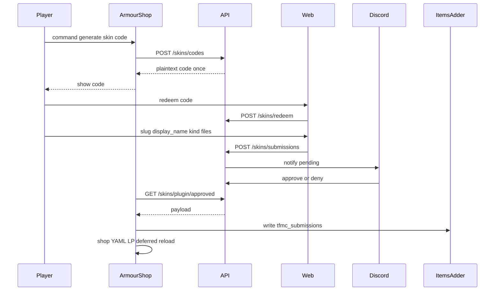

# 05 — Skins system (codes, website, API)

End-to-end design for donator texture submissions on **ProvinceSystem** (store + review state).  

**See also:** [10-armourshop-itemsadder.md](./10-armourshop-itemsadder.md) (MC apply), [11-discord-bot.md](./11-discord-bot.md) (staff UI), [07-naming-conventions.md](./07-naming-conventions.md) (slugs), [12-end-to-end-flows.md](./12-end-to-end-flows.md) (full journey).

## Goals

- Donators submit **armor sets** (2D) or **item skins** (2D now; 3D later).
- No website logins; codes from ArmourShop bound to player UUID.
- Staff approve/deny in Discord (deny includes reason).
- ArmourShop writes ItemsAdder namespace **`tfmc_submissions`**, shop YAML, LP permission; reloads when safe.

## Upload kinds

| Kind | Files (after rename) | IA approach |
|------|----------------------|-------------|
| `armor_set` | `{slug}_helmet.png`, `{slug}_chestplate.png`, `{slug}_leggings.png`, `{slug}_boots.png`, `{slug}_layer_1.png`, `{slug}_layer_2.png` | Like `tfmc_armor`: `generate: true` icons + `armors_rendering` with two layers |
| `item_2d` | `{slug}.png` | `generate: true` on a base material |
| `item_3d` | `{slug}.png` + `{slug}.json` | Like cooking: `generate: false` + `model_path` (includes 3D helmets as **single items**, not armor sets) |

MVP ships `armor_set` + `item_2d`. `item_3d` is Track B4.

Original upload filenames are **ignored**; the API stores only the fixed stems above.

## High-level flow



## Code rules

| Rule | Behavior |
|------|----------|
| Bound to UUID | Issued with `player_uuid`; cosmetic always granted to that UUID |
| Share resistance | Submission stores issuer UUID; ArmourShop only grants that UUID |
| Storage | Hash of code (SHA-256); plaintext shown once in-game |
| Lifetime | Expiry (e.g. 24–72h); single redeem for upload session |
| Revocation | Staff/plugin can invalidate a code row |

Eligibility (donator rank) is enforced **in ArmourShop** before calling issue.

## Storage

### SQLite — `codes`

| Column | Notes |
|--------|-------|
| `id` | PK |
| `code_hash` | unique |
| `player_uuid` | issuer |
| `created_at` / `expires_at` | |
| `redeemed_at` | nullable |
| `revoked` | bool |

### SQLite — `submissions`

| Column | Notes |
|--------|-------|
| `id` | Public id for Discord |
| `player_uuid` | from code |
| `code_id` | FK |
| `kind` | `armor_set` \| `item_2d` \| `item_3d` |
| `slug` | validated snake_case; unique among non-denied actives |
| `display_name` | human string |
| `status` | `pending` \| `approved` \| `denied` \| `applied` |
| `deny_reason` | nullable |
| `dir_path` | relative folder under `data/skins/` |
| `created_at` / `reviewed_at` / `applied_at` | |
| `discord_message_id` | nullable |

### Disk (API pending)

```text
backend/src/data/skins/{submission_id}/
  meta.json
  …fixed stems per kind…
```

Compose: mount `backend/src/data` like `input` / `output`.

## Validation

- Slug: see [07-naming-conventions.md](./07-naming-conventions.md) — reject before storing files.
- PNG: magic bytes, max bytes, max dimensions (confirm exact sizes vs pack; document in implementation).
- `armor_set`: exactly six PNGs in the six slots.
- `item_2d`: exactly one PNG.
- `item_3d`: PNG + JSON; JSON parseable; size capped; no path traversal in strings.
- Never accept zip archives in MVP.

## ItemsAdder shape (ArmourShop writes)

Namespace: **`tfmc_submissions`**.

Armor set YAML mirrors `tfmc_armor` (example pattern):

```yaml
info:
  namespace: tfmc_submissions
armors_rendering:
  {slug}:
    color: '#ffffff'
    layer_1: armor_layers/{slug}_layer_1
    layer_2: armor_layers/{slug}_layer_2
    use_color: false
items:
  {slug}_helmet:
    display_name: '{display_name} Helmet'
    permission: {slug}
    resource:
      generate: true
      textures:
      - armor_icons/{slug}_helmet
    specific_properties:
      armor:
        slot: head
        custom_armor: {slug}
  # chestplate / leggings / boots likewise
```

Item 2D: single item with `generate: true` and texture `{slug}`.

Do **not** add manual `custom_model_data` overrides under `minecraft` (legacy `tfmc_pack` style).

## ArmourShop apply

Full checklist and IA layout: **[10-armourshop-itemsadder.md](./10-armourshop-itemsadder.md)**. Do not duplicate long apply steps here.

## HTTP contracts

### ArmourShop → API (`X-Plugin-Key`)

| Method | Purpose |
|--------|---------|
| `POST /skins/codes` | `{ "player_uuid" }` → `{ "code", "expires_at" }` |
| `GET /skins/plugin/approved?since=…` | New approvals + file URLs or multipart manifest |
| `POST /skins/plugin/applied` | Ack submission ids |

### Web → API (after redeem)

| Method | Purpose |
|--------|---------|
| `POST /skins/redeem` | `{ "code" }` → session |
| `POST /skins/submissions` | Multipart: kind, slug, display_name, fixed file fields |
| `GET /skins/submissions/{id}` | Status for owner session |

### Discord bot → API (`X-Staff-Key`)

| Method | Purpose |
|--------|---------|
| `POST /skins/submissions/{id}/approve` | |
| `POST /skins/submissions/{id}/deny` | `{ "reason" }` |

### API → Discord

Webhook or bot poll: submission id, slug, kind, UUID, preview image URLs (staff-auth or signed short-lived), buttons.

## Frontend (`/skins`)

1. Enter code → redeem  
2. Choose kind → **fixed slots** (armor: 6 labeled inputs; item_2d: 1)  
3. Enter **display name** + **slug** (show live validation / auto-slugify then confirm)  
4. Submit → status page  
5. No accounts  

## Discord bot

Skins review cog + ban-role behavior: **[11-discord-bot.md](./11-discord-bot.md)**. In-game bans stay on the MC server.

## SimpleFactions

Unchanged for skins — map only ([09-map-system.md](./09-map-system.md)).

## Local MVP without live integrations

Seed hashed codes; approve via curl; pull endpoint with httpie. Fixture PNGs named with correct stems. See [06-local-development.md](./06-local-development.md).

## Security (skins-specific)

- Plugin and staff secrets only in server env  
- Rate-limit redeem and upload  
- Previews for staff only  
- No public list-all-submissions endpoint  
