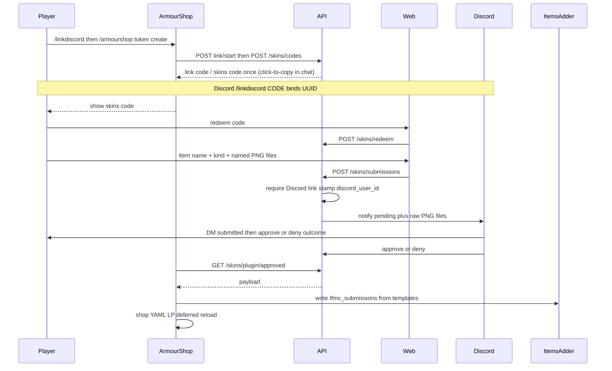

# 05 — Skins system (codes, website, API)

End-to-end design for donator texture submissions on **ProvinceSystem** (store + review state).  

**See also:** [10-armourshop-itemsadder.md](./10-armourshop-itemsadder.md) (MC apply), [11-discord-bot.md](./11-discord-bot.md) (staff UI), [07-naming-conventions.md](./07-naming-conventions.md) (Item name vs filename-derived id), [12-end-to-end-flows.md](./12-end-to-end-flows.md) (full journey).

## Goals

- Donators submit **armor sets** (2D) or **weapon/tool skins** (`handheld` / `large_handheld` / `bow` / `large_bow` / `crossbow`; `item` disabled for now; 3D + shields later).
- No website logins; codes from ArmourShop bound to player UUID.
- Staff approve/deny in Discord (deny includes reason); MVP attaches **raw submission PNGs** in `#bot-feed` (review-sheet later).
- ArmourShop writes ItemsAdder namespace **`tfmc_submissions`**, shop YAML, LP permission; reloads when safe. ArmourShop owns IA `display` / model templates.

## Upload kinds

| Kind | Files (after rename) | Exact sizes | IA approach |
|------|----------------------|-------------|-------------|
| `armor_set` | `{slug}_helmet.png`, `{slug}_chestplate.png`, `{slug}_leggings.png`, `{slug}_boots.png`, `{slug}_layer_1.png`, `{slug}_layer_2.png` | Icons **16×16**; layers **64×32** | Like `tfmc_armor`: `generate: true` icons + `armors_rendering` with two layers |
| `handheld` | `{slug}.png` | **16×16** | Sword-style handheld parent (`generate: true`) |
| `large_handheld` | `{slug}.png` | **32×32** | `generate: false` + thin model parenting ArmourShop **grip template** JSON (`bottom` / `middle` / `top`) |
| `bow` | `{slug}.png` + `{slug}_0/_1/_2.png` | **16×16** | BOW + `generate: true` pull frames |
| `large_bow` | same four PNGs | **32×32** | Large bow thin models + locked display |
| `crossbow` | four + `{slug}_charged.png` | **16×16** | CROSSBOW + `generate: true` |
| `item` | — | — | **Disabled** for upload (no use yet) |
| `item_3d` (later) | `{slug}.png` + `{slug}.json` | Texture + JSON size caps (tiered); JSON must include required `display` keys | Cooking-style: `generate: false` + `model_path` |
| `shield` (later) | model + texture (one mesh) | Same 3D caps; required `display` keys | ArmourShop clones model + locked **blocking** display |

**Enabled upload kinds:** `armor_set`, `handheld`, `large_handheld`, `bow`, `large_bow`, `crossbow`.  
**`base_set` pairing** (type/tier → kind): see [step-8/00-index](./batches/step-8/00-index.md).  
**Deferred:** guns (`rifles`/`pistols`/`shotguns`/`launchers`), `shields`, `helmets` BaseSets.  
**Track B4:** `item_3d` + `shield`.  
**Apply:** Pack writer [step-7](./batches/step-7/00-index.md) (armor/handheld/large); live apply + bow writers [step-8](./batches/step-8/00-index.md).

Original upload **file names must follow convention** (they define the skin id); the API stores fixed stems under the submission folder.

### Grip presets (`large_handheld` only)

| `grip_preset` | Meaning | Who expands to `display` |
|---------------|---------|---------------------------|
| `bottom` | Hold near bottom of art (hammer/staff-like) | Shared grip **template** model JSON (ArmourShop ships three); thin per-skin model parents the template |
| `middle` | Hold mid-art | Same |
| `top` | Hold toward top (longsword-like) | Same |

Store preset id on the submission / `meta.json`. Do not put grip in filenames.

## High-level flow



## Code rules

| Rule | Behavior |
|------|----------|
| Bound to UUID | Issued with `player_uuid`; cosmetic always granted to that UUID |
| Share resistance | Submission stores issuer UUID; ArmourShop only grants that UUID |
| Storage | Hash of code (SHA-256); plaintext shown once in-game |
| Lifetime | Expiry (e.g. 24–72h); single redeem for upload session |
| Revocation | Staff/plugin can invalidate a code row |
| Tier limits (later) | Optional higher 3D byte caps from code / donator tier |

Eligibility (donator rank) is enforced **in ArmourShop** via permission `armourshop.token.create` (assigned with LP for donator ranks later). Command: `/armourshop token create`.

Upload requires a prior **Discord link** for that UUID ([step-5](./batches/step-5/00-index.md)).

## Discord link (MC ↔ Discord)

Durable bind so the bot can DM the player. No OAuth; no Discord fields on the website.

| Step | Who | What |
|------|-----|------|
| 1 | Player in game | `/linkdiscord` → ArmourShop `POST /skins/discord/link/start` with online UUID |
| 2 | Player in Discord | `/linkdiscord <code>` → bot `POST /skins/discord/link/complete` with their Discord user id |
| 3 | API | Stores `discord_links` row (`player_uuid` ↔ `discord_user_id`) |
| Unlink | Player | In-game `/unlinkdiscord` → `POST …/link/unlink` (plugin); or Discord `/unlinkdiscord` → `POST …/link/unlink-discord` (staff) |

Relink replaces the row for the same UUID. A Discord id already linked to another UUID is rejected. Skin upload codes are **one-time** (`redeemed_at`).

### SQLite — `discord_links` / `discord_link_codes`

| Table | Notes |
|-------|-------|
| `discord_links` | `player_uuid` unique, `discord_user_id` unique, `linked_at`, optional `minecraft_name` |
| `discord_link_codes` | one-time code hash, UUID, expiry (~10–15m), `used_at` |

### Player DMs

| Event | How |
|-------|-----|
| Submitted | Outbox `skin_notifications` (`type=submitted`); bot polls + ack |
| Approved / denied | Cog DMs after successful staff API call (deny includes reason) |

## Storage

### SQLite — `codes`

| Column | Notes |
|--------|-------|
| `id` | PK |
| `code_hash` | unique |
| `player_uuid` | issuer |
| `created_at` / `expires_at` | |
| `redeemed_at` | nullable |
| `revoked` | bool |

### SQLite — `submissions`

| Column | Notes |
|--------|-------|
| `id` | Public id for Discord |
| `player_uuid` | from code |
| `code_id` | FK |
| `kind` | `armor_set` \| `handheld` \| `large_handheld` \| `bow` \| `large_bow` \| `crossbow` \| later `item_3d` \| `shield` (`item` disabled) |
| `slug` | `{player_key}_{base_id}` from PNG basenames + Discord-link player key |
| `display_name` | human string (plain text; colours/styles are separate) |
| `add_name` | bool; when true, ArmourShop renames gear with styled name |
| `name_colours` | JSON array of `#RRGGBB` or legacy `§c` / `&c` (1 = solid, 2+ = gradient) |
| `name_styles` | JSON array: `bold` / `italic` / `underline` / `strikethrough` |
| `grip_preset` | nullable; required when `kind=large_handheld` (`bottom` \| `middle` \| `top`) |
| `base_set` | ArmourShop BaseSet id; required; must match kind allowlist ([step-8](./batches/step-8/00-index.md)) |
| `status` | `pending` \| `approved` \| `denied` \| `applied` |
| `deny_reason` | nullable |
| `dir_path` | relative folder under `data/skins/` |
| `created_at` / `reviewed_at` / `applied_at` | |
| `discord_message_id` | nullable |
| `discord_user_id` | from `discord_links` at submit; required for new uploads |

Also: durable `player_keys` (`player_uuid` → `player_key`); `discord_links.player_key` denormalized. Status may be `revoked` after staff delete.

### Disk (API pending)

```text
backend/src/data/skins/{submission_id}/
  meta.json          # slug, kind, display_name, grip_preset?, base_set, add_name, name_colours, name_styles
  …fixed stems per kind…
```

Compose: mount `backend/src/data` like `input` / `output`.

## Validation

- Slug: see [07-naming-conventions.md](./07-naming-conventions.md) — reject before storing files.
- PNG: magic bytes `\x89PNG`; max bytes (e.g. 2MB each); **exact** pixel sizes below — wrong size → **400**.
- `armor_set`: six PNGs; icons 16×16; layers 64×32.
- `handheld`: one PNG, 16×16.
- `large_handheld`: one PNG, 32×32 + non-empty `grip_preset` in allowed set.
- `bow` / `large_bow`: four PNGs (`{id}.png`, `{id}_0.png`, `{id}_1.png`, `{id}_2.png`), same id; sizes 16×16 / 32×32.
- `crossbow`: five PNGs (bow four + `{id}_charged.png`), all 16×16.
- `base_set`: required for enabled kinds; must match kind allowlist ([step-8](./batches/step-8/00-index.md)); reject `kind=item`.
- `item_3d` / `shield` (later): PNG + JSON; JSON parseable; required `display` keys present; combined size capped (default &lt; 30KB json+texture unless tier raises it); no path traversal in strings.
- Never accept zip archives in MVP.

## Review preview (PNG sheets)

Staff must see submissions visually without opening Blockbench.

| Phase | What the API serves | Who consumes |
|-------|---------------------|--------------|
| **Step 4 Discord MVP** | Individual on-disk PNGs via staff file download | Bot attaches raw files to `#bot-feed` |
| Step 2+ / curl | Staff-auth **contact sheet** PNG (`review-sheet`): armor = six labeled tiles; item kinds = texture + kind/grip caption | curl / later Discord when render system ships |
| Later (3D / shield) | Multi-view bake: `gui`, `ground`, first/third person hands; shield also **blocking** | Discord + site view-only viewer |

- Discord does **not** embed interactive WebGL — only static images (raw files now; pre-baked sheets later).
- Interactive orbit viewer is website-only and deferred.
- Endpoints: `GET /skins/submissions/{id}/review-sheet` (staff); staff file GET under `/skins/staff/...` (Step 4.01).

## ItemsAdder shape (ArmourShop writes)

Namespace: **`tfmc_submissions`**.

Armor set YAML mirrors `tfmc_armor` (example pattern):

```yaml
info:
  namespace: tfmc_submissions
armors_rendering:
  {slug}:
    color: '#ffffff'
    layer_1: armor_layers/{slug}_layer_1
    layer_2: armor_layers/{slug}_layer_2
    use_color: false
items:
  {slug}_helmet:
    display_name: '{display_name} Helmet'
    permission: {slug}
    resource:
      generate: true
      textures:
      - armor_icons/{slug}_helmet
    specific_properties:
      armor:
        slot: head
        custom_armor: {slug}
  # chestplate / leggings / boots likewise
```

`handheld`: single item; `generate: true` + `parent: item/handheld`.  
`large_handheld`: `generate: false`; thin model parents a shipped grip template (`bottom` / `middle` / `top`).  
`bow` / `large_bow` / `crossbow`: writers in [step-8/07](./batches/step-8/07-bow-crossbow-writers.md). Donor does not edit JSON for these kinds.

Do **not** add manual `custom_model_data` overrides under `minecraft` (legacy `tfmc_pack` style).

## ArmourShop apply

Full checklist and IA layout: **[10-armourshop-itemsadder.md](./10-armourshop-itemsadder.md)**. Do not duplicate long apply steps here.

## HTTP contracts

### ArmourShop → API (`X-Plugin-Key`)

| Method | Purpose |
|--------|---------|
| `POST /skins/discord/link/start` | `{ "player_uuid", "minecraft_name?" }` → `{ "code", "expires_at" }` |
| `POST /skins/discord/link/unlink` | `{ "player_uuid" }` → clear link for that UUID |
| `POST /skins/codes` | `{ "player_uuid" }` → `{ "code", "expires_at" }` |
| `GET /skins/plugin/approved?since=…` | New approvals + file URLs or multipart manifest (includes `kind`, `grip_preset`, `base_set`) |
| `POST /skins/plugin/applied` | Ack submission ids |

### Web → API (after redeem)

| Method | Purpose |
|--------|---------|
| `POST /skins/redeem` | `{ "code" }` → session |
| `POST /skins/submissions` | Multipart: kind, display_name (Item name, plain), `base_set` (tier/type), optional grip_preset; optional `add_name`, `name_colours` / `name_styles` (JSON arrays); optional slug (scripts); base id from upload filenames → stored as `{player_key}_{base_id}`; **requires Discord link**; rejects same-player active name/base_id conflict |
| `GET /skins/submissions/check` | Session: `display_name` / `base_id` → `{ ok, conflicts }` |
| `GET /skins/plugin/submissions/{id}` | Plugin: metadata for delete |
| `POST /skins/plugin/submissions/{id}/revoke` | Plugin: mark `revoked` (frees slug) |
| `GET /skins/submissions/{id}` | Status for owner session |

### Discord bot → API (`X-Staff-Key`)

| Method | Purpose |
|--------|---------|
| `POST /skins/discord/link/complete` | `{ "code", "discord_user_id" }` → durable link |
| `POST /skins/discord/link/unlink-discord` | `{ "discord_user_id" }` → clear link for that Discord id |
| `GET /skins/staff/pending` | List `status=pending` (includes `discord_user_id` when set) |
| `GET /skins/staff/notifications` | Undelivered player notify rows (`submitted`, …) |
| `POST /skins/staff/notifications/{id}/ack` | Mark notification delivered |
| `GET /skins/staff/submissions/{id}/files/{filename}` | Download one PNG under that submission dir |
| `GET /skins/submissions/{id}/review-sheet` | Contact sheet (optional for Discord later) |
| `POST /skins/submissions/{id}/approve` | |
| `POST /skins/submissions/{id}/deny` | `{ "reason" }` |

### API → Discord

Bot poll: pending metadata + **raw file** downloads; buttons in `#bot-feed`; notification poll for **submitted** DMs; approve/deny handlers send outcome DMs.

## Frontend (`/skins`)

1. Enter code → redeem  
2. Choose kind (no `item`) → **fixed slots** (armor: 6; handheld/large: 1; bow/large_bow: 4; crossbow: 5)  
3. Pick **`base_set`** filtered by kind (armor tier or applicable type); large also picks grip  
4. Enter **Item name** (plain text stored as `display_name`); optional **Apply name** unlocks colours (hex / § palette; 2+ = gradient), styles, and a live preview  
5. Client-side size hints; server still enforces exact pixels + `base_set` pairing + colour/style allowlists  
6. Submit → status page shows plain name + apply-name note (API rejects if Discord not linked)  
7. No accounts; no Discord id fields on the form  

## Discord bot

Skins review + `/linkdiscord` + player DMs: **[11-discord-bot.md](./11-discord-bot.md)** · [batches/step-5](./batches/step-5/00-index.md). In-game bans stay on the MC server.

## SimpleFactions

Unchanged for skins — map only ([09-map-system.md](./09-map-system.md)).

## Local MVP without live integrations

Seed hashed codes; upload **correct-size** fixtures; approve via curl; pull endpoint with httpie; fetch review-sheet PNG. See [06-local-development.md](./06-local-development.md).

## Security (skins-specific)

- Plugin and staff secrets only in server env  
- Rate-limit redeem and upload  
- Review sheets and previews for staff only  
- No public list-all-submissions endpoint  
