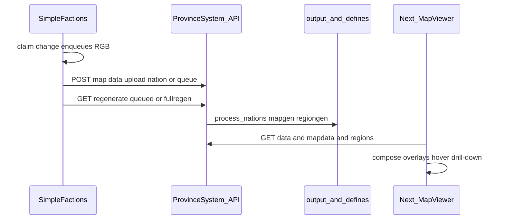

# 09 — Map system (SimpleFactions ↔ ProvinceSystem)

> **Product truth:** [16-map-platform.md](./16-map-platform.md). This doc covers the existing SF ↔ API ↔ web pipeline.

End-to-end **interactive world map**: faction data on the Paper server becomes PNG layers and JSON on the website.

Perf/UX work (cropped overlays, hover, mobile): [04-map-performance.md](./04-map-performance.md).  
Website baseline: [01-current-state.md](./01-current-state.md).

## Components

| Piece | Path | Job |
|-------|------|-----|
| SimpleFactions | `Workspace/simplefactions/` | Owns nations/provinces; talks HTTP to API |
| ProvinceSystem API | `ProvinceSystem/backend/` | Upload defines, regen maps/regions, serve files |
| ProvinceSystem web | `ProvinceSystem/frontend/` | MapViewer, modes, drill-down |
| Data | `backend/src/input|defines|output/{map}/` | Per-map worlds (`main`, `dev`, …) |

## Flow

## SimpleFactions REST

Primary client: `Workspace/simplefactions/.../REST/RestServer.java` (under the TFMC workspace root).

| Call | Purpose |
|------|---------|
| `GET {api}/{mapRef}/map/province/{x},{z}` | Resolve province under player |
| `POST {api}/{mapRef}/data/upload/{mode}` | Push nation / provinces / guilds / queue JSON |
| `GET {api}/{mapRef}/{hashedKey}/api/regenerate/{type}` | `textonly`, queued, or `fullregen` |
| `GET {api}/generator/banner` | Random banner patterns |

Config knobs (today partly hardcoded):

- `apiURL` — e.g. production API or `http://localhost:8000`
- `Cache.mapRef` — which map folder (`main`, `dev`, …)
- `Cache.mapEnabled` — kill switch
- Regen auth — MD5 path segment; **move secret to plugin config** when touching this code (do not leave production secrets only in source)

Claim changes typically `enqueue("nation", rgb)` then later upload queue + regenerate.

## ProvinceSystem map pipeline

1. Load/compile nation (and other modes) into `defines/{map}/`.  
2. `create_map` / `generate_regions` write `output/{map}/maps/` and `regions/`.  
3. [`file_routes`](../backend/src/api/file_routes.py) serves PNGs; data routes serve JSON.  
4. Frontend uses `NEXT_PUBLIC_API_URL` + `mapId` (e.g. `/map/main`).

Generators on `dev` are fast; browser cost is still full-size region overlays until [04](./04-map-performance.md) lands.

## Multi-map

Each logical world has its own `input/{map}`, `defines/{map}`, `output/{map}`. SimpleFactions `mapRef` must match the website `mapId` for that season/world.

## Local vs live

| Mode | Map data |
|------|----------|
| Website only | Sample `input`/`defines` + one-shot regen → `output` ([06](./06-local-development.md)) |
| Integration | Point SF `apiURL` at local/staging API; use a test mapRef |
| Production | SF on Paper → live API; players browse tfminecraft.net |

SimpleFactions is **not** involved in skins.

## Implementation notes (map track)

See [16-map-platform.md](./16-map-platform.md) steps 37–45. Technical perf detail: fix hover card, cropped PNGs, SF config hygiene.

## See also

- [12-end-to-end-flows.md](./12-end-to-end-flows.md) — journey “map border update”  
- [03-roadmap.md](./03-roadmap.md) — Track A  
- [08-implementation-checklist.md](./08-implementation-checklist.md) — Map track tasks  
