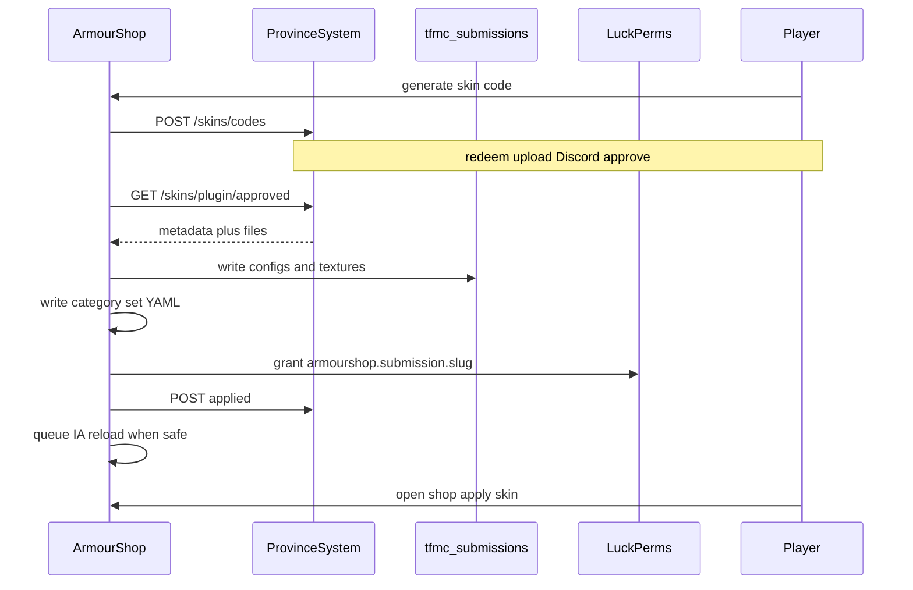

# 10 — ArmourShop and ItemsAdder (skins apply)

How approved website submissions become **usable cosmetics** on the Minecraft server.

Website/API contracts and kinds: [05-skins-system.md](./05-skins-system.md).  
Naming: [07-naming-conventions.md](./07-naming-conventions.md).

## Role split

| Actor | Does |
|-------|------|
| ProvinceSystem | Codes, uploads, Discord review state, file store |
| **ArmourShop** | Mint codes; pull approved; write IA + shop YAML; LP; deferred reload |
| ItemsAdder | Loads `tfmc_submissions` after files exist / pack rebuild |
| SimpleFactions | Nothing here |

ArmourShop is the **only** writer into live `contents/tfmc_submissions/` for player skins.

## Paths

| Piece | Location |
|-------|----------|
| Plugin source | `Workspace/armourshop/` |
| Live shop YAML | `Workspace/plugins/ArmourShop/Categories/` |
| IA contents (live) | `Workspace/plugins/ItemsAdder/contents/` |
| IA reference copy | `ItemsAdder Copy/ItemsAdder/contents/` |
| Curated armor example | `…/tfmc_armor/` (`generate: true` + layers) |
| Model-style example | `…/tfmc_cooking/` (`generate: false` + `model_path`) |
| Legacy CMD (avoid) | `…/tfmc_pack/` (vanilla overrides) |

## Apply flow



## ItemsAdder: `tfmc_submissions`

Create namespace once (scaffold empty pack), then ArmourShop appends per submission.

**Armor set** (2D) — mirror `tfmc_armor`:

- `armors_rendering.{slug}` with `layer_1` / `layer_2`
- Four items: `{slug}_helmet|chestplate|leggings|boots` with `generate: true`, icon textures, `custom_armor: {slug}`

**Item 2D** — single item, `generate: true`, texture `{slug}`.

**Item 3D** (later) — cooking style: `generate: false`, `model_path`, ship JSON under namespace models.

Never add new skins via manual `custom_model_data` lists in `tfmc_pack`.

## ArmourShop shop integration

Today categories point at `ia.tfmc_armor:…` or legacy `localmodel(…)`. Player submissions should only use:

```text
ia.tfmc_submissions:{slug}_helmet
ia.tfmc_submissions:{slug}
```

- Set key / category entry id = `{slug}`  
- Optional dedicated category e.g. “Player Submissions”  
- Gate with `permission: armourshop.submission.{slug}` (already supported on `SkinSet` / categories)

Apply path stays existing `ArmorMerger.merge` + IA id.

## LuckPerms

On apply: grant issuer UUID `armourshop.submission.{slug}`.  
On revoke/deny-after-apply (if ever): remove node and optionally disable IA permission.

## Deferred reload

Same policy as map regen when possible:

1. Write files immediately.  
2. If players online → mark pending reload.  
3. When `onlineCount == 0` or on restart → ItemsAdder pack rebuild / reload command.  
4. Ack `applied` to API when pack is live (or when files are written + reload queued—pick one rule and stick to it; prefer ack when reload completed).

## Config (plugin)

| Key | Purpose |
|-----|---------|
| API base URL | ProvinceSystem |
| Plugin key | `X-Plugin-Key` |
| IA contents path | Absolute path to `ItemsAdder/contents` |
| ArmourShop categories path | Where to write YAML |
| Reload command / API | How to trigger IA |

Mirror the REST style of SimpleFactions `RestServer`, but **secrets in config.yml**, not hardcoded hashes in source.

## Local / dry run

Point ArmourShop at `ItemsAdder Copy` (or a temp contents dir), not production. Pull from local API with mock approved submissions. See [06-local-development.md](./06-local-development.md).

## Checklist

- [ ] Scaffold empty `tfmc_submissions` on live + copy  
- [ ] REST client + code command  
- [ ] Pull + write armor_set and item_2d  
- [ ] Category YAML + LP  
- [ ] Deferred reload + applied ack  
- [ ] item_3d later  

## See also

- [12-end-to-end-flows.md](./12-end-to-end-flows.md) — skin journey  
- [11-discord-bot.md](./11-discord-bot.md) — approval before pull  
- [08-implementation-checklist.md](./08-implementation-checklist.md) — Sprint / Pack track  
