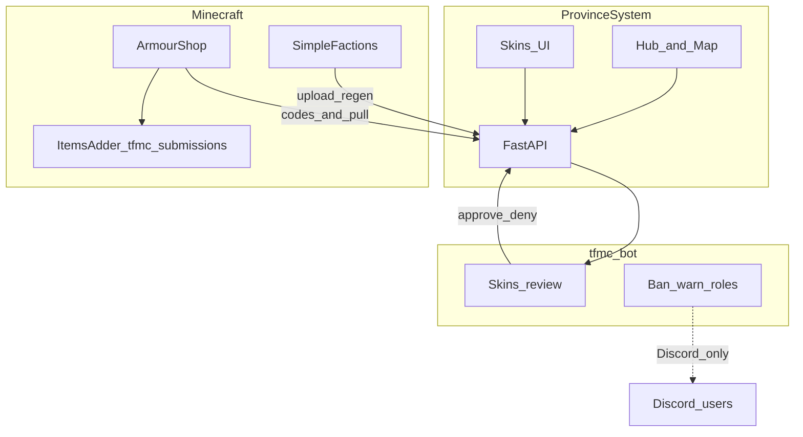
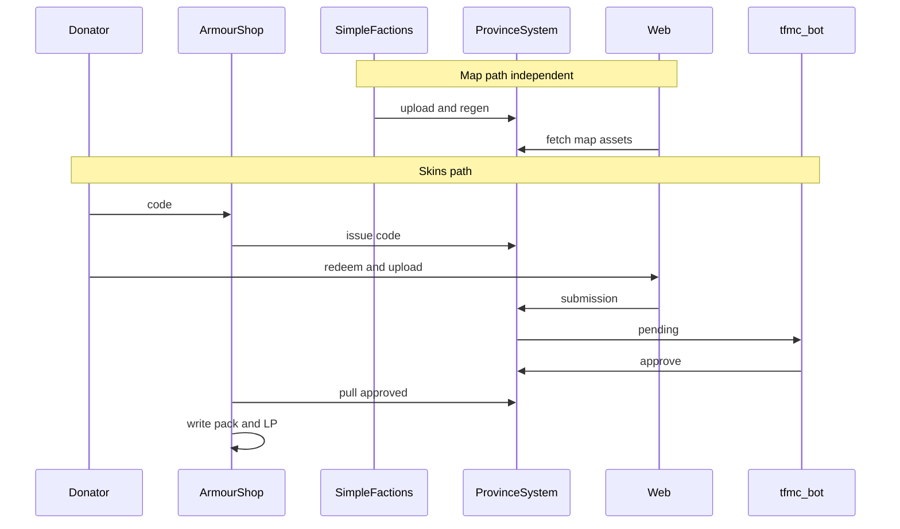

# 12 — End-to-end flows

Master journeys across the full TFMC platform. Detail docs: [09](./09-map-system.md) map, [05](./05-skins-system.md)/[10](./10-armourshop-itemsadder.md)/[11](./11-discord-bot.md) skins and bot.

## Platform overview

---

## Flow 1 — Map border update

**Actors:** Player/staff on MC, SimpleFactions, ProvinceSystem, website visitors.

| Step | Who | What |
|------|-----|------|
| 1 | Gameplay | Nation claims change |
| 2 | SimpleFactions | Enqueue affected region RGB; persist nation JSON |
| 3 | SimpleFactions | `POST /{map}/data/upload/…` and/or queue upload |
| 4 | SimpleFactions | `GET /{map}/{key}/api/regenerate/…` |
| 5 | ProvinceSystem | Compile + mapgen + regiongen → `output/{map}/` |
| 6 | Visitor | Opens `/map/{mapId}`; loads mapdata, regions, defines JSON |
| 7 | Visitor | Hover/drill-down on MapViewer |

**Failure modes:** wrong `mapRef`; empty `output/`; regen lock; stale CDN/browser cache (API FileResponse).

**Local without SF:** seed input/defines + manual fullregen ([06](./06-local-development.md)).

---

## Flow 2 — Skin submission to usable cosmetic

**Actors:** Donator, ArmourShop, website, Discord staff, ItemsAdder, LuckPerms.

| Step | Who | What |
|------|-----|------|
| 0a | Donator | In-game `/linkdiscord` → one-time code |
| 0b | Donator | Discord `/linkdiscord <code>` → UUID ↔ Discord id linked |
| 1 | Donator | In-game: `/armourshop token create` (perm `armourshop.token.create` / admin; LP for donators later) |
| 2 | ArmourShop | `POST /skins/codes` with UUID; shows plaintext once (**click-to-copy**) |
| 3 | Donator | Website `/skins`: redeem code |
| 4 | Donator | Chooses kind (+ grip for large); enters **Item name**; uploads PNGs named per [07](./07-naming-conventions.md) (skin id from filenames) |
| 5 | API | Requires Discord link; validates naming ([07](./07-naming-conventions.md)) and **exact pixel sizes**; stores fixed stems + `discord_user_id`; status `pending`; enqueues submitted notify |
| 5b | tfmc_bot | DM player: submission received |
| 6 | tfmc_bot | Skins cog posts review embed to `#bot-feed` **with raw submission PNGs** (review-sheet later) |
| 7 | Staff | Approve or Deny (+ reason) from visuals |
| 8 | API | Status `approved` / `denied` |
| 8b | tfmc_bot | DM player: approved, or denied + reason |
| 9 | ArmourShop | Pulls approved; writes `tfmc_submissions` from kind/grip templates; shop YAML; LP `armourshop.submission.{slug}` |
| 10 | ArmourShop | Deferred IA reload when safe; ack `applied` |
| 11 | Donator | Opens ArmourShop; sees set; applies to gear |

**Armor files:** 4 icons (16×16) + 2 layers (64×32). **Item / handheld:** one 16×16 PNG. **Large handheld:** one 32×32 PNG + grip. Upload **file names** define skin id ([07](./07-naming-conventions.md)).

**Failure modes:** not Discord-linked; bad PNG file names / id; wrong pixel size; incomplete armor slots; Discord double-approve; closed DMs (review still works); reload while players online; LP missing so shop hides set.

---

## Flow 3 — Staff Discord ban notify + role mute

**Actors:** Staff, tfmc_bot, Discord user. Minecraft ban is **separate** (in-game command).

| Step | Who | What |
|------|-----|------|
| 1 | Staff | Ban player **in-game** (server plugin) |
| 2 | Staff | Discord `/minecraftban` with Discord user, MC name, reason, duration |
| 3 | Bot | Ephemeral preview → DM user → log channel |
| 4 | Bot | Add **Banned** role (planned) |
| 5 | Discord | Role denies speak in configured channels |
| 6 | Staff | Later `/minecraftunban` (or clear): remove role; optional unban in-game separately |

**Warn:** `/minecraftwarn` — DM + log; no banned role.

**Non-goal:** bot does not execute MC bans.

---

## Flow map (skins + map together)

---

## Definition of done (platform MVP)

- Flow 1 works on live map (existing; UX polish ongoing).  
- Flow 2 works for armor_set + item/handheld/large_handheld with Discord approve (PNG sheet) and ArmourShop apply.  
- Flow 3 DM/log works today; role add/clear ships with bot track.  
- Naming enforced on Flow 2.  
- Local testing possible for API/UI without Paper ([06](./06-local-development.md)).  

Build order: [08-implementation-checklist.md](./08-implementation-checklist.md).
