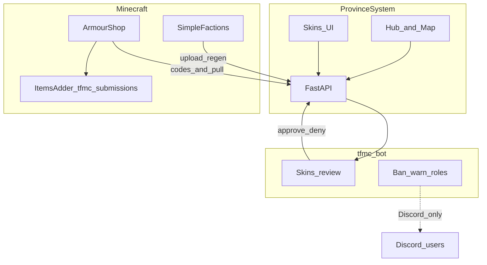
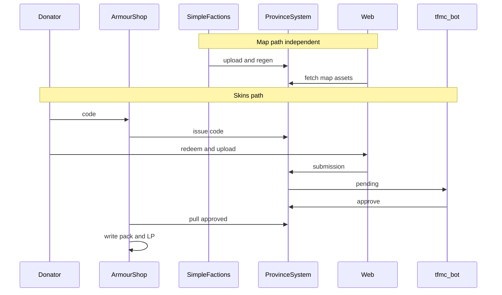

# 12 — End-to-end flows

Master journeys across the full TFMC platform. Detail docs: [09](./09-map-system.md) map, [05](./05-skins-system.md)/[10](./10-armourshop-itemsadder.md)/[11](./11-discord-bot.md) skins and bot.

## Platform overview



---

## Flow 1 — Map border update

**Actors:** Player/staff on MC, SimpleFactions, ProvinceSystem, website visitors.

| Step | Who | What |
|------|-----|------|
| 1 | Gameplay | Nation claims change |
| 2 | SimpleFactions | Enqueue affected region RGB; persist nation JSON |
| 3 | SimpleFactions | `POST /{map}/data/upload/…` and/or queue upload |
| 4 | SimpleFactions | `GET /{map}/{key}/api/regenerate/…` |
| 5 | ProvinceSystem | Compile + mapgen + regiongen → `output/{map}/` |
| 6 | Visitor | Opens `/map/{mapId}`; loads mapdata, regions, defines JSON |
| 7 | Visitor | Hover/drill-down on MapViewer |

**Failure modes:** wrong `mapRef`; empty `output/`; regen lock; stale CDN/browser cache (API FileResponse).

**Local without SF:** seed input/defines + manual fullregen ([06](./06-local-development.md)).

---

## Flow 2 — Skin submission to usable cosmetic

**Actors:** Donator, TFMCWeb, ArmourShop, website, Discord staff, ItemsAdder, LuckPerms.

| Step | Who | What |
|------|-----|------|
| 0a | Donator | In-game TFMCWeb `/linkdiscord` → one-time code |
| 0b | Donator | Discord `/linkdiscord <code>` → UUID ↔ Discord id linked |
| 1 | Donator | In-game: `/token create skin` (perm `tfmcweb.token.create`; PS rejects if rank disallowed or on cooldown) |
| 2 | TFMCWeb | `POST /skins/codes` scope=skin; shows plaintext once (**click-to-copy**) |
| 3 | Donator | Website `/skins`: redeem code (session includes `skin_kinds` + `allow_armor_3d_helmet`) |
| 4 | Donator | KindPicker filtered by rank; picks **`base_set`**; grip for large; **Item name**; uploads PNGs per [07](./07-naming-conventions.md). Armor 3D helmet only if entitled |
| 5 | API | Requires Discord link; validates kind whitelist, naming, sizes, `base_set`↔kind; stores fixed stems + `discord_user_id`; status `pending`; enqueues submitted notify |
| 5b | tfmc_bot | DM player: submission received |
| 6 | tfmc_bot | Skins cog posts review embed to `#bot-feed` **with raw submission PNGs** (+ kind / `base_set` / grip) |
| 7 | Staff | Approve or Deny (+ reason) from visuals |
| 8 | API | Status `approved` / `denied` |
| 8b | tfmc_bot | DM player: approved, or denied + reason |
| 9 | ArmourShop | Pulls approved; writes `tfmc_submissions` (armor/handheld/large now; bow kinds after [8.07](./batches/step-8/07-bow-crossbow-writers.md)); shop set in `ps_armor` / `ps_items` with `set: {base_set}`; LP `armourshop.submission.{slug}` |
| 10 | ArmourShop | Deferred IA reload when safe; ack `applied` |
| 11 | Donator | Opens ArmourShop; sees set; applies onto matching BaseSet gear |

**Armor files:** 4 icons (16×16) + 2 layers (64×32); tier one of iron/steel/abyssalite/mythril/mage/infantry. **Handheld:** one 16×16 + type (swords, axes, …). **Large handheld:** one 32×32 + grip + type (spears, staffs, …). **Bow / large_bow / crossbow:** after 8.07. Upload **file names** define skin id ([07](./07-naming-conventions.md)).

**Failure modes:** not Discord-linked; rank cannot mint / shared skin↔drink cooldown (TFMCWeb); kind not allowed for rank; armor 3D helmet without entitlement; bad PNG file names / id; wrong pixel size; incomplete armor slots; bad/missing `base_set` or wrong kind pairing; Discord double-approve; closed DMs (review still works); reload while players online; LP missing so shop hides set; wrong BaseSet gear in inventory so apply finds nothing.

---

## Flow 2c — Donator drink (BreweryX)

**Status:** Code **shipped** (step-31.02–31.08). Human verify: [STAGING.md](../STAGING.md) Step 31.

**Actors:** Donator, TFMCWeb, DrinkBuilder, website, Discord staff, ItemsAdder, BreweryX.

| Step | Who | What |
|------|-----|------|
| 1 | Donator | `/token create drink` (shared cooldown with skin on TFMCWeb) |
| 2 | Donator | Redeem on `/drinks`; fill brew form; Noble color-only / Gilded+ texture or reuse |
| 3 | API | Validate ingredients allowlist + effects blacklist; store pending |
| 4 | Bot | Review embed + sheet; Approve/Deny |
| 5 | DrinkBuilder | If texture: write `tfmc_drinks` CMD; merge `recipes.yml`; Brewery reload |
| 6 | Donator | Brew in-game |

**Playbook:** [15-drink-builder.md](./15-drink-builder.md) · **Batches:** [step-31](./batches/step-31/00-index.md)

---

## Flow 3 — Staff Discord ban notify + role mute

**Actors:** Staff, TFMCWeb, Essentials (or CE), tfmc_bot, Discord user.

| Step | Who | What |
|------|-----|------|
| 1 | Staff | Ban in-game: Essentials `/tempban` / `/ban` (or CE `/tfmc ban`) |
| 2 | TFMCWeb | Listens → enqueues moderation outbox (linked Discord id) |
| 3 | Bot | Polls outbox → DM user → staff log → add **Banned** role (`BANNED_ROLE_ID`) |
| 4 | Discord | Role denies speak in configured channels |
| 5 | Staff | In-game `/unban` → TFMCWeb → bot clears Banned role (no player DM) |

**Manual fallback:** Discord `/minecraftban` / `/minecraftunban` / `/minecraftwarn` still work without the MC mirror.

**Warn:** TFMCWeb `/warning` → in-game chat (if online) + store + bot DM + log. Unlinked: store only.

**Non-goal:** bot does not execute MC bans.

---

## Flow 2b — Staff curated skin (no Discord review)

**Actors:** Staff, TFMCWeb, website, ArmourShop, ItemsAdder. **Batches:** [step-18](./batches/step-18/00-index.md).

| Step | Who | What |
|------|-----|------|
| 0 | ArmourShop | On load: sync categories + skin-set keys + scrolls → API |
| 1 | Staff | `/token create skin staff` → redeem on `/skins` |
| 2 | Staff | Same kind upload + **category** + **scroll** dropdowns |
| 3 | API | Auto-approve (no bot / pending) |
| 4 | ArmourShop | Pull → write **`tfmc_armorshop`** + upsert chosen category YAML with scroll |
| 5 | Staff/players | Apply via ArmourShop using scroll (not submission LP) |

Mint is **TFMCWeb** (`/token create skin staff`), not ArmourShop (the diagram under Flow map still shows the older AS mint path for the player lane). Guns use the same staff path. Player Flow 2 unchanged.

---

## Flow map (skins + map together)



---

## Definition of done (platform MVP)

- Flow 1 works on live map; **map platform** (steps 37–45) delivers parchment UX, modals, chronicle, and wealth charts — see [16-map-platform.md](./16-map-platform.md).  
- Flow 2 works for armor_set + handheld/large_handheld with Discord approve and ArmourShop apply; bow kinds after [8.07](./batches/step-8/07-bow-crossbow-writers.md).  
- Flow 3 DM/log + **Banned role add/clear done** ([step-17.07](./batches/step-17/07-warn-and-ban-mirror.md)).  
- Naming enforced on Flow 2.  
- Local testing possible for API/UI without Paper ([06](./06-local-development.md)).  

Build order: [08-implementation-checklist.md](./08-implementation-checklist.md). **Next build:** [step-42 capitals / settlements](./batches/step-42/00-index.md).

---

## Flow 4 — Map chronicle (planned)

After [step-44](./batches/step-44/00-index.md):

```text
SF claim change → upload + regen → daily snapshot job
  → composited map frame stored
  → events.jsonl (SF events + diffs)
  → optional slideshow / season recap UI
```
