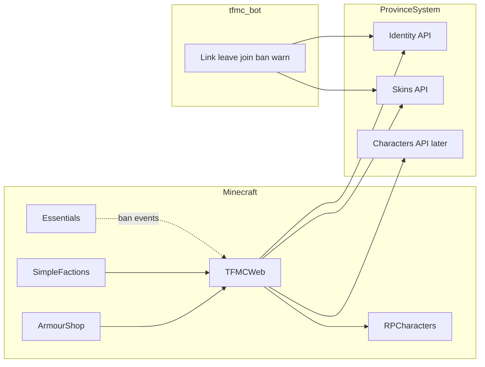

# 13 — TFMCWeb (identity, tokens, Discord gate)

**Status:** Implemented ([step-17](./batches/step-17/00-index.md) 17.01–17.08). Character creator Phase 1 **implemented** ([14-character-creator.md](./14-character-creator.md) / [step-19](./batches/step-19/00-index.md)); tick staging in [STAGING.md](../STAGING.md). Drink mint + shared skin↔drink cooldown **shipped** ([15-drink-builder.md](./15-drink-builder.md) / [step-31](./batches/step-31/00-index.md) 31.02).  
**Repos:** `Workspace/tfmcweb/` (Bukkit plugin) · `ProvinceSystem` · `tfmc_bot` · soft-depends `Workspace/rpcharacters` · consumers `armourshop` (pack only); SimpleFactions / character creator via TFMCWeb.

Companion: [11-discord-bot.md](./11-discord-bot.md) · skins tokens today: [10-armourshop-itemsadder.md](./10-armourshop-itemsadder.md) · batches: [step-17](./batches/step-17/00-index.md).

---

## Why

ArmourShop historically owned Discord link (`/linkdiscord`), skins token mint, plugin-notice poll, and HTTP to ProvinceSystem. **TFMCWeb** now owns identity + tokens ([17.04](./batches/step-17/04-tfmcweb-scaffold.md)–[17.06](./batches/step-17/06-armourshop-cutover.md)); ArmourShop keeps pack apply. SimpleFactions has its own HTTP. Character creation uses the same identity + scoped codes.

**TFMCWeb** is the single TFMC-specific gate to ProvinceSystem (like **TFMCCore** is TFMC-specific gameplay; **TLibs** stays portable).

---

## Locked decisions

| Decision | Choice |
|----------|--------|
| Plugin name | **TFMCWeb** (`net.tfminecraft.TFMCWeb`) |
| Owns | HTTP client, plugin key, Discord **link**, scoped **tokens**, link **cache**, Discord **gate** (via RPCharacters freeze), ban/warn **mirrors**, admin `/web` |
| Does **not** own | Pack writing (ArmourShop), map regen (SimpleFactions), character data (RPCharacters), Essentials ban execution |
| Naming vs TLibs | TFMCWeb / TFMCCore = TFMC-only; TLibs = multi-server library |
| Discord required | Every player must link Discord **and** be in the TFMC guild to play Survival |
| Staff / helpers | Trusted; they are **not** in Survival for normal play — Discord gate applies **only in Survival** (same skip pattern as RPCharacters freeze today) |
| Alts | **None** — one Discord ↔ one Minecraft UUID (already UNIQUE in `discord_links`; keep hard) |
| Leave Discord | **1 hour grace** — if they rejoin within 1h, stay linked (needed for donator rank re-apply rejoins). After grace → unlink + freeze |
| Freeze | Use **RPCharacters** freeze; **do not** touch characters / wipe / deactivate. New freeze reason only |
| Character creator UI | [14-character-creator.md](./14-character-creator.md) / [step-19](./batches/step-19/00-index.md) — Phase 1 **shipped** (`/character`); redeem `POST /skins/character/redeem` (session **1h** / Remember me **30d**); this doc owns identity + mint only |
| Commands | Player: `/token …`, `/linkdiscord` (alias). Admin: `/web …`. Warnings: `/warning …` (TFMCWeb) |
| Bans | Keep **Essentials** `/tempban` / `/ban`; TFMCWeb listens and mirrors to Discord bot |
| Warnings | New in-game `/warning` (TFMCWeb) → player chat + web store + bot DM (today’s `/minecraftwarn` is manual Discord-only) |

---

## Ownership matrix

| Concern | Owner |
|---------|--------|
| Base URL, `X-Plugin-Key`, timeouts, async HTTP | TFMCWeb |
| UUID ↔ Discord link + guild membership + grace | ProvinceSystem identity + TFMCWeb cache + bot leave/join |
| Scoped feature codes (`skin`, `drink`, `character`, …) | ProvinceSystem + TFMCWeb `/token create <scope>` |
| Survival Discord gate freeze | TFMCWeb → RPCharacters API |
| Skin pack apply | ArmourShop (transport via TFMCWeb later) |
| Essentials ban/unban | Essentials executes; TFMCWeb mirrors |
| In-game warnings | TFMCWeb |
| Discord DMs / banned role / leave events | `tfmc_bot` |
| Character sheets / freeze loop | RPCharacters |

---

## Architecture



Domain plugins **depend on TFMCWeb** for network/identity. They do not open raw `HttpURLConnection` to ProvinceSystem once migrated.

---

## Identity (extract from skins)

Today link tables live under skins SQLite (`discord_links`, `discord_link_codes`) and routes under `/skins/discord/…` — [step-5](./batches/step-5/00-index.md).

**Target:** identity module/routes usable by all features:

| Route (proposed) | Auth | Role |
|------------------|------|------|
| `POST /v1/identity/link/start` | Plugin | Same as today’s link start |
| `POST /v1/identity/link/complete` | Staff (bot) | Bind Discord id; **reject** if Discord already on another UUID |
| `POST /v1/identity/link/unlink` | Plugin / staff | Explicit unlink |
| `POST /v1/identity/guild/left` | Staff (bot) | Start **1h grace** (do not delete link yet) |
| `POST /v1/identity/guild/joined` | Staff (bot) | Clear grace if still linked |
| `GET /v1/identity/status/{uuid}` | Plugin | linked? grace_until? in_guild? |
| Plugin notices | Plugin | Extend types: `link_success`, `guild_left_grace`, `grace_expired`, `guild_rejoined` |

Keep backward-compatible aliases under `/skins/discord/…` during migration, or redirect.

**Extra columns (conceptual):** `grace_until`, `left_guild_at`, maybe `last_guild_check_at`. While `now < grace_until`, treat as still eligible for play.

---

## Tokens

Replace ArmourShop-only mint with scoped codes:

| Command | Scope | Redeems on |
|---------|--------|------------|
| `/token create skin` | `skin` | Existing `/skins` redeem |
| `/token create drink` | `drink` | `/drinks` — **shipped** ([15](./15-drink-builder.md) / [step-31](./batches/step-31/00-index.md)) |
| `/token create character` | `character` | Character-creator site |

Rules:

- Must be Discord-linked and not past grace (Survival players).
- Codes bound to UUID (same threat model as skins — no shareable account takeover).
- Session TTL: skins/drinks ~1h after redeem; character default **1h**, Remember me **30d** ([14-character-creator.md](./14-character-creator.md)).
- **Shared mint cooldown (`skin` + `drink`):** owned by **TFMCWeb** only (rank days in TW config). ProvinceSystem does **not** enforce mint cooldown days after Step 31.02. Character is not in the shared family.
- **Command gate:** LP `tfmcweb.token.create` (and drink uses same unless split later).
- **Staff mint (`skin_staff`):** bypasses shared cooldown (perm `tfmcweb.token.create.staff`). Drink staff mint optional later.
- Skins **upload** entitlements (kinds, colour stops, 3D) remain ArmourShop → PS player-meta — separate from mint cooldown.

Admin `/web` does **not** mint player tokens.

---

## Discord gate + RPCharacters freeze

### Behaviour

1. Player in **Survival** and (not linked **or** grace expired after leave) → **freeze**.
2. Linked + in guild (or within 1h grace) → clear Discord freeze reason.
3. **Do not** change active character, delete characters, or force `NO_CHARACTER`.
4. Non-Survival (staff/helpers creative/spectator/etc.) → **no Discord gate** (trusted + already in Discord).

### RPCharacters change required

Today `FreezeReason` is only `NO_CHARACTER` | `LACKING_CLUES` | `EXCESS_CHARACTERS`. `getFreezeReason` is private; external `releaseFreeze` is overwritten by the 5-tick loop.

**Add:**

- `FreezeReason.DISCORD_REQUIRED` (or `DISCORD_UNLINKED`)
- Public API e.g. `PlayerManager.setDiscordGate(UUID/Player, boolean)` + message in `notifyFrozen`
- `getFreezeReason` honors the flag
- Soft-depend pattern optional; TFMCWeb soft-depends RPCharacters

TFMCWeb on join / notice / grace tick: set or clear gate → `reevaluateFreeze(player)`.

### Leave / grace flow

```mermaid
sequenceDiagram
  participant Bot
  participant API as ProvinceSystem
  participant TW as TFMCWeb
  participant RPC as RPCharacters

  Bot->>API: guild member_remove
  API->>API: grace_until = now + 1h
  API->>TW: notice guild_left_grace
  Note over TW,RPC: still linked; no freeze

  alt rejoins within 1h
    Bot->>API: guild member_join
    API->>API: clear grace
    API->>TW: notice guild_rejoined
  else grace expires
    API->>API: unlink or mark unlinked
    API->>TW: notice grace_expired
    TW->>RPC: setDiscordGate true
    Note over RPC: Survival freeze only
  end
```

---

## Bans and warnings

### Bans (Essentials)

- Staff continue `/tempban`, `/ban`, `/unban` (and ConditionalEvents `/tfmc ban` helper wrapper if kept).
- TFMCWeb: softdepend Essentials; listen ban/tempban/unban (API events preferred; command fallback if needed).
- On ban: resolve Discord id from link cache → ProvinceSystem → bot DM + **Banned** role (upgrade [11](./11-discord-bot.md) planned role mute).
- On unban: clear Discord banned role.
- Never block the main thread on HTTP.

### Warnings (new)

| Piece | Behaviour |
|-------|-----------|
| `/warning <player> <reason>` | TFMCWeb; permission for staff/helper |
| In-game | Message to target chat (and optional staff log) |
| Web | Store warning history (UUID, staff, reason, time) |
| Discord | Bot DM (automate today’s `/minecraftwarn`) |

Warnings are **not** Essentials notes; web-backed for character/staff pages later.

---

## Commands (TFMCWeb)

### Player

| Command | Permission (indicative) | Action |
|---------|-------------------------|--------|
| `/linkdiscord` | default true | Issue link code (move from ArmourShop) |
| `/unlinkdiscord` | default true | Explicit unlink → Discord gate if Survival |
| `/token create skin` | skins donator / default as today | Scoped skins code |
| `/token create drink` | donator ranks (shared cooldown) | Scoped drink code ([step-31](./batches/step-31/00-index.md)) |
| `/token create character` | when character web ships | Scoped character code |
| `/token resetcooldowns <player>` | `tfmcweb.token.resetcooldowns` (op default) | Clear shared skin+drink mint cooldown |
| `/token` | — | Usage |

### Staff

| Command | Action |
|---------|--------|
| `/web status` | API reachability, link cache stats |
| `/web reload` | Reload TFMCWeb config |
| `/web lookup <player>` | UUID ↔ Discord / grace |
| `/web unlink <player>` | Force unlink |
| `/web reconcile` | Pull identity status for online players |
| `/warning <player> <reason>` | Warn + mirror |

---

## Migration from ArmourShop

Completed in step-17: TFMCWeb owns link, notices, and `/token create`; ArmourShop keeps pack apply + admin token list/delete. Staging LP: migrate `armourshop.token.create` → `tfmcweb.token.create`.

Still later: SimpleFactions REST through TFMCWeb. Character creator Phase 1 + Phase 2 kit plumbing shipped ([14](./14-character-creator.md) / [step-19](./batches/step-19/00-index.md) / [step-20](./batches/step-20/00-index.md)); Phase 3 claim cutover + lore-item in [step-21](./batches/step-21/00-index.md); Phase 4 later.

---

## Gaps vs current code

| Desired | Status |
|---------|--------|
| TFMCWeb plugin + Survival gate + `/token` | Done ([17.04](./batches/step-17/04-tfmcweb-scaffold.md)–[17.06](./batches/step-17/06-armourshop-cutover.md)) |
| Guild leave/join + 1h grace | Done ([17.02](./batches/step-17/02-identity-api.md), [17.03](./batches/step-17/03-bot-guild-events.md)) |
| RPC Discord freeze | Done ([17.01](./batches/step-17/01-rpc-discord-freeze.md)) |
| `/warning` + Essentials ban mirror + Banned role | Done ([17.07](./batches/step-17/07-warn-and-ban-mirror.md)) |
| Identity routes outside `/skins` path prefix | Remaining (tables still under skins API) |
| Character creator UI | Out of scope (token stub only) |
| SimpleFactions via TFMCWeb | Remaining |

---

## Success criteria

- Survival player without Discord link (or past leave grace) is frozen via RPCharacters; characters untouched.
- Staff in non-Survival are not Discord-gated.
- Leave Discord → 1h grace → rejoin OK; after 1h → freeze.
- No alts (one Discord ↔ one UUID).
- `/token create skin`, `drink`, and `character` work from TFMCWeb (drink redeem in step-31.03).
- Shared skin↔drink mint cooldown enforced on TFMCWeb (`token-cooldowns` + `GET /skins/plugin/cosmetic-mint-status`).
- `/tempban` mirrors to Discord; `/warning` hits chat + Discord.
- ArmourShop no longer owns link/HTTP identity.

Staging verify script: [08-docs-verify.md](./batches/step-17/08-docs-verify.md).

---

## Next step

Character creator Phase 1 is **done** (staging verified). Phase 2 kit plumbing **done** ([step-20](./batches/step-20/00-index.md) 20.01–20.03); claim + lore-item cutover in [step-21](./batches/step-21/00-index.md) (**21.06 → 21.07 → 21.05**). Phase 4 wardrobe **planned** ([step-30](./batches/step-30/00-index.md)).
