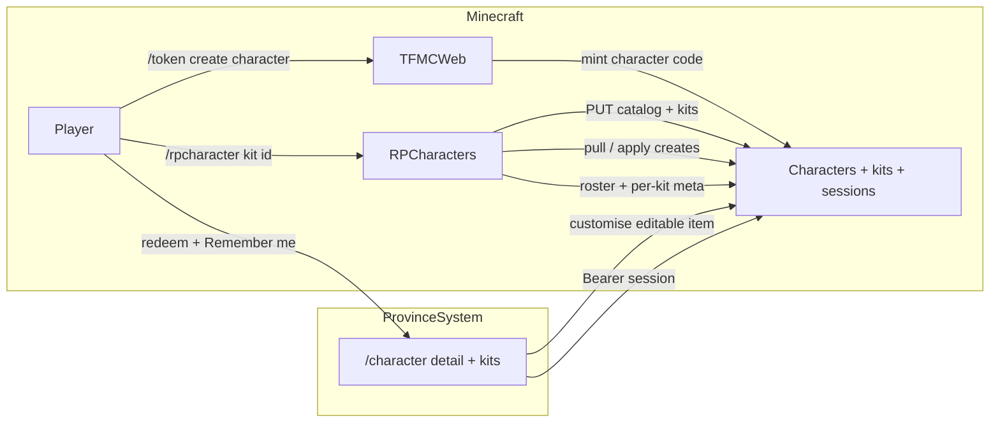

# 14 — Character creator (web + RPCharacters)

**Status:** Phase 1 **implemented** ([step-19](./batches/step-19/00-index.md)). Phase 2 multi-kit claim **implemented** ([step-20](./batches/step-20/00-index.md) / [21.06](./batches/step-21/06-kit-claim-command.md) / [21.08](./batches/step-21/08-kits-yml-and-kit-service.md)). Phase 3 character kits UI **implemented** ([21.09](./batches/step-21/09-kits-web-character-ui.md)); docs [21.05](./batches/step-21/05-docs-verify.md) **done**. Phase 4 deferred.  
**Repos:** `Workspace/rpcharacters/` · `ProvinceSystem` · `Workspace/tfmcweb/` · `frontend` · (Phase 3) `Workspace/armourshop/`  
**Depends on:** TFMCWeb identity + `/token create character` ([13-tfmcweb.md](./13-tfmcweb.md) / [step-17](./batches/step-17/00-index.md)).

Companion batches: [step-19](./batches/step-19/00-index.md) (Phase 1) · [step-20](./batches/step-20/00-index.md) (Phase 2 kits) · [step-21](./batches/step-21/00-index.md) (Phase 3 kits + lore customise).

---

## Why

Donators (and later all players) create and manage RP characters on the website with the **same rules as in-game** `/rpcharacter create` / menu. Creation stages sync from the server so YAML edits update the site after reload. Auth stays **in-game tokens** (no website accounts). Configurable kits and editable kit items layer on top of Phase 1.

---

## Four phases

| Phase | Name | In scope |
|-------|------|----------|
| **1** | Web character creator | Attribute point-buy in RPC; creation catalog sync; character redeem + Remember me; create + list alive/dead; `/character` UI — **done** |
| **2** | Kits in RPCharacters | `kits.yml`; `KitService`; `/rpcharacter kit <id>`; per-kit cooldown + once-per-character — **done** ([step-20](./batches/step-20/00-index.md) / [21.06](./batches/step-21/06-kit-claim-command.md) / [21.08](./batches/step-21/08-kits-yml-and-kit-service.md)) |
| **3** | Kit item customise | Character detail → Kits → Edit editable items; player skins → `ps_items`; RPC lore; NBT preview; hold claim while `pending_skin` — **done** ([step-21](./batches/step-21/00-index.md) / [21.09](./batches/step-21/09-kits-web-character-ui.md)) |
| **4** | Character skin wardrobe | Optional Mojang/player skins (incl. masked texture); separate from item `/skins` and RP identity masks |

Phase 3 **requires** Phase 2 kit claim in RPC. Phase 4 is independent of kit/lore.

---

## Locked decisions (Phase 1)

### Auth

| Decision | Choice |
|----------|--------|
| Proof of account | In-game `/token create character` (UUID-bound, Discord-eligible) |
| Code lifetime | **Single-use** — redeem once, then invalid |
| After redeem | API **session** Bearer (same pattern as skins) — not “stay logged in with the raw code” |
| Default session TTL | **1 hour** (match skins) |
| Remember me | Checkbox on redeem → session TTL **30 days** |
| Storage | Browser: sessionStorage if not remembered; localStorage if Remember me (still expiry-checked) |
| Logout | Explicit **Log out** — clear browser session + `POST` revoke on API |
| Website accounts | **None** — no passwords; mint a new in-game token when session expires |

### Attribute point-buy (replaces `attributes_selection_stage` trait picks)

Today’s `str1`/`str2`… discrete traits with `cost: 1|2` and stage `points: 12` become a **sheet**:

| Rule | Value |
|------|-------|
| Attributes | `strength`, `dexterity`, `constitution`, `intelligence`, `wisdom`, `charisma` (`rpcharacters` `config.yml` `attributes:`) |
| Pool | **12** points — **must spend exactly 12** |
| Max rank per attribute at creation | **+2** |
| Cost to buy the *n*-th rank in one attribute | **n** points (1st → 1, 2nd → 2) |
| Cost to reach +2 in one stat | **1 + 2 = 3** |
| All six at +2 | **18** points — impossible on a 12 pool → **forced specialization** |
| UX (in-game + web) | One GUI/sheet: all six rows, remaining points, +/−; not multi-select of I/II icons |
| Stage type | New type (e.g. `attributes` / `point_buy`) — **not** another `selection` |
| Persistence | Ranks → same MMOCore modifiers as today (`strength.1` per rank, etc.); stop requiring `str1`/`str2` trait ids for creation |
| Sync | Formula + caps + pool exported in creation catalog so web cannot drift |

Personality / physical / celestial / story traits stay **selection** stages unless later redesigned.

### Creation catalog sync

Mirror ArmourShop catalog sync ([step-18/01](./batches/step-18/01-catalog-sync.md)):

- RPCharacters on enable/reload (+ admin sync command) **PUT**s a full-replace snapshot to ProvinceSystem.
- Payload includes: stage order/types, option lists (races, traits, classes from MMOCore at sync time), validation rules (name/age/description/clues), slot limits by permission group, **attribute point-buy formula**.
- Web **GET**s snapshot for the wizard; never hardcodes stage lists in the frontend.

### Characters API + ownership

| Concern | Owner |
|---------|--------|
| Source of truth for living characters | **RPCharacters** (JSON / plugin data) |
| Web drafts / create requests / sessions | **ProvinceSystem** Characters API |
| Apply web creates into RPC | RPCharacters (or TFMCWeb bridge) pull/ingest — **not** website writing plugin files directly |
| Identity + mint | TFMCWeb + existing Discord link |
| Item skins / lore knife / Mojang skins | Out of Phase 1 |

### Product / UI

| Decision | Choice |
|----------|--------|
| Nav | New **Character** tab beside Map and Skins |
| Landing | Session → list characters (alive + dead); CTA to create if free slot |
| Create | Multi-step wizard from synced stages; summary before commit |
| Visual bar | Match skins submission quality (expressive UI, one job per step — see frontend design rules) |
| Slots | Enforce synced limits (default 3; Gilded 4; Ascended/Legacy 5; hard cap 10) |
| Dead characters | Viewable; do not consume alive slots (same as in-game) |
| Dual path | In-game `/rpcharacter create` remains; both paths share validation + point-buy rules |

---

## Locked decisions (Phase 2 — kits)

Replace ConditionalEvents `/tfmc starter` (see `Workspace/plugins/ConditionalEvents/events/a_boosters.yml` `tfmc_starter`) with RPCharacters-owned **configurable kits**.

### Source kit (current CE baseline → kit id `starter`)

| Give | Id / command |
|------|----------------|
| Hunting knife | `mi give TOOLS IRON_HUNTING_KNIFE …` |
| Food | `mi give FOODS CHURRO …` (256) |
| Gold | `mi give CURRENCY GOLD_COIN …` (32) |
| Vanilla | oak boat, writable book, bundle, white bed |

`starter` ships the **full CE list** in `kits.yml`. CE `one_time: true` is replaced by per-kit rules below.

### Grant rules (product truth)

| Rule | Choice |
|------|--------|
| Config | `plugins/RPCharacters/kits.yml` — named kits; items; optional `editable` per item |
| Service | `KitService` — **no** starter-hardcoded type/name in code |
| Claim command | `/rpcharacter kit <kitId>` with that character **active**. No auto-grant on join, reload, or create |
| Cooldown | **Per kit** (player UUID × kit id), hours from that kit’s `cooldown-hours` |
| Once per character | Per kit `once-per-character: true|false`. `true` (starter): at most one successful claim per character. `false`: claim again after that kit’s cooldown expires |
| Claim blocked | That kit’s cooldown active; once-per-character already `granted`; **or** (Phase 3) customise for that kit is `pending_skin` — hold **whole kit** until `ready` |
| Create during cooldown | Always allowed; claim when that kit’s cooldown is clear |
| Player messaging | Discord (and ops). **Do not** add tip/nudge copy in FE/RPC |
| Sync | All kit defs + per-character per-kit status + per-kit cooldown remaining → ProvinceSystem |
| Truth | Claim + flags live in **RPCharacters**; website displays synced state |

**Code note:** 20.01–20.03 auto-grant era; 21.06 claim for starter-shaped `kit.yml`. Multi-kit cutover: [21.08](./batches/step-21/08-kits-yml-and-kit-service.md).

### `kits.yml` shape (illustrative)

```yaml
kits:
  starter:
    display-name: Starter
    cooldown-hours: 48
    once-per-character: true
    items:
      - path: m.tools.IRON_HUNTING_KNIFE
        amount: 1
        editable:
          skin-png: knife_skin
          base-set: knives
      - path: m.currency.GOLD_COIN
        amount: 32
      # … churro, boat, book, bundle, bed
```

Default knife texture: `plugins/RPCharacters/assets/knife_skin.png` (do **not** scrape `tfmc_pack`). Custom skins are **player submissions** (Discord → `tfmc_submissions` / `ps_items`).

### Checkpoint (Phase 2)

```text
kits.yml → /rpcharacter kit <id> → per-kit cooldown + once-per-character from config
```

Batches: [step-20](./batches/step-20/00-index.md) plumbing; claim + multi-kit: [21.06](./batches/step-21/06-kit-claim-command.md) / [21.08](./batches/step-21/08-kits-yml-and-kit-service.md).

---

## Locked decisions (Phase 3 — kit item customise)

Customise **editable** kit lines (starter knife = same `IRON_HUNTING_KNIFE`). Not a different MI id. Batches: [step-21](./batches/step-21/00-index.md).

| Concern | Owner |
|---------|--------|
| Texture + display name | Player skins pipeline → `ps_items` via Discord |
| Custom lore | RPCharacters |
| Which parts editable | `kits.yml` `editable` (`base-set` / `skin-png` locked; no staff `category`) |
| When / where | **Website character screen:** ALIVE character → Kits → kit → Edit editable item. **Not** create wizard; in-game create has no kit editor |
| Eligibility | Customise while that kit is still **claimable** for the character. Once-per-character + already claimed → no customise |
| Claim gate | `pending_skin` for that kit+character blocks `/rpcharacter kit <id>` until `ready`; claim applies skin+lore |
| Web UI | Character detail (menu-like) + kits browser + item editor (NBT preview); show all items, Edit only on editable |
| Sync | **All** kits from RPC → API → site |
| Extensibility | More kits / editable lines via YAML the same way |

**Out of Phase 3:** Ascended gate; tip/nudge copy (Discord owns messaging).

**Code note:** 21.07 added create-wizard customise — **superseded** by [21.09](./batches/step-21/09-kits-web-character-ui.md). Multi-kit RPC: [21.08](./batches/step-21/08-kits-yml-and-kit-service.md).

---

## Architecture (Phase 1 + kits + web customise)



---

## Out of Phase 1

- Player/Mojang skin wardrobe (Phase 4)
- Rewriting non-attribute selection stages into sheets
- Website passwords / OAuth

Phase 2 kit plumbing + claim: [step-20](./batches/step-20/00-index.md) / [21.06](./batches/step-21/06-kit-claim-command.md); multi-kit **21.08** — **implemented**.  
Phase 3: character kits UI **21.09**; docs **21.05** — **implemented**.

---

## Checkpoint (Phase 1)

```text
RPC attribute sheet → catalog sync → character redeem (+ Remember me / logout)
  → create via web → ingest into RPC → list alive/dead on /character
```

**Done when:** Linked player mints character token → redeem (optional Remember me) → completes wizard with attribute sheet → character appears in RPCharacters and on the site (including dead list when applicable); in-game create still works with the same attribute rules. **Phase 1 staging verified.**
