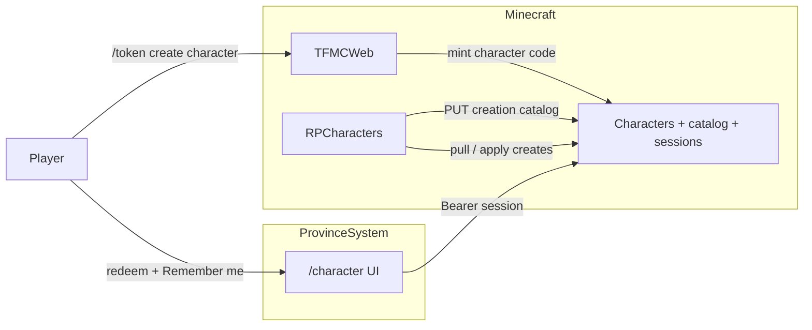

# 14 — Character creator (web + RPCharacters)

**Status:** Phase 1 **implemented** ([step-19](./batches/step-19/00-index.md) 19.01–19.06). Phases 2–4 deferred. Tick staging in [STAGING.md](../STAGING.md) / [06-docs-verify](./batches/step-19/06-docs-verify.md).  
**Repos:** `Workspace/rpcharacters/` · `ProvinceSystem` · `Workspace/tfmcweb/` · `frontend`  
**Depends on:** TFMCWeb identity + `/token create character` ([13-tfmcweb.md](./13-tfmcweb.md) / [step-17](./batches/step-17/00-index.md)); prefer Step 17 staging green before pre-launch donator access.

Companion batches: [step-19](./batches/step-19/00-index.md).

---

## Why

Donators (and later all players) create and manage RP characters on the website with the **same rules as in-game** `/rpcharacter create` / menu. Creation stages sync from the server so YAML edits update the site after reload. Auth stays **in-game tokens** (no website accounts). Extra cosmetics (lore knife, player skins) are optional later layers — not required for Phase 1.

---

## Four phases

| Phase | Name | In scope |
|-------|------|----------|
| **1** | Web character creator | Attribute point-buy in RPC; creation catalog sync; character redeem + Remember me; create + list alive/dead; `/character` UI (skins-quality) |
| **2** | Starter kit in RPCharacters | Per-character kit (incl. hunting knife) + 48h cooldown; migrate off ConditionalEvents-only starter when ready |
| **3** | Ascended lore knife | Approve/deny custom name/lore/skin for kit knife; catalog or upload |
| **4** | Character skin wardrobe | Optional Mojang/player skins (incl. masked texture); separate from item `/skins` and RP identity masks |

Phases 2–4 **must not** block Phase 1. Knife and player skins remain fully optional even after those systems exist.

---

## Locked decisions (Phase 1)

### Auth

| Decision | Choice |
|----------|--------|
| Proof of account | In-game `/token create character` (UUID-bound, Discord-eligible) |
| Code lifetime | **Single-use** — redeem once, then invalid |
| After redeem | API **session** Bearer (same pattern as skins) — not “stay logged in with the raw code” |
| Default session TTL | **1 hour** (match skins) |
| Remember me | Checkbox on redeem → session TTL **30 days** |
| Storage | Browser: sessionStorage if not remembered; localStorage if Remember me (still expiry-checked) |
| Logout | Explicit **Log out** — clear browser session + `POST` revoke on API |
| Website accounts | **None** — no passwords; mint a new in-game token when session expires |

### Attribute point-buy (replaces `attributes_selection_stage` trait picks)

Today’s `str1`/`str2`… discrete traits with `cost: 1|2` and stage `points: 12` become a **sheet**:

| Rule | Value |
|------|-------|
| Attributes | `strength`, `dexterity`, `constitution`, `intelligence`, `wisdom`, `charisma` (`rpcharacters` `config.yml` `attributes:`) |
| Pool | **12** points — **must spend exactly 12** |
| Max rank per attribute at creation | **+2** |
| Cost to buy the *n*-th rank in one attribute | **n** points (1st → 1, 2nd → 2) |
| Cost to reach +2 in one stat | **1 + 2 = 3** |
| All six at +2 | **18** points — impossible on a 12 pool → **forced specialization** |
| UX (in-game + web) | One GUI/sheet: all six rows, remaining points, +/−; not multi-select of I/II icons |
| Stage type | New type (e.g. `attributes` / `point_buy`) — **not** another `selection` |
| Persistence | Ranks → same MMOCore modifiers as today (`strength.1` per rank, etc.); stop requiring `str1`/`str2` trait ids for creation |
| Sync | Formula + caps + pool exported in creation catalog so web cannot drift |

Personality / physical / celestial / story traits stay **selection** stages unless later redesigned.

### Creation catalog sync

Mirror ArmourShop catalog sync ([step-18/01](./batches/step-18/01-catalog-sync.md)):

- RPCharacters on enable/reload (+ admin sync command) **PUT**s a full-replace snapshot to ProvinceSystem.
- Payload includes: stage order/types, option lists (races, traits, classes from MMOCore at sync time), validation rules (name/age/description/clues), slot limits by permission group, **attribute point-buy formula**.
- Web **GET**s snapshot for the wizard; never hardcodes stage lists in the frontend.

### Characters API + ownership

| Concern | Owner |
|---------|--------|
| Source of truth for living characters | **RPCharacters** (JSON / plugin data) |
| Web drafts / create requests / sessions | **ProvinceSystem** Characters API |
| Apply web creates into RPC | RPCharacters (or TFMCWeb bridge) pull/ingest — **not** website writing plugin files directly |
| Identity + mint | TFMCWeb + existing Discord link |
| Item skins / lore knife / Mojang skins | Out of Phase 1 |

### Product / UI

| Decision | Choice |
|----------|--------|
| Nav | New **Character** tab beside Map and Skins |
| Landing | Session → list characters (alive + dead); CTA to create if free slot |
| Create | Multi-step wizard from synced stages; summary before commit |
| Visual bar | Match skins submission quality (expressive UI, one job per step — see frontend design rules) |
| Slots | Enforce synced limits (default 3; Gilded 4; Ascended/Legacy 5; hard cap 10) |
| Dead characters | Viewable; do not consume alive slots (same as in-game) |
| Dual path | In-game `/rpcharacter create` remains; both paths share validation + point-buy rules |

---

## Architecture (Phase 1)



---

## Out of Phase 1

- Starter kit / hunting knife grant and cooldown (Phase 2)
- Lore knife customiser (Phase 3)
- Player/Mojang skin wardrobe and masked textures (Phase 4)
- Rewriting non-attribute selection stages into sheets
- Website passwords / OAuth

---

## Checkpoint (Phase 1)

```text
RPC attribute sheet → catalog sync → character redeem (+ Remember me / logout)
  → create via web → ingest into RPC → list alive/dead on /character
```

**Done when:** Linked player mints character token → redeem (optional Remember me) → completes wizard with 12-point attribute sheet → character appears in RPCharacters and on the site (including dead list when applicable); in-game create still works with the same attribute rules.
