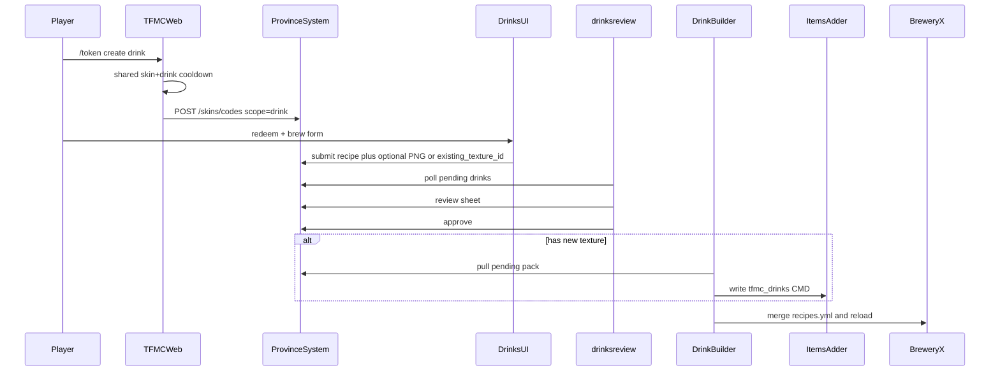

# 15 — Drink Builder (BreweryX donator drinks)

**Status:** Code **done** (step-31.02–31.08). Docs/cutover **31.09**. Operator staging smoke in [STAGING.md](../STAGING.md) Step 31.

End-to-end design for donator **custom BreweryX recipes**: token → website brew form → Discord review → DrinkBuilder writes ItemsAdder `tfmc_drinks` (optional texture) + merges `recipes.yml`.

**Repos:** `Workspace/drinkbuilder/` (new plugin) · `Workspace/tfmcweb/` · `ProvinceSystem/` · `tfmc_bot/` · ItemsAdder `tfmc_drinks` · BreweryX  
**Batches:** [step-31](./batches/step-31/00-index.md)  
**Related:** skins [05](./05-skins-system.md) · TFMCWeb [13](./13-tfmcweb.md) · flows [12](./12-end-to-end-flows.md)

## Goals

- Replace the closed-source DrinkBuilder GUI + staff-ticket screenshot flow with TFMCWeb token + website + Discord review (same pattern as skins).
- Curated ingredient allowlist in DrinkBuilder (vanilla / MMOItems / ItemsAdder) synced to the site — **not** every MMOItems/IA item.
- Optional custom potion PNG → IA `tfmc_drinks` with forced CMD; BreweryX `customModelData` matches (no brew-event texture swap).
- Texture **reuse** across drinks (refcount); staff delete drink without orphaning shared skins.
- **Shared mint cooldown** skin↔drink owned by **TFMCWeb** (retire ProvinceSystem / ArmourShop skin mint cooldown).

## Locked product rules

| Rule | Choice |
|------|--------|
| Token | `/token create drink` → scope `drink`; redeem on `/drinks` |
| Shared cooldown | Skin + drink share one clock; config **only on TFMCWeb**; PS no longer enforces mint cooldown days |
| Staff cooldown reset | `/token resetcooldowns <player>` (`tfmcweb.token.resetcooldowns`) — clears shared clock without deleting codes |
| Staff mint | Optional later; staff bypass cooldown (like `skin_staff`) |
| Noble | Can mint drink; **color-only** (no custom texture upload/reuse) |
| Gilded+ | Can upload texture **or** reuse an existing owned drink texture |
| Ascended / Legacy | Same texture rights as Gilded; shorter shared cooldown |
| Defaults / non-ranked | Cannot mint (cooldown deny) |
| Ingredients | Allowlist in DrinkBuilder `ingredients.yml`; sync catalog to PS/web |
| Category labels | `categories.yml` → human titles on website picker |
| Name colours | DrinkBuilder `permission-groups.yml` → `name_colour_stops` on join meta (not ArmourShop) |
| IA ingredients | BreweryX native: `itemsadder:namespace:id/amount` (IAOraxenAddon archived / integrated) |
| MMOItems | `MMOItems:ID/amount` (matches live recipes) |
| Texture base | Vanilla **potion** + CMD — never paper |
| IA namespace | **`tfmc_drinks`** (separate from ArmourShop `tfmc_submissions` / `tfmc_armorshop`) |
| Color xor texture | Color-only **or** custom texture, not both |
| Player commands | No `servercommands` / `playercommands` on player submits |
| Effects | Config blacklist (port old DrinkBuilder list) |
| Review | One Discord submission = recipe + optional texture / color sheet |
| Apply order | Approve → (if texture) pending pack → write IA + assign CMD → merge BreweryX recipe → reload |
| Delete | `/drinkbuilder drink delete <id>`; remove recipe; delete IA texture only if refcount = 0 |
| Old GUI | Retire `/tfmc drinks` (CE) → `/token create drink` + `/drinks` (31.09) |

## Rank ladder (mint + texture)

| Rank | Shared cooldown | Mint drink | Custom texture |
|------|-----------------|------------|----------------|
| defaults | disallowed | no | no |
| Noble | 28 days | yes | no (color only) |
| Gilded | 21 days | yes | yes |
| Ascended | 14 days | yes | yes |
| Legacy | 7 days | yes | yes |

Cooldown live in TFMCWeb token-cooldown config (LP nodes `rpchar.group.*`). DrinkBuilder `permission-groups.yml` owns drink **name colour stops** + **allow-drink-texture**. ArmourShop keeps skins **upload** entitlements (kinds, colour stops, 3D bytes, armor 3D helmet) — **not** mint cooldown or drink colours after cutover.

## High-level flow

## Ingredient allowlist (first draft)

Seed file: [drink-ingredients-draft.yml](./assets/drink-ingredients-draft.yml) (prune in ops).

Sources: vanilla brew staples · ItemsAdder **`tfmc_cooking`** (replaces old `food:` pack; all produce/spices from `ingredients.yml` + pantry staples from `items.yml`) · MMOItems pantry + full herb set + **legacy MMO fruit/spice ids** still referenced by live `recipes.yml`.

**Note:** Until `tfmc_cooking` is deployed under live ItemsAdder contents, fruit/spice tokens in **existing** `recipes.yml` still say `MMOItems:GRAPE` etc. Draft includes both IA `itemsadder:tfmc_cooking:…` (intended) and MMO legacy rows labeled `(MMO legacy)` so you can prune one side after cutover.

## Texture / CMD

1. Allocate CMD from reserved range (e.g. 20000–29999) owned by DrinkBuilder.
2. Write IA item under `tfmc_drinks` with `material: POTION`, `model_id: <cmd>`, player PNG.
3. Brewery recipe `customModelData: <cmd>` (optional quality `a/b/c` later).
4. Reuse: new drink references `texture_id`; same CMD; refcount++.
5. Color-only: Brewery `color:`; review sheet uses tinted `potion_overlay` + `glass_bottle` (synced from DrinkBuilder).

## Data (ProvinceSystem)

Tables (step-31.03):

- `drink_submissions` — recipe JSON, status (`pending` / `approved` / `pending_pack` / `applied`), player UUID, optional `texture_id`, `new_texture`
- `drink_textures` — owner UUID, CMD, IA id, refcount, png path
- `drink_catalog` — ingredients allowlist + category labels + effects blacklist (plugin sync)
- `drink_player_meta` — `allow_drink_texture` + `name_colour_stops` (DrinkBuilder join push)
- `drink_notifications` — staff/bot outbox

**API (`/drinks`):** redeem · submit · catalog · staff pending/approve/deny · plugin catalog/meta.

## Plugin surface (DrinkBuilder)

**Repo:** `Workspace/drinkbuilder/` (31.04 scaffold · **31.07 pack pull live**).

| Command | Role |
|---------|------|
| `/drinkbuilder reload` | Reload config + ingredients + categories + permission-groups + blacklist; re-push catalog + online meta |
| `/drinkbuilder catalog sync` | Push ingredients + categories + effects blacklist to PS |
| `/drinkbuilder pack pull [force]` | Pull approved / pending-pack → IA + Brewery merge + reload + ack applied |
| `/drinkbuilder drink delete <id>` | Remove Brewery recipe; revoke PS; free IA/CMD iff texture refcount 0 |
| `/drinkbuilder list` | Active player drinks (later) |

Config: `ingredients.yml` · `categories.yml` · `permission-groups.yml` · `effects-blacklist.yml` · `assets/` (`glass_bottle.png` + `potion_overlay.png`, synced to PS on reload) · CMD range · BreweryX / IA paths · API key · `ia-reload-delay-seconds`.  
Join push: `allow_drink_texture` + `name_colour_stops` from `permission-groups.yml`.  
CMD allocator + `tfmc_drinks` IA scaffold + pack writers (31.07) + delete reverse (31.08). RecipesYmlMerger bakes `&#rrggbb` colour stops into name/lore/message/title.

**PS plugin apply/delete:** `GET /drinks/plugin/pending-apply` · file GET · `POST …/textures/{id}/cmd` · `POST /drinks/plugin/applied` · `GET/POST /drinks/plugin/drinks/…` (deletable / get / revoke).  
**Reuse:** `GET /drinks/textures` lists owned applied textures only; submit requires `cmd` set.

## Website

- `/drinks` redeem + brew editor + `/drinks/[id]` status (31.05)
- Session key `tfmc_drinks_session`; gate texture UI on `allow_drink_texture`; `NameColourPicker` on names/lore/message/title gated by `name_colour_stops`
- Recipe fields: name / quality names (+ colours), ingredients (modal picker), cooking/distill checkbox/age/wood/difficulty/alcohol, lore, effects (modal), drink message/title, glint, color **xor** PNG/reuse
- Appearance KindPicker-style cards; file upload as real button; tinted potion preview via `GET /drinks/assets/{glass_bottle|potion_overlay}.png` + ModelPreview
- PNG: 16×16 potion icon; empty catalog shows staff sync hint
- Ingredient picker from `GET /drinks/catalog` (search + category labels)

## Discord

**Done (31.06):** thin [`drinksreview`](../../tfmc_bot/drinksreview/) cog polls `/drinks/staff/pending`, posts recipe embed + review sheet (texture or tinted overlay+bottle), Approve/Deny once; player DMs via drink notifications outbox.

## Cutover

1. **Done (31.02):** TFMCWeb shared cooldown; PS `issue_code` no longer gates mint days; AS `skin-token-cooldown-days` deprecated for mint.
2. **Deploy on staging (31.09):** DrinkBuilder jar + empty `tfmc_drinks` — see [STAGING.md](../STAGING.md) Step 31.
3. **Deploy on staging (31.09):** Website `/drinks` + `drinksreview` bot — same STAGING section.
4. **Done (31.09 docs):** ConditionalEvents `/tfmc drinks` retired — event file renamed to `drinkbuilder.yml.disabled`; players use `/token create drink` then redeem on `/drinks`.

**Still later:** `/drinkbuilder list` (active player drinks).

## Out of scope (this playbook)

- Migrating every hand-authored Brewery recipe to IA fruit tokens
- Player-authored servercommands
- ArmourShop writing drinks
- Brewery cauldron.yml auto-entries (optional later)
