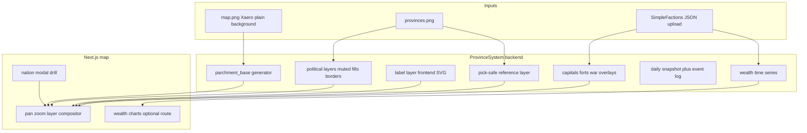

# 16 — Map platform

**Status:** Planning lock **done** (step-36.01). Implementation **steps 37–42 + 47 + 48 + 49 code done**. **Step 43 next**. Steps 44–46 planned.  
**Repos:** `ProvinceSystem` (FE + BE mapgen) · `Workspace/simplefactions` (export + upload) · `Workspace/tfmcweb` (staff map gate)  
**Batches:** [step-36](./batches/step-36/00-index.md) (lock) · [step-37](./batches/step-37/00-index.md)–[step-49](./batches/step-49/00-index.md)  
**Technical refs:** [09-map-system.md](./09-map-system.md) · [04-map-performance.md](./04-map-performance.md)  
**Related:** flows [12](./12-end-to-end-flows.md) · TFMCWeb [13](./13-tfmcweb.md)

## Goals

Turn the live political map from flat colour blobs into a **fantasy cartography product**: parchment terrain, muted realm overlays, nation labels (straight text v1; curved `textPath` deferred), rich nation popups, settlements and forts, war layers, daily chronicle snapshots, and wealth analytics — while staying fast on desktop and mobile.

## Requirement → step

| # | Requirement | Step |
|---|-------------|------|
| 1 | Fast refined layout | [37](./batches/step-37/00-index.md) |
| 2 | Xaero world map → colour base + optional ink parchment | [38](./batches/step-38/00-index.md) · [39](./batches/step-39/00-index.md) — **done** |
| 3 | Fantasy muted nation overlays (faithful-hue parchment washes) | [38](./batches/step-38/00-index.md) · [39](./batches/step-39/00-index.md) — **done** |
| 4 | Nation names on continuous territory (frontend SVG, graph diameter) | [40](./batches/step-40/00-index.md) — **done** |
| 4b | Title + trade labels; Calavorn terrain/fertility/trade modes | [47](./batches/step-47/00-index.md) — **done** |
| 4c | Label neighbor graph (water bridges ≤100px; labels only) | [48](./batches/step-48/00-index.md) — **done** |
| 4d | Pan and zoom (wheel + middle-mouse pan, clamped bounds) | [49](./batches/step-49/00-index.md) — **done (code)** |
| 5 | Visual parity with site hub / shell | [37](./batches/step-37/00-index.md) |
| 6 | Staff-only maps (configurable per `mapId`) | [41](./batches/step-41/00-index.md) — **done** |
| 7 | Click → nation modal; Ctrl+click → drill | [37](./batches/step-37/00-index.md) |
| 8 | Named capitals / guild settlements on map | [42](./batches/step-42/00-index.md) — **done** |
| 9 | Forts + zone of control | [43](./batches/step-43/00-index.md) |
| 10 | Wars / frontlines / campaigns | [44](./batches/step-44/00-index.md) (blocked on SF war rework) |
| 11 | Daily map snapshots + changelog | [45](./batches/step-45/00-index.md) |
| 12 | Nation / global wealth charts over time | [46](./batches/step-46/00-index.md) |

## Architecture

### Layer model

| Layer | Source | Purpose |
|-------|--------|---------|
| `parchment_base` | `input/{map}/map.png` + grade/texture → `output/.../parchment_base.png` | Terrain backdrop |
| `political_{mode}` | `provinces.png` + nation defines | Desaturated fills, borders, hover |
| `labels_{mode}` | Province graph + nation names (frontend SVG) | Straight text per contiguous blob; curved `textPath` deferred |
| `markers` | SF export (`capitals`, `forts`, …) | Town/fort icons |
| `war_{id}` | SF war export | Frontlines, contested tint |
| `pick_{mode}` | Raw RGB map (`apply_overrides=False`) | Hit-testing only; never styled away |

Pick layer must stay separate from display (see [`mapgen.py`](../backend/src/scripts/mapgen/mapgen.py) `apply_overrides=False` rule) so vassal pixels remain selectable.

## Locked product rules

| Rule | Choice |
|------|--------|
| Grid alignment | `map.png` and `provinces.png` share the same pixel grid per `mapId` |
| Nation colour | Desaturated/dulled vs raw `rgb` in nation.json; parchment masked interior optional |
| Interaction | **Click** → nation detail modal; **Ctrl+click** (Cmd on Mac) → drill into subjects; mobile: tap + explicit drill |
| Staff maps | Gated by profile Bearer session + `permission_flags["tfmc.map.staff"]` from TFMCWeb/LP sync; `public` vs staff per map in PS `maps.yml` + SF `mapRef` — see [step-41/01-planning-lock](./batches/step-41/01-planning-lock.md) |
| SF export | Draft schema: [`assets/map-export-schema.json`](./assets/map-export-schema.json) |
| Wars | **Do not infer** frontlines from territory diffs alone; require SF war rework export ([step-43](./batches/step-43/00-index.md)) |
| Chronicle | Daily composited snapshot + structured event log (prefer SF-emitted events over pure JSON diff) |
| Wealth history | Append-only time series from nation upload `balance` + global aggregate |

## SimpleFactions contract (summary)

Nation upload (`nation.json`) already carries `balance`, `provinces`, `relations`, etc. Extensions for map platform live in [`map-export-schema.json`](./assets/map-export-schema.json):

- `capitals` — faction + guild named capitals with province id and map pixel coords
- `settlements` — guild towns beyond distance threshold from faction capital
- `forts` — fort id, province, ZOC province list
- `wars` — belligerents, frontline province ids, campaign markers (when war rework ships)
- `events` — explicit chronicle events (war declared, province taken, capital moved, …)
- `global_wealth` — optional aggregate for charts

Capitals must be **named in-game** via SF (`setcapital` / guild capital rules) before they appear on the web map.

## Build order (steps)

1. **[36](./batches/step-36/00-index.md)** — Planning lock (this playbook + hub docs) **done**
2. **[37](./batches/step-37/00-index.md)** — Site UX, interaction, perf (crop overlays, mobile). Vote links removed from map; restore later on dedicated vote page. **done**
3. **[38](./batches/step-38/00-index.md)** — Parchment pipeline + muted political layers **done**
4. **[39](./batches/step-39/00-index.md)** — Ink cartography (colour base default, parchment washes, uniform borders) **done**
5. **[40](./batches/step-40/00-index.md)** — Nation labels (frontend SVG, province graph) **done**
6. **[41](./batches/step-41/00-index.md)** — Staff map access **done**
7. **[42](./batches/step-42/00-index.md)** — Capitals / settlements (SF + PS + TFMCWeb + FE) — **done**
8. **[43](./batches/step-43/00-index.md)** — Forts + ZOC (SF + PS) — **next**
9. **[44](./batches/step-44/00-index.md)** — War layer (**blocked on SF war rework**)
10. **[45](./batches/step-45/00-index.md)** — Map chronicle (snapshots + log)
11. **[46](./batches/step-46/00-index.md)** — Wealth history + charts

## Out of scope (v1 map platform)

- Vector / WebGL map engine rewrite
- Auto-generated oversimplified animation video (store frames + events for future tooling)
- Rewriting mapgen in another language

## Success criteria (map platform MVP)

- Parchment terrain + muted nations readable on desktop and phone
- Click nation → modal with size, subjects, culture, relations, wealth
- `main` public; staff maps hidden without permission
- Named capitals visible when SF exports them
- Daily snapshot + diff/event log stored
- Nation wealth chart over season (minimum: line per top nations + global total)

Operator checklists: [STAGING.md](../STAGING.md) Steps 37–45 (added as each step lands).
