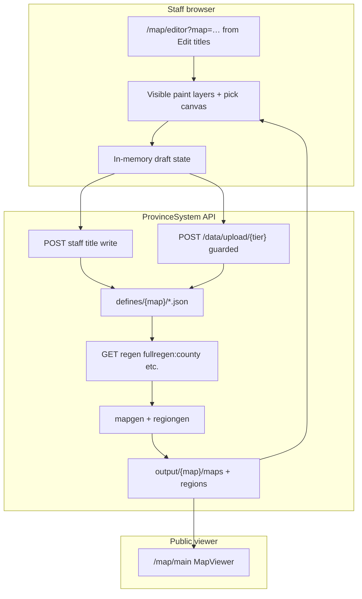

# 17 — Map title editor

**Status:** Planning lock **done** (step-72.01). Implementation **shipped** (steps 72.02–72.11 done). **Follow-up** [step-73](./batches/step-73/00-index.md) UX polish + performance **done** (73.01–73.07). **Follow-up** [step-74](./batches/step-74/00-index.md) offline ZIP export - **74.01 lock done**.  
**Repos:** `ProvinceSystem` (FE + BE)  
**Batches:** [step-72](./batches/step-72/00-index.md) · [step-73](./batches/step-73/00-index.md) · [step-74](./batches/step-74/00-index.md)  
**Technical refs:** [09-map-system.md](./09-map-system.md) · [16-map-platform.md](./16-map-platform.md) · legacy Tkinter [`county_editor.py`](../backend/src/editor/county_editor.py)  
**Related:** staff map gate [step-41](./batches/step-41/00-index.md) · title rollup [step-47](./batches/step-47/00-index.md) · colour picker UX [step-23](./batches/step-23/00-index.md)

## Goals

Ship a **staff-gated web map editor** so lore/map staff (non-technical users) can set up the political title hierarchy without editing JSON or running Tkinter tools:

1. **Combine provinces into counties** - click provinces on the map, name the county, pick a title colour.
2. **Combine counties into duchies** (and duchies into kingdoms, kingdoms into empires) - same UX at each tier.
3. **Edit existing titles** - rename, change colour, add/remove members, delete a title.
4. **Clear visual layers** - selection layer (child tier or unassigned) at lower opacity; active title being built/edited at high opacity.
5. **Live canvas feedback** - colours update on click before save (no regen wait for every click).
6. **Upload + regen** - save JSON to `defines/{map}/`, trigger mapgen so the public viewer reflects changes.

**Immediate operator goal (Calavorn / `main`):** Counties are roughly correct but need renaming; duchies and above should be wiped and rebuilt in the editor.

## Requirement → step

| # | Requirement | Step |
|---|-------------|------|
| 1 | Planning lock (data model, UX, auth, API) | [72.01](./batches/step-72/01-planning-lock.md) |
| 2 | Staff-authenticated write API + validation | [72.02](./batches/step-72/02-staff-write-api.md) |
| 3 | Title RGB colour picker (skins UX parity) | [72.03](./batches/step-72/03-title-rgb-picker.md) |
| 4 | Editor route, gate, shell layout | [72.04](./batches/step-72/04-editor-route-shell.md) |
| 5 | Province pick layer + live paint canvas | [72.05](./batches/step-72/05-province-pick-layer.md) |
| 6 | County mode (create + edit) | [72.06](./batches/step-72/06-county-mode.md) |
| 7 | Duchy mode (county selection) | [72.07](./batches/step-72/07-duchy-mode.md) |
| 8 | Kingdom + empire modes | [72.08](./batches/step-72/08-kingdom-empire-mode.md) |
| 9 | Save, upload, regen preview | [72.09](./batches/step-72/09-save-upload-regen.md) |
| 10 | Calavorn data prep (wipe duchy+, county rename pass) | [72.10](./batches/step-72/10-main-calavorn-prep.md) |
| 11 | Docs, STAGING, operator QA | [72.11](./batches/step-72/11-docs-verify.md) |

## Current state (before step 72)

| Piece | Status |
|-------|--------|
| Read-only map viewer (`MapViewer`, pan/zoom, pick canvas) | **Shipped** (steps 37–49) |
| Title JSON in `defines/{map}/` | **Static** - not SF-uploaded |
| `POST /{map}/data/upload/{mode}` | Writes JSON but **no auth** |
| Tkinter `county_editor.py` | Province click-select + live paint; not staff-gated or web |
| `NameColourPicker` | Hex gradient for MC names - not map `"R,G,B"` strings |
| Staff map gate (`tfmc.map.staff`) | **Shipped** on viewer GET routes (step 41) |

## Data model (locked)

Hierarchy bottom → top:

```text
Province  (provinces.txt: id = R,G,B;terrain;fertility)
  └── County   (county.json: provinces[], name, rgb, overlay)
        └── Duchy   (duchy.json: titles[] → county ids, name, rgb, overlay)
              └── Kingdom (kingdom.json: titles[] → duchy ids)
                    └── Empire (empire.json: titles[] → kingdom ids)
```

| Field | Rule |
|-------|------|
| `rgb` | Comma-separated `"R,G,B"` - unique per title **within the same tier file** for pick maps |
| `overlay` | Auto-computed on regen (`overlay_metadata.py`) - editor does not require manual bbox |
| `name` | Display string for labels and tooltips |
| Id keys | `COUNTY_N`, `DUCHY_N`, etc. - stable ids; editor generates next free id on create |

Nations and trade layers are **out of scope** for v1 editor (SF upload path).

## Architecture



### Layer model (editor)

| Layer | Opacity | Content |
|-------|---------|---------|
| Base terrain | 100% | `GET /{map}/map` parchment or satellite |
| Selection layer | ~35–45% | Child tier colours (e.g. existing counties when building a duchy) or unassigned provinces |
| Active layer | ~85–95% | Title being edited + current click selection |
| Pick canvas | hidden | Province or tier pick map (`mapdata/{mode}` or `provinces.png` RGB) |

Reference: Tkinter `county_editor.py` paints `rendered_map` then overlays `SELECT_COLOR` on selection.

## Auth (locked)

Same as staff map viewer (step 41):

1. Character page redeem → Bearer session.
2. `permission_flags["tfmc.map.staff"]` on `rpc_player_meta` for map `realm_id`.
3. Editor route and all write/upload/regen-trigger endpoints return **403** without permission.

`POST /data/upload/{mode}` for title tiers must be gated or replaced by dedicated staff routes (72.02).

## Entry and nav (locked step 73)

Supersedes 72.01 nav + map-selector rows. Full lock: [step-73/01-planning-lock](./batches/step-73/01-planning-lock.md).

| Piece | Choice |
|-------|--------|
| Global nav | No "Map editor"; no staff map links (e.g. Adavaar) in `SiteHeader` |
| Entry | **Edit titles** on `/map/{page}` when staff can write that map (or UI dev) |
| Editor URL | `/map/editor?map=main` or `?map=dev` (`map` query **required**) |
| Editor UI | Read-only map name; no map dropdown |
| Bare `/map/editor` | Redirect to `/map/main` or gate: open editor from map page |

**Performance (step 73):** Province index via `GET /{map}/editor/province-index` (gzip grid from committed `province_id_grid.bin.gz`). Canvas paint uses incremental subset updates; typing a title name does not repaint the full map. **Step 74.02:** grid file required; no on-demand rebuild or image fallback.

## Offline export (locked step 74)

Supersedes 72.09 save-to-server + editor regen UI. Full lock: [step-74/01-planning-lock](./batches/step-74/01-planning-lock.md).

| Piece | Choice |
|-------|--------|
| Persist | **Download ZIP** (`county.json`, `duchy.json`, `kingdom.json`, `empire.json`) |
| Reset | Revert all tiers to last **loaded** server snapshot |
| Regenerate | **Not in editor**; operator runs mapgen on host after merging ZIP |
| Open map | **Removed** from toolbar |
| Province grid | File-only `province_id_grid.bin.gz`; admin script when provinces change |
| Loading | Staged progress (% + stage label) |

Operator flow: staff downloads ZIP → operator merges `defines/{map}/` → mapgen on host → deploy. Calavorn runbook Phases A–C **Save to server** / **Regenerate** steps superseded by ZIP + operator mapgen (update in step 74.07).

## Calavorn operator runbook (`main`)

Repo state after step **72.10**: `duchy.json`, `kingdom.json`, and `empire.json` are empty `{}`. Counties are unchanged; lore staff rename and rebuild higher tiers in the editor. Pre-wipe snapshots live in [archive/main-pre-editor-wipe](./batches/step-72/archive/main-pre-editor-wipe/).

**After deploy:** run regen on staging then production so viewer layers drop stale duchy/kingdom/empire colours:

```text
fullregen:duchy
fullregen:kingdom
fullregen:empire
```

Or a single `fullregen` if you prefer a full rebuild.

### Phase A - County rename (lore staff)

1. From `/map/main`, click **Edit titles** (or open `/map/editor?map=main&tier=county`).
2. For each county: select, set lore name, adjust colour if needed, **Save to server**.
3. **Regenerate** `fullregen:county`.
4. Check `/map/main` county mode labels.

### Phase B - Rebuild duchies

1. Duchy tab: **New duchy**, name + colour, click counties on the map, **Save to server**.
2. Repeat for all duchies.
3. **Regenerate** `fullregen:duchy`.

### Phase C - Kingdom and empire

Same pattern on kingdom and empire tabs. Save each tier, then regen `fullregen:kingdom` and `fullregen:empire`.

### Phase D - QA

From `ProvinceSystem/backend`:

```bash
python -m src.scripts.util.validate_title_coverage main
```

Expect exit 0: every province in exactly one county; when duchies exist, each county in at most one duchy.

- Spot-check no duplicate rgb within a tier (editor blocks on save).
- Labels readable on `/map/main` for county, duchy, kingdom, and empire modes.

## Out of scope (v1)

- Editing `provinces.txt` or province geometry (use `province_editor.py` Tkinter tool).
- Nation / trade / guild political layers.
- Real-time multiplayer co-editing or draft locking.
- Curved label placement editing.
- Rewriting mapgen in the browser (regen stays server-side).

## Success criteria

- Lore staff can open the editor with profile login + `tfmc.map.staff`, pick `main` or `dev`, and work without touching JSON files.
- County mode: create county from province clicks, rename, recolour, add/remove provinces, delete county.
- Duchy mode: combine counties with clear selection vs active layers; same pattern for kingdom and empire.
- Save uploads JSON and optional regen shows updated colours on viewer within one operator flow.
- Calavorn: duchy/kingdom/empire cleared; counties renamed via editor; hierarchy rebuilt and visible on `/map/main`.

Operator checklist: [STAGING.md](../STAGING.md) Step 72 (added in 72.11).

## Next after step 72

- Optional: editor on `dev` map for dry-run before `main` publish.
- Optional: validate province coverage (every province in exactly one county) before save - CLI: `python -m src.scripts.util.validate_title_coverage main`.
- Chronicle / snapshot integration (step 45) can log title edits later.
