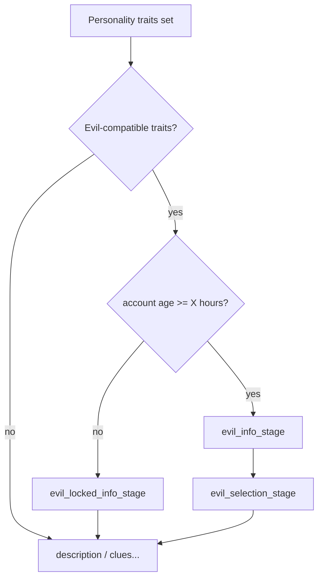

# Character creator polish (full batch)

Ordered batches so each session can ship alone. Account-age clock stays as today (`PlayerData.getAgeSeconds()` / wall time since account `createdAt`); gates and sync use **seconds**, display as **hours**. Hour rollover is accurate because the check is `ageSeconds >= hours * 3600` at the moment of stage/list evaluation.

## Batch A — Info copy + MC colours (YAML)

**Goal:** Restore description/clues (and any dull late info stages) to the early-stage look; no em dashes.

- Rewrite `Workspace/rpcharacters/src/main/resources/stages.yml` + `Workspace/plugins/RPCharacters/stages.yml` for:
  - `creation_description_stage` — fuller `§a` title / `§e` body / `#32ed73` only on `/rpcharacter next`
  - `clue_info_stage` — same palette (replace `#c9a24f` / bare `§7` dull titles)
- Keep web-messages plain and comma-friendly (no em dashes).
- Sync UI-dev fixture web copy if it mirrors these stages.

**Done when:** In-game titles for description/clues match welcome/creation_info colour style.

---

## Batch B — Attributes + class GUI polish (Java)

**Goal:** Attributes sheet colours match other selection GUIs; class names not italic purple.

- `InventoryManager`:
  - Keep exp bottle; restyle header/confirm/± labels to selection-GUI conventions (`§7` muted lore, green confirm when ready, `§e`/`§a` names — avoid hex-heavy COMMAND on every label).
  - Class items: always set a coloured display name (`§r` + colour + name), including unselected; set italic false on meta when setting name after cloning MMOCore icons.
- Touch race/trait only if the same italic-purple pattern appears on uncoloured names.

**Done when:** Attributes and class sheets look consistent with race/trait sheets.

---

## Batch C — Creation summary formatting + confirm close

**Goal:** Summary values readable; attributes not one huge line; confirm closes the GUI.

- Summary lore: every value line starts with reset + colour (`§r§f` / `§r§e` / `§r§7`) so MC does not italic-purple raw text. Apply to name, class, race, clues count, traits, description.
- Attributes entry: list ranks one-per-line (or wrap), e.g. `Strength +2`, not a comma-joined trait-id dump.
- `CharacterCreation.finish()`: call `p.closeInventory()` after successful create (holder already overridden in summary click). Early validation failures leave GUI open so the player can fix.

**Done when:** Confirm closes inventory on success; summary items look formatted and attributes are multi-line.

---

## Batch D — Evil dual stages by account age (RPC core)

**Goal:** Compatible personalities + **age < X** → locked info only; **age ≥ X** → normal evil info + selection.

Chosen gate shape (extends existing stage skip in `runStage`):

```yaml
# config.yml
evil-min-account-age-hours: 24

# stages.yml
evil_locked_info_stage:          # NEW — below threshold
  type: info
  dependency: { trait one-or-more: callous/spiteful/... }
  require-account-age-hours-max: 24   # show only if age < 24h
  messages: ... unlock after {hours} hours ...

evil_info_stage:
  dependency: { same traits }
  require-account-age-hours-min: 24   # show only if age >= 24h

evil_selection_stage:
  dependency: { same traits }         # also add — currently missing
  require-account-age-hours-min: 24
```

- Parse min/max on `Stage`; check in `runStage` after trait dependency (need player → `PlayerData.getAgeSeconds()`).
- Stage ints match config; `Cache.evilMinAccountAgeHours` used for messages/catalog.
- Info copy substitutes `{hours}` at display time in InfoStage.
- Keep per-trait `required-account-playtime` as belt-and-suspenders on click; locked path should not open selection at all.
- Catalog sync: emit `evil_min_account_age_hours` (+ new stage ids / web-messages).

**Done when:** New account with evil-compatible traits sees locked info and skips selection; aged account sees info + selection.



---

## Batch E — Account age sync to ProvinceSystem + web gate

**Goal:** Web knows account age so it can show the locked path vs evil selection.

- Roster push (`RosterSyncService`): include `account_created_at_epoch` from `PlayerData.getCreatedAtEpochSeconds()` (stable).
- Backend: store on `character_player_meta`; `GET /characters` returns `account_age_seconds` computed as `now - created_at`, plus `evil_unlocked` using catalog/config hours.
- Catalog: `evil_min_account_age_hours`.
- FE: when building playable stages, branch evil stages like `skipRealAge`: show `evil_locked_info` when below hours; show `evil_info` + `evil_selection` when at/above; skip the other branch.
- Smoke: roster with created_at → list age/unlocked flags.

**Done when:** Web wizard mirrors in-game locked vs unlock evil path from synced account age.

---

## Batch F — `/rpcharacter stage preview <stageId>`

**Goal:** Staff dry-run any stage without saving a character.

- Command + tab-complete stage ids; permission e.g. existing staff/admin node.
- Open a **preview session**: ephemeral creation flagged `preview=true`.
  - Info: play titles/messages once.
  - Selection / attributes / summary / clue: open GUI; clicks update temp draft only; confirm/cancel closes and tears down; **no** `pd.addCharacter`, **no** roster push, **no** completedStages writes.
- Refuse preview while a real creation is active.

**Done when:** Staff can preview info + GUIs for a stage id safely.

---

## Out of scope (this step)

- Redesigning web attribute point-buy UI.
- Changing evil trait YAML hours independently of `evil-min-account-age-hours` (keep aligned).
- Real Bukkit `PLAY_ONE_MINUTE` clock (account age only).

## Suggested implement order

**A → B → C → D → E → F** (copy/colours first, then bugs, then gates/sync, then staff tool).

Say which batch to start with when ready (default: A).
