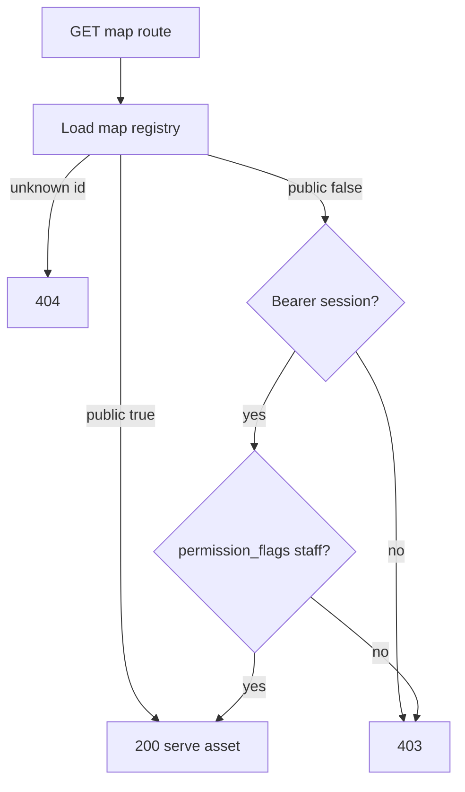

# Step 41.01 — Planning lock

**Plan + docs only.** Lock staff map access scope and integration contracts before batches 41.02–41.05.

**Repos:** Planning (+ `ProvinceSystem` · `Workspace/tfmcweb` for later batches)  
**Depends on:** [00-index](./00-index.md) · [step-37/01-planning-lock](../step-37/01-planning-lock.md) · [step-32/00-rpc-player-meta](../step-32/00-rpc-player-meta.md)  
**Playbook:** [16-map-platform.md](../../16-map-platform.md) — requirement 6

## Locked — why now

Steps 37–49 shipped map UX, labels, and pan/zoom on `/map/{id}`. All map **GET** routes remain world-readable: anyone who knows `/map/r3b1rth` or `GET /dev/data/nation` can load the staff test map. Requirement 6 ([16-map-platform.md](../../16-map-platform.md)) requires configurable public vs staff-only maps before capitals and chronicle layers add more sensitive data.

## Locked — problem (today)

| Issue | Root cause |
|-------|------------|
| Staff map URL is public | [`/map/r3b1rth`](../../../frontend/app/map/r3b1rth/page.tsx) renders `mapId="dev"` with no gate |
| API serves any alphanumeric `map_name` | [`map_routes.py`](../../../backend/src/api/map_routes.py), [`data_routes.py`](../../../backend/src/api/data_routes.py), [`file_routes.py`](../../../backend/src/api/file_routes.py) call `validate_map()` only |
| Nav hides dev map but API does not | [`SiteHeader`](../../../frontend/app/components/shell/SiteHeader.tsx) links `/map/main` only; direct URLs still work |

Security must be **server-side** (403 on API); hiding nav links alone is insufficient.

## Locked — map registry

New ProvinceSystem config, e.g. [`backend/src/config/maps.yml`](../../../backend/src/config/maps.yml):

```yaml
maps:
  - id: main
    public: true
    display_name: Calavorn
    realm_id: main
  - id: dev
    public: false
    display_name: Adavaar
    realm_id: dev
    staff_permission: tfmc.map.staff
```

| Field | Rule |
|-------|--------|
| `id` | Matches `input/`, `defines/`, `output/` folder name and SimpleFactions `mapRef` / export `map_id` |
| `public` | `true` → anonymous GET allowed on map viewer routes |
| `display_name` | Human label for nav and error UI |
| `realm_id` | Realm for `rpc_player_meta` permission lookup; **defaults to `id`** when omitted |
| `staff_permission` | LP node synced to `permission_flags` via TFMCWeb; **required** when `public: false` |

| HTTP | Condition |
|------|-----------|
| **404** | `map_name` not in registry (do not leak existence of staff maps to anonymous callers beyond “not found”) |
| **403** | Known map, `public: false`, caller lacks staff permission |
| **200** | Public map, or staff map with valid permission |

Registry is the single source of truth for which maps exist on the website. SF `mapRef` must match registry `id`.

## Locked — auth model

### Profile session (website identity)

**Profile session = character Bearer session** in v1: redeem via existing character code flow (`POST /characters/redeem` → Bearer token → `GET /characters/player-meta`).

Future product rebrand: “character” UI becomes **profile** (characters + current/previous submissions). **Step 41.x does not rename routes or session storage keys** — only documents that staff map gate treats profile login as website identity.

### Public maps (`main`)

- **No Bearer required** for GET map viewer routes.
- Anonymous visitors can browse Calavorn as today.

### Staff maps (`dev`, future staff-only ids)

Caller must satisfy **all** of:

1. Valid Bearer session from profile/character redeem.
2. `permission_flags[staff_permission] === true` on `rpc_player_meta` for the session player’s **`realm_id`** (from session / meta row).
3. Map registry entry has `public: false`.



### TFMCWeb / LuckPerms

| Piece | Choice |
|-------|--------|
| Permission node | `tfmc.map.staff` (v1 default for `dev`) |
| Sync | Add to TFMCWeb `player-meta.sync-permissions` so join writes `permission_flags["tfmc.map.staff"]` ([step-32](../step-32/00-rpc-player-meta.md)) |
| Operator flow | Staff joins lobby/survival (TFMCWeb syncs meta) → redeems profile code on website → opens staff map |

Staff without synced meta or without profile login see **403**, not a broken partial map.

## Locked — routes to guard (GET only, v1)

Shared FastAPI dependency `require_map_access(map_name, request)` on **all map viewer GET handlers**:

| Router | Routes |
|--------|--------|
| [`map_routes.py`](../../../backend/src/api/map_routes.py) | `/{map}/map`, `/map/parchment`, `/map/original`, `/map/province/{coords}`, `/province/{coords}/meta` |
| [`data_routes.py`](../../../backend/src/api/data_routes.py) | `/{map}/data/{file}`, `/data/province_label_grid_bin`, `/compiled_data/provinces` |
| [`file_routes.py`](../../../backend/src/api/file_routes.py) | `/{map}/mapdata/{type}`, `/{map}/regions/{type}/{file}`, `/{map}/banners/{mode}/{file}` |

### New listing route (41.02)

| Route | Auth | Response |
|-------|------|----------|
| `GET /maps/accessible` | Optional Bearer | Public maps always; staff maps only when session has permission |

Used by frontend nav — avoids hardcoding map list in React.

## Locked — out of scope (viewer gate v1)

| Piece | Reason |
|-------|--------|
| `POST /{map}/data/upload/{mode}` | SimpleFactions plugin upload; separate hardening (plugin key / TFMCWeb gateway) — not viewer gate |
| `claim_router` / `regen_router` | Already hashed-key auth |
| Next.js page middleware as sole gate | API is source of truth; FE shows friendly errors |
| Full character → profile UI/API rename | Document intent; deferred past 41.x |
| Per-map mode restrictions | e.g. terrain-only on dev — not in 41.x |
| New map ids beyond `main` + `dev` | Registry is extensible; v1 ships two entries |

## Locked — frontend behaviour (41.04)

| Piece | Choice |
|-------|--------|
| Public nav | [`SiteHeader`](../../../frontend/app/components/shell/SiteHeader.tsx) — `/map/main` for everyone |
| Staff nav | Show staff map link (e.g. `/map/r3b1rth` → `dev`) only when `GET /maps/accessible` includes it |
| Staff page load | First API 403 → clear message: profile login required vs staff permission required |
| `MapId` type | Keep `"main" \| "dev"` in [`types.ts`](../../../frontend/app/components/map/types.ts); visibility from registry API |
| URL codename | `/map/r3b1rth` may remain; optional rename to `/map/dev` in 41.04 (cosmetic) |

Bearer token attached to map fetches when profile session exists (same pattern as skins/drinks `apiFetch`).

## Locked — backend file plan (later batches)

| Batch | Files | Action |
|-------|-------|--------|
| **41.02** | `backend/src/config/maps.yml`, `map_registry.py` | Registry loader + `require_map_access` |
| **41.02** | `map_routes.py`, `data_routes.py`, `file_routes.py` | Apply dependency on GET handlers |
| **41.02** | `maps_routes.py` (or `data_routes`) | `GET /maps/accessible` |
| **41.03** | `rpc_player_meta.py` | Helper: `has_map_staff_access(player_uuid, realm_id, permission_node)` |
| **41.03** | TFMCWeb `config.yml` example | `sync-permissions` includes `tfmc.map.staff` |
| **41.04** | `SiteHeader.tsx`, map pages, `useMapModeData` / fetch layer | Bearer + accessible list + error states |
| **41.05** | STAGING, hubs | Operator checklist |

No mapgen or `fullregen` changes.

## Locked — tests

| Test | Expectation |
|------|-------------|
| Anonymous `GET /main/data/nation` | 200 |
| Anonymous `GET /dev/data/nation` | 403 |
| Profile session without `tfmc.map.staff` → `GET /dev/data/nation` | 403 |
| Profile session with flag → `GET /dev/data/nation` | 200 |
| `GET /notamap/data/nation` | 404 |
| `GET /maps/accessible` (anonymous) | `{ maps: [{ id: "main", ... }] }` only |
| `GET /maps/accessible` (staff session) | includes `dev` |
| Manual | Player never sees dev nav link; staff sees it after profile login + LP flag |

## Locked — operator notes (preview for STAGING)

1. Grant `tfmc.map.staff` (or group inheritance) on LuckPerms for staff groups.
2. Add `tfmc.map.staff` to TFMCWeb `player-meta.sync-permissions` on lobby + survival.
3. Staff joins once so `rpc_player_meta` syncs; redeems profile code on website.
4. Verify anonymous `/map/main` works; `/map/r3b1rth` returns 403 or gated UI without login.

## Hub edits (41.01)

- [00-index](./00-index.md) — batch links + status
- [STAGING.md](../../../STAGING.md) — Step 41 operator checklist (draft)
- [16-map-platform.md](../../16-map-platform.md) — req 6 → 41.01 lock
- [08-implementation-checklist.md](../../08-implementation-checklist.md) — M4 41.01 locked note

## Verify

- [x] Locked tables in this file
- [x] Batches [02](./02-ps-map-registry.md)–[05](./05-docs-verify.md) stubbed
- [x] Hub docs updated
- [x] No application code in 41.01
- [x] Profile session auth decision recorded

## Status

**Done.** Next: [02-ps-map-registry](./02-ps-map-registry.md).
