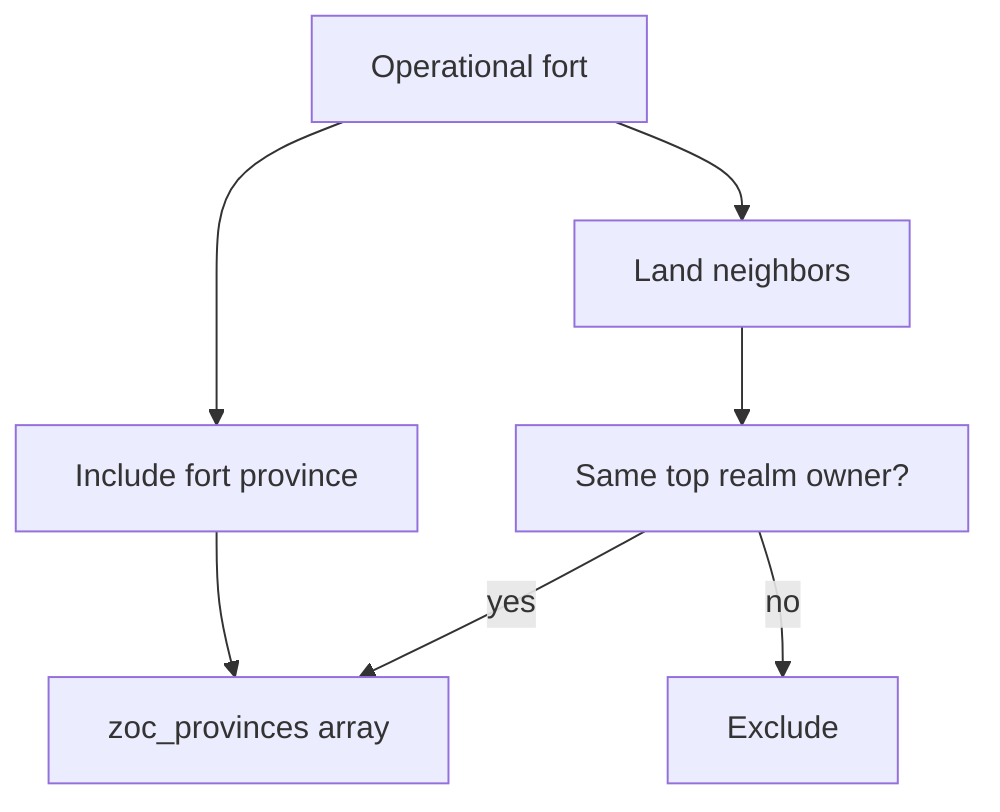

# Step 43.01 — Planning lock

**Plan + docs only.** Lock fort ZOC gameplay, export shape, precomputed hatch overlays, and frontend hover before 43.02+ code.

**Repos:** `Workspace/simplefactions` · `Workspace/ProvinceSystem`  
**Depends on:** [00-index](./00-index.md) · [step-54/01-planning-lock](../step-54/01-planning-lock.md) · [step-55/01-planning-lock](../step-55/01-planning-lock.md)  
**Authoritative gameplay doc (after 43.05):** extend [`Installations.md`](../../../../simplefactions/Documentation/Installations.md) ZOC section

## Locked — gameplay (ZOC geometry)

| Rule | Value |
|------|--------|
| Source | **Operational forts only** (`InstallationKind.FORT` in `byId`; pending construction excluded — step 55) |
| Seed province | Fort's `province_id` (always included if fort is operational) |
| Neighbors | One-ring `Province.getNeighbours()` from SF province graph (`Input/province_neighbors.json`) |
| Sea | **Exclude** neighbor provinces where `Province.isSea()` (`SEA` / `WATER` terrain) |
| Unclaimed | **Exclude** neighbors with `Province.getOwner() == null` |

## Locked — top realm (political filter)

ZOC extends only into provinces owned by factions in the **same top realm** as the fort holder.

| Term | Definition |
|------|------------|
| **Top realm id** | `RelationManager.getTopLiege(f)` if non-null; else `f.getId()` (independent faction is its own root) |
| **Same top realm** | `topRealmId(a).equalsIgnoreCase(topRealmId(b))` |

Consequences (intended):

- Overlord ↔ vassal ZOC overlaps
- Sibling vassals under one overlord overlap
- Independent nations do **not** overlap
- Foreign neighbor on the province ring is omitted from `zoc_provinces` only (not a separate clip at render time)

**Use existing API:** `RelationManager.getTopLiege` in SF. New small helper e.g. `ZocRealm.sameTopRealm(Faction a, Faction b)` in SF export code (43.02).

### Deferred — war exception (document only)

When factions A and B are **at war**, A's fort ZOC must **not** include provinces owned by B (and vice versa), even if they share a top realm (e.g. rebel vassal vs overlord).

**Out of scope for step 43 v1** — SF war rework later. Add `// TODO step-43-war` in export; no war check in 43.02.

## Locked — export (`forts[]`)

Extend `Markers.java` (43.02) — **separate array** from `installations[]`:

| Field | Type | Notes |
|-------|------|--------|
| `id` | string | Same as installation id |
| `name` | string | Display name |
| `province_id` | int | Fort province |
| `faction_id` | string | Fort owner |
| `center_x` / `center_z` | int | From installation (pin position) |
| `zoc_provinces` | int[] | Sorted unique; SF-computed per rules above |

Schema: [`map-export-schema.json`](../../assets/map-export-schema.json) — add `center_x`/`center_z` to `fort` in 43.02 (pin parity with installations).

`installations[]` unchanged (all kinds for map pins). `forts[]` is ZOC + overlay metadata only.

## Locked — visual (precomputed per-fort hatch overlay)

**Decision:** Precomputed PNG per fort (not runtime canvas). Mirrors nation region overlay pipeline (`overlay_metadata.py`, `MapCanvas.tsx`).

### Hatch asset

| Property | Value |
|----------|--------|
| Pattern | Diagonal lines **bottom-left → top-right** |
| Gaps | Small transparent gaps between lines (tileable) |
| Tile | e.g. 16×16 PNG at `defines/common/zoc_hatch.png` (or generated once in script) |
| Colour | Semi-transparent neutral dark (e.g. `rgba(40,35,30,0.35)`) — readable on parchment + nation modes |
| Not faction-coloured | v1 |

### Per-fort PNG generation (PS `zocgen`, batch 43.03)

For each `forts[]` entry:

1. Union pixel mask of all `zoc_provinces` via `MapGeometryCache.province_id_map` (same mask source as `regiongen_numpy.py`)
2. Fill masked area with repeating hatch tile
3. `crop_to_content` + 2px pad → bbox `{x,y,w,h}`
4. Save `output/{map}/zoc/{fort_id}.png`

### Metadata on API response

Each fort in `GET /{map}/data/markers` (enriched) gains:

| Field | Source |
|-------|--------|
| `overlay` | bbox from zocgen |
| `zoc_url` | `/{map}/zoc/{fort_id}.png` (static route in `file_routes.py`) |
| `map_x` / `map_y` | PS enrich from `center_x`/`center_z` (1:1, same as installations) |

Prefer inline on fort row for FE simplicity (optional sidecar `defines/{map}/zoc_overlays.json` only if payload size becomes an issue).

### Regen trigger

Run `zocgen` when:

- `map_markers` uploaded (after SF regen), and
- During `fullregen` (explicit step after marker sync)

Delete stale `output/{map}/zoc/*.png` for removed fort ids.

## Locked — frontend (hover only, batch 43.04)

| Rule | Value |
|------|--------|
| When | Hover **fort** installation marker (`kind === "fort"`) |
| Where | Political marker modes only (`isMarkerMapMode` — nation/county/duchy/kingdom/empire/trade) |
| What | Show precomputed hatch PNG at `fort.overlay` bbox via `overlayStyle` |
| Layer | New `hoveredFortZoc` state — **do not** reuse nation `hoveredOverlay` (marker hover currently clears nation overlay in `useMapHover.ts`) |
| Z-index | Above parchment/base map, below or beside nation drill stack (match region overlays in `MapCanvas`) |
| No hover | Port/airport pins — no ZOC |
| No click | v1 hover-only; no persistent “show all ZOC” toggle |

Lookup: match `installation.id` → `forts[]` row by id for `overlay` + `zoc_url`.

## Locked — code touchpoints

| Area | Change |
|------|--------|
| `Markers.java` | Export `forts[]` + `zoc_provinces` (43.02) |
| `ZocRealm` (or inline helper) | `topRealmId`, `sameTopRealm`, `computeZocProvinces` |
| `map-export-schema.json` | `fort.center_x`, `fort.center_z` |
| PS `zocgen` + `file_routes.py` | Hatch PNGs + static serve (43.03) |
| `markers.py` | Enrich `forts[]` with `overlay`, `zoc_url`, `map_x`/`map_y` |
| FE `MapCanvas` / `useMapHover` | Fort hover ZOC layer (43.04) |

## Out of scope (step 43)

- War-based ZOC suppression (noted for future)
- ZOC gameplay effects in SF (movement/combat) — **map display only**
- Port/airport ZOC
- “Show all forts ZOC” toggle
- Faction-coloured hatch
- PS recomputing `zoc_provinces` (SF is source of truth)

## Status

**Done** (2026-08-19).

## Next

[02-sf-forts-export](./02-sf-forts-export.md)
