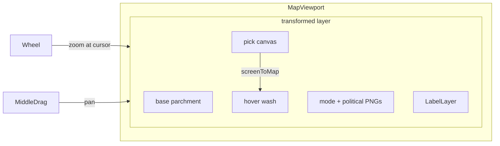

# Step 49.01 — Planning lock

**Plan + docs only.** Lock pan/zoom scope and integration contracts before batches 49.02–49.07.

**Repos:** Planning (+ `ProvinceSystem` frontend for later batches)  
**Depends on:** [00-index](./00-index.md) · [step-40/01-planning-lock](../step-40/01-planning-lock.md) · [step-40/05-label-polish](../step-40/05-label-polish.md)  
**Playbook:** [16-map-platform.md](../../16-map-platform.md)

## Locked — why now

Step 40 shipped nation/title labels and a **zoom-hide stub** (`LABEL_MAX_ZOOM`, `DEFAULT_MAP_ZOOM`) waiting on real viewport scale. Step 37 deferred pan/zoom gestures on mobile. Desktop wheel + middle-mouse pan is the next map interaction milestone before chronicle (step 45) reuses the same compositor.

## Locked — interaction model



| Input | Behavior |
|-------|----------|
| **Initial state** | `scale = 1`, `translate = (0, 0)` — same visual as today (map fit to viewport width) |
| **Wheel** | Zoom in/out toward cursor; `preventDefault` on wheel over viewport (no page scroll) |
| **Middle mouse** | Pan while button held; `cursor: grab` when idle over viewport, `grabbing` while dragging |
| **Left click** | Unchanged — nation pick, Ctrl+drill, modal |
| **Pan limits** | After every pan/zoom, clamp translate so the map always **covers** the viewport (no empty margin outside map) |
| **Zoom limits** | Cannot zoom out below `MAP_ZOOM_MIN`; cannot zoom in above `MAP_ZOOM_MAX` |

**Not in v1:** pinch-to-zoom, zoom buttons, keyboard +/-, double-click zoom, inertia/momentum, rotation, “Reset view” button.

## Locked — coordinate spaces

| Space | Units | Used for |
|-------|-------|----------|
| **Map** | Native image pixels (`mapSize.w` × `mapSize.h`) | Pick canvas, overlay bboxes, label `viewBox` |
| **Viewport** | CSS pixels of visible map panel | Wheel events, clamp math |
| **Display** | Map pixels × scale, offset by translate | CSS transform on inner wrapper |

### Transform convention

Apply on inner layer:

```text
transform: translate(tx, ty) scale(s);
transform-origin: 0 0;
```

Map point `(mx, my)` → viewport pixels:

```text
vx = mx * s + tx
vy = my * s + ty
```

Inverse (`screenToMap`) used by pick/hover:

```text
mx = (vx - tx) / s
my = (vy - ty) / s
```

where `(vx, vy)` is cursor position relative to viewport top-left.

Extend [`getMapCoords`](../../../frontend/app/hooks/useMapCoords.ts) to accept viewport `{ scale, translateX, translateY }` and invert before mapping to map pixel indices.

## Locked — clamp algorithm

Given viewport `(Vw, Vh)`, map `(Mw, Mh)`, scale `s`, translate `(tx, ty)`:

- Displayed size: `(Mw·s, Mh·s)`
- Clamp: `tx ∈ [Vw − Mw·s, 0]`, `ty ∈ [Vh − Mh·s, 0]`
- When `Mw·s ≤ Vw` (or `Mh·s ≤ Vh`): **pin translate on that axis to `0`** (no pan where map is smaller than viewport)

At `MAP_ZOOM_MIN = 1`, pan is typically `(0, 0)` on both axes.

### Zoom toward cursor

On wheel with factor `f` (in) or `1/f` (out), clamp new scale to `[MAP_ZOOM_MIN, MAP_ZOOM_MAX]`, then adjust translate so the map point under the cursor stays fixed:

```text
mx = (cx - tx) / s
my = (cy - ty) / s
s' = clamp(s * f)
tx' = cx - mx * s'
ty' = cy - my * s'
```

Then run clamp on `(tx', ty', s')`.

## Locked — constants

| Constant | Value | Notes |
|----------|-------|-------|
| `MAP_ZOOM_MIN` | **1** | “No zoom” baseline = current fit view |
| `MAP_ZOOM_MAX` | **3** | Province-level detail on 4096-wide `main`; tune in 49.07 if needed |
| `MAP_ZOOM_WHEEL_FACTOR` | **1.1** | Per notch: `scale *= factor` (in) or `/= factor` (out) |
| `LABEL_MAX_ZOOM` | **1.5** | Unchanged — labels hidden when `scale > 1.5` |
| `DEFAULT_MAP_ZOOM` | **1** | Initial scale; replace stub wiring in 49.05 |

Font size stays **constant in map pixels** (step 40 lock). Labels do not scale with zoom.

## Locked — layer invariant

These share **one** transform parent (inner wrapper):

| Layer | File |
|-------|------|
| Base parchment | [`MapCanvas.tsx`](../../../frontend/app/components/map/MapCanvas.tsx) |
| Mode overlay (terrain / fertility / prosperity) | same |
| Political PNG overlays | same |
| Hover wash | same |
| Nation/title labels | [`LabelLayer.tsx`](../../../frontend/app/components/map/LabelLayer.tsx) |
| Pick canvas | same |

Tooltip (`cursorTooltip`) stays **fixed** screen position — outside transform.

## Locked — cursor and events

| Rule | Choice |
|------|--------|
| Idle cursor over viewport | `grab` |
| Middle-drag active | `grabbing` |
| Text selection | `user-select: none` on viewport during drag |
| Wheel listener | `{ passive: false }` so `preventDefault` works |
| Middle-click | Suppress autoscroll / unwanted `auxclick` behaviour |

Left-click path unchanged on pick canvas (`z-20`, `pointer-events-auto`).

## Locked — reset behaviour

Reset viewport to `(scale=1, translate=(0,0))` when:

- `mapId` changes
- `mapType` changes (alongside existing drill/hover reset in [`MapViewer.tsx`](../../../frontend/app/components/MapViewer.tsx))

## Locked — frontend file plan (later batches)

| Batch | Files | Action |
|-------|-------|--------|
| **49.02** | `frontend/app/lib/mapViewportMath.ts` | Pure: `clampTranslate`, `zoomAtPoint`, `screenToMap`, `mapToScreen` + unit tests |
| **49.02** | `frontend/app/hooks/useMapViewport.ts` | State, wheel, middle-drag, resize observer |
| **49.03** | `frontend/app/components/map/MapViewport.tsx` | Viewport shell + transformed inner |
| **49.03** | [`MapCanvas.tsx`](../../../frontend/app/components/map/MapCanvas.tsx) | Move stack inside `MapViewport` |
| **49.04** | [`useMapCoords.ts`](../../../frontend/app/hooks/useMapCoords.ts) | Viewport-aware coordinate mapping |
| **49.05** | [`MapViewer.tsx`](../../../frontend/app/components/MapViewer.tsx) | Live `scale` → `mapZoom`; reset on mode/map change |
| **49.06** | — | Resize, late `mapSize` from `onLoad`, middle-click edge cases |

No backend or mapgen changes.

## Locked — label integration

| Rule | Choice |
|------|--------|
| Visibility | `shouldShowLabelsAtZoom(scale)` — existing hook in [`mapLabels.ts`](../../../frontend/app/lib/mapLabels.ts) |
| Font size | Unchanged — map-pixel units, not scaled by viewport |
| Modes | All label modes on `/map/main` (nation, county, duchy, kingdom, empire, trade) |

## Locked — tests

| Test | Expectation |
|------|-------------|
| `clampTranslate` | Cannot pan past edges at zoom 2 and 3 |
| `clampTranslate` | At zoom 1, translate forced to 0 |
| `zoomAtPoint` | Cursor-anchored point stable across zoom step |
| `screenToMap` | Round-trip with known transform |
| Manual | Hover/click/drill correct at corners and max zoom on `/map/main` |
| Manual | Labels visible at zoom ≤ 1.5, hidden above |
| Manual | Wheel does not scroll page when cursor over map |
| Manual | Cannot pan to show empty margin outside map |

## Locked — map modes

Pan/zoom applies to **all** map modes on `/map/{id}` (nation, title tiers, trade, terrain, fertility, prosperity). Pick/hover behaviour per mode unchanged except coordinate transform.

## Out of scope (v1)

- Mobile pinch/pan ([step-37/05](../step-37/05-mobile-layout.md) deferred)
- Zoom UI controls, minimap, animated “fit all”
- Label font scaling with zoom
- Chronicle (step 45) — inherits viewport automatically; no separate 49.x work
- Backend / `fullregen` / new JSON artifacts

## Status

**Done.** Next: [02-viewport-math](./02-viewport-math.md).
