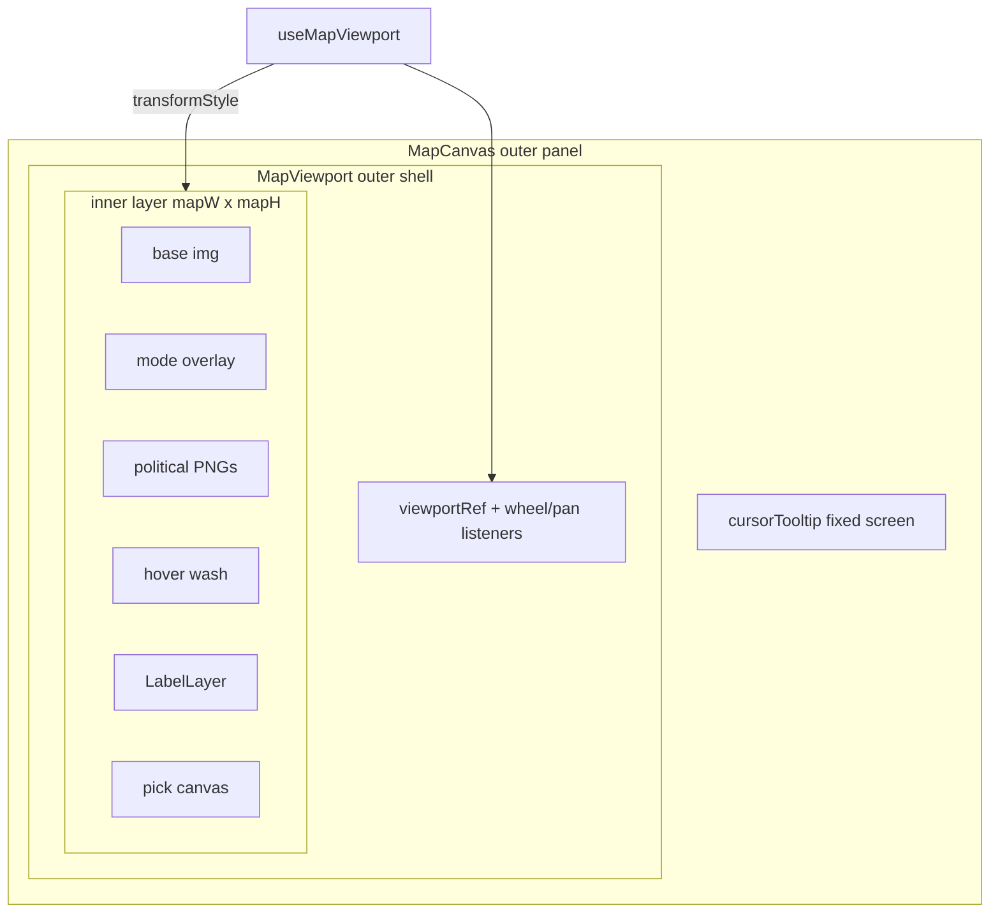

# Step 49.03 — MapViewport + MapCanvas integration

**Repos:** `ProvinceSystem` frontend  
**Depends on:** [02-viewport-math](./02-viewport-math.md)

## Goal

Wire the 49.02 viewport hook into the map UI so wheel zoom and middle-mouse pan are visible on `/map/{id}`. All compositor layers share one CSS transform on an inner wrapper per the planning lock.

## Architecture



**Fit-scale model:** inner layer is `mapW × mapH` CSS pixels; `displayScale = fitScale * userScale` where `fitScale = viewportW / mapW`. At `userScale = 1`, visual width equals viewport width — same as pre-49.03 `w-full`.

## Build

| File | Action |
|------|--------|
| `frontend/app/components/map/MapViewport.tsx` | create — presentational viewport shell + transformed inner |
| `frontend/app/components/map/MapCanvas.tsx` | refactor — `useMapViewport` + wrap layer stack |
| `frontend/app/components/map/LabelLayer.tsx` | tweak — SVG `h-full w-full` inside fixed inner parent |

## `MapViewport.tsx` API

Presentational component — MapCanvas owns hook state (for easy 49.05 wiring):

```typescript
type MapViewportProps = {
  mapSize: Size
  viewportRef: RefObject<HTMLDivElement>
  transformStyle: string
  cursorClassName: string
  isPanning: boolean
  children: ReactNode
}
```

**Outer shell:** `relative w-full overflow-hidden`, `aspectRatio: mapW / mapH`, grab/grabbing cursor, `select-none` while panning.

**Inner layer:** `mapW × mapH` px, `transform: translate(tx, ty) scale(displayScale)`, `transformOrigin: 0 0`.

## Layer sizing changes

| Layer | Before | After |
|-------|--------|-------|
| Base map | `h-auto w-full` (flow layout) | `block h-full w-full` inside inner |
| Province overlay | `absolute left-0 top-0 h-auto w-full` | `absolute inset-0 h-full w-full` |
| Political overlays | `%` via `overlayStyle` | unchanged |
| LabelLayer SVG | `h-auto w-full` | `h-full w-full` |
| Pick canvas | `absolute inset-0` on outer panel | `absolute inset-0` on inner layer |

`cursorTooltip` stays outside `MapViewport` (fixed screen position).

## Verify

- [x] `npm run build` passes
- [x] At zoom 1, map fits viewport width (aspect-ratio shell)
- [x] Wheel zoom and middle-mouse pan wired via `useMapViewport`
- [x] No changes to `MapViewer.tsx` or `useMapCoords.ts`

## Known limitation (until 49.04)

Hover/click/drill coordinates are wrong when `userScale !== 1` or translate is non-zero. Visual pan/zoom works; coordinate pipeline fixed in [04-pick-hover](./04-pick-hover.md).

## Out of scope

- Viewport-aware `getMapCoords` (49.04)
- Live `mapZoom` + viewport reset on mode/map change (49.05)
- Resize / late `mapSize` edge cases (49.06)
