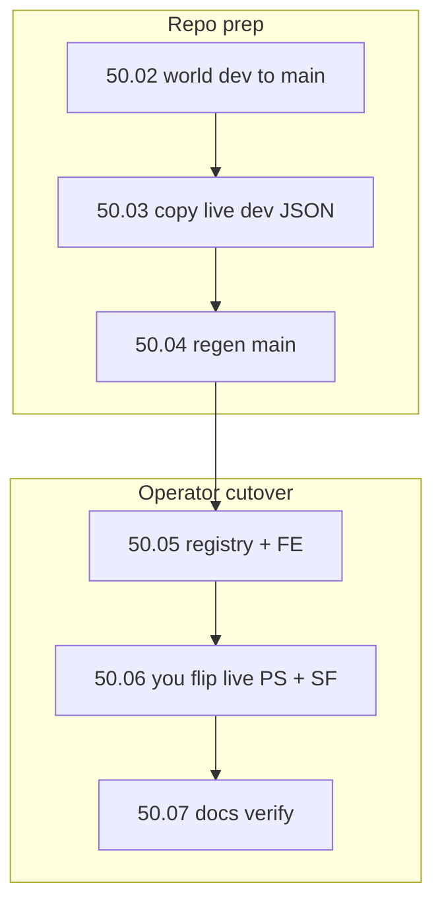

# Step 50 — S5 map cutover (Adavaar → public main)

**Repos:** `ProvinceSystem` · `Workspace/simplefactions` (reference only until cutover)  
**Depends on:** [step-41](../step-41/00-index.md) · [step-42](../step-42/00-index.md) · [step-47](../step-47/00-index.md)  
**Playbook:** [09-map-system.md](../../09-map-system.md) · [16-map-platform.md](../../16-map-platform.md)

## Goal

Season **5** public map is **Adavaar**. Adavaar world data lives in PS **`dev`** today; **`main`** in the repo still had Calavorn (S4) until batch **50.02**. Cut over so `/map/main` shows Adavaar with live faction data when you flip production.

## Live vs repo (locked)

| Environment | Today | After operator cutover (50.06) |
|-------------|-------|--------------------------------|
| **Live PS** | `main` = Calavorn public; `dev` = Adavaar + SF uploads | You flip: public `main` = Adavaar |
| **SF** | `map-reference: dev` | **You** set `map-reference: main` (50.06 — not repo batches 50.02–50.05) |
| **Political JSON** | SF uploads → live PS `input/dev/` | Copy into repo `input/main/` (50.03); then regen |

**Key rule:** Province ids are per world. World promotion (50.02) and political data (50.03) are separate steps.

## What already exists

| Asset | Location |
|-------|----------|
| Adavaar world + geometry | [`backend/src/defines/dev/`](../../../backend/src/defines/dev/) |
| Adavaar on `main` (after 50.02) | [`backend/src/defines/main/`](../../../backend/src/defines/main/) |
| SF live upload snapshot (reference) | [`Workspace/simplefactions/src/main/resources/MapAPI/`](../../../../Workspace/simplefactions/src/main/resources/MapAPI/) |
| Staff preview | `/map/r3b1rth` → `mapId=dev` |

## Build order

## Batches

| # | Batch | Repo | Summary |
|---|-------|------|---------|
| 1 | [01-planning-lock](./01-planning-lock.md) | Planning | Lock ids, manual copy workflow, SF stays on `dev` until 50.06 |
| 2 | [02-promote-dev-world](./02-promote-dev-world.md) | PS | Copy Adavaar world `dev` → `main` — **done** |
| 3 | [03-seed-live-input](./03-seed-live-input.md) | PS | SF MapAPI → `input/main` — **done** |
| 4 | [04-regen-main](./04-regen-main.md) | PS | fullregen on `main` after 50.03 — **done** |
| 5 | [05-ps-frontend-registry](./05-ps-frontend-registry.md) | PS | `maps.yml`, bounds, display names — deploy with cutover |
| 6 | [06-sf-map-reference](./06-sf-map-reference.md) | Operator | **You** switch SF + live PS at cutover (not repo prep) |
| 7 | [07-docs-verify](./07-docs-verify.md) | Planning | STAGING Step 50 |

## Status

**50.04 done.** Next: [05-ps-frontend-registry](./05-ps-frontend-registry.md).

## Out of scope

- Step 43+ forts / wars / chronicle
- Changing SF `map-reference` in repo prep batches
- Renaming map ids — promote **content** into existing `main`
