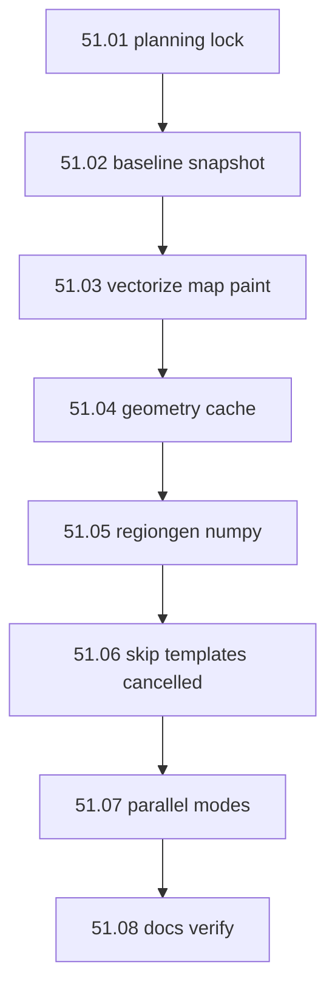

# Step 51 — Mapgen performance (fullregen optimization)

**Repos:** `ProvinceSystem` backend  
**Depends on:** [step-50](../step-50/00-index.md) (50.04 `fullregen` + timing instrumentation)  
**Playbook:** [09-map-system.md](../../09-map-system.md) · [16-map-platform.md](../../16-map-platform.md)

## Goal

Cut **`fullregen`** wall time on Adavaar (`main`, 6400²) from **~18–22 min** to a **target of 3–7 min** (stretch **2–4 min** with parallelism) while producing **byte-identical or visually equivalent** map output.

Every optimization batch must **snapshot outputs + timings** so we can compare against baseline and prior checkpoints.

## Baseline (locked from 50.04 + timing run)

| Metric | Value |
|--------|-------|
| Map | `main` (Adavaar, 806 provinces, 6400²) |
| Total `fullregen` | **~1311s (~22 min)** (instrumented run 2026-08-16) |
| Dominant cost | **regiongen ~72%** (`county.regions` alone ~26%) |
| Map paint | **~24%** (6× Python PIL full-canvas loops) |
| Stack | Pure Python + PIL pixel access; **no numpy** |

## Benchmark contract

| Rule | Choice |
|------|--------|
| Snapshot root | [`backend/benchmarks/regen/`](../../../backend/benchmarks/regen/) |
| Baseline label | **`v0-baseline`** — capture **before any 51 code changes** |
| Per-batch labels | `v1-map-paint`, `v2-geometry-cache`, `v3-regiongen`, … |
| What to save | Timing JSON + file manifest (SHA256); full PNG trees under `snapshots/` (gitignored) |
| Compare gate | Manifest match OR documented acceptable diff; timing regression ≤5% without manifest match fails |
| Test map | **`main`** only for benchmarks (Adavaar is the production workload) |

## Build order

## Batches

| # | Batch | Repo | Summary |
|---|-------|------|---------|
| 1 | [01-planning-lock](./01-planning-lock.md) | Planning | Targets, benchmark rules, correctness gates |
| 2 | [02-baseline-snapshot](./02-baseline-snapshot.md) | PS | Harness + **`v0-baseline`** snapshot from 50.04 output (no regen) |
| 3 | [03-vectorize-map-paint](./03-vectorize-map-paint.md) | PS | Numpy LUT `create_map` (~24% of time today) |
| 4 | [04-geometry-cache](./04-geometry-cache.md) | PS | Province ID map once per regen; shared across modes |
| 5 | [05-regiongen-numpy](./05-regiongen-numpy.md) | PS | Masks + bbox crop; no xy lists / full canvases (~72%) |
| 6 | [06-skip-template-modes](./06-skip-template-modes.md) | PS | ~~Skip empty/template title layers~~ **cancelled** |
| 7 | [07-parallel-modes](./07-parallel-modes.md) | PS | Multiprocessing per mode |
| 8 | [08-docs-verify](./08-docs-verify.md) | Planning | Final benchmark table + STAGING |

## Status

**In progress.** 51.07 parallel modes done (−24% vs v3, pixel-identical); next: [08-docs-verify](./08-docs-verify.md).

## Out of scope

- GPU/CUDA mapgen
- Changing frontend pick/hover contract
- Step 50.05–50.07 cutover work (can run in parallel on another branch)
- Terrain/fertility in `fullregen` loop (stay manual scripts unless added later)
