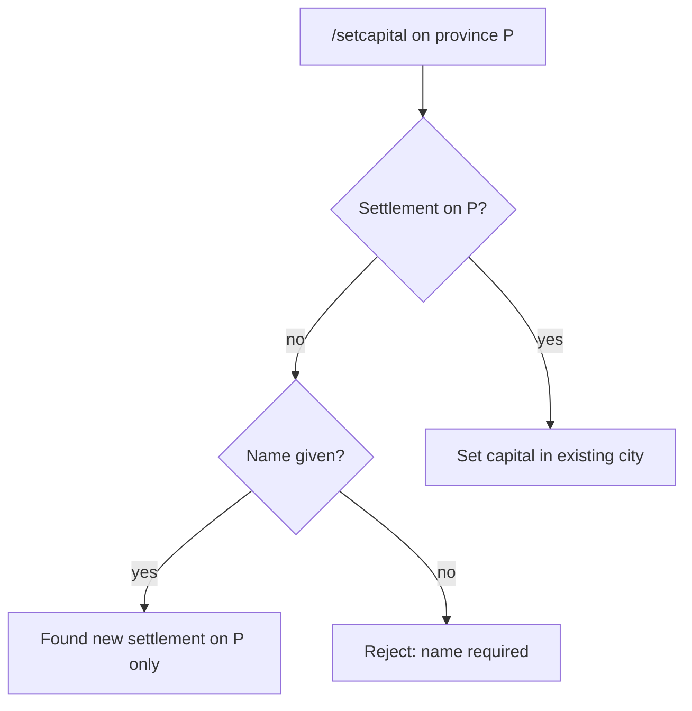

# Step 53.01 — Planning lock

**Plan + docs only.** Lock one-province-per-settlement rules before treating later step-53 batches as authoritative.

**Repos:** `Workspace/simplefactions` · `ProvinceSystem`  
**Depends on:** [00-index](./00-index.md) · [map-export-schema.json](../../assets/map-export-schema.json)  
**Supersedes:** Multi-province settlement territory rules in [step-42/01-planning-lock](../step-42/01-planning-lock.md)

## Authoritative spec

Full settlement gameplay and implementation rules:

**[`Workspace/simplefactions/Documentation/Settlements.md`](../../../../simplefactions/Documentation/Settlements.md)**

Summary below; if this file disagrees with `Settlements.md`, the SF doc wins.

## What changes vs step 42

| Area | Step 42 (superseded) | Step 53 (locked) |
|------|----------------------|------------------|
| Territory | Centre + owned land neighbours | `{ centerProvince }` only |
| Found | Requires ≥2 hops from all centres | Any unoccupied owned province + name |
| Join | 1 hop → merge into existing city | **Removed** — always found or use existing |
| Claim | Adjacent claims grow settlement | **No effect** on settlements |
| Loss | Outer province removed; centre dissolves | Any loss of settlement province → dissolve |
| Population | Guild capital in any settlement province | Guild capital **==** `centerProvince` |
| Config | `settlement-found-distance` | **Removed** |

## Locked — summary

| Area | Rule |
|------|------|
| Territory | `provinces` = `{ centerProvince }` only — never more than one |
| Found | `/setcapital <name>` on a province **without** a settlement → found city on that province |
| Existing city | `/setcapital` on a province **with** a settlement → set capital there (no name) |
| Adjacency | **No** join, **no** hop distance, **no** “too close to found” |
| Claim | Claiming land does **not** attach provinces to settlements |
| Loss | Lose settlement province → **dissolve** settlement |
| Dissolve | Clear guild + faction capitals on that province; remove from handler |
| Hygiene | `validate()` from `Faction.tick()` — normalize to centre only; dissolve if centre not owned |
| Relocate | Last guild leaves settlement → disband; destination uses same found / existing-city rules |
| Population | Guild counts if `guild.capital == settlement.centerProvince` |
| Export | `map_markers` `provinces: [centerProvince]`; marker at `centerX` / `centerZ` |
| Config | Remove `settlement-found-distance` (unused) |
| Migration | Dev only — trim fixtures; `validate()` normalizes on load |

## Locked — invariants

| Invariant | Notes |
|-----------|--------|
| One settlement per province per faction | `provinceIndex` maps centre province → settlement |
| Faction land independent of settlement territory | Faction `provinces` may include land with no city |
| `centerProvince ∈ provinces` | After load/validate, `provinces` is exactly `{ centerProvince }` |

## Locked — export contract

Sidecar `map_markers.json` per [map-export-schema.json](../../assets/map-export-schema.json):

| Field | Rule |
|-------|------|
| `province_id` | `centerProvince` |
| `center_x` / `center_z` | Founding block coords (unchanged from step 42) |
| `provinces` | Always `[province_id]` — `minItems: 1`, `maxItems: 1` |

Details in Settlements.md.

## Out of scope

- Renaming settlements
- Per-guild markers on map
- Fort markers ([step-43](../step-43/00-index.md))
- ProvinceSystem runtime (markers already use `center_x` / `center_z`)

## Status

**Done** (2026-08-18).

## Next

[02-sf-handler-simplify](./02-sf-handler-simplify.md)
