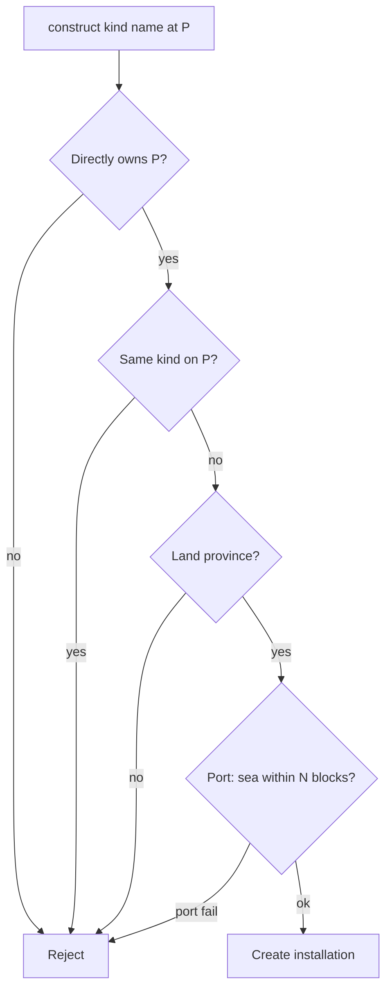

# Step 54.01 — Planning lock

**Plan + docs only.** Lock province grid and installation rules before 54.02+ implementation.

**Repos:** `Workspace/simplefactions` · `ProvinceSystem`  
**Depends on:** [00-index](./00-index.md) · [map-export-schema.json](../../assets/map-export-schema.json)  
**Supersedes:** HTTP province lookup for in-game spatial queries

## Authoritative spec (after 54.06)

| Topic | Doc |
|-------|-----|
| Installations | [`Workspace/simplefactions/Documentation/Installations.md`](../../../../simplefactions/Documentation/Installations.md) |
| Province grid | [`Workspace/simplefactions/Documentation/ProvinceGrid.md`](../../../../simplefactions/Documentation/ProvinceGrid.md) |

Summary below; if this file disagrees with those SF docs after 54.06, the SF doc wins.

## Locked — province ID grid


| Item | Rule |
|------|------|
| PS source | `input/{map}/provinces.png` + `defines/{map}/provinces.txt` |
| PS output | `defines/{map}/province_id_grid.bin.gz` — **not** `input/`, **no** `assets/` folder |
| SF input | `plugins/SimpleFactions/Input/province_id_grid.bin.gz` |
| SF MapAPI | **Output only** — grid is **not** loaded from MapAPI |
| Generation | PS admin script (54.02) — run manually when map geometry changes; **not** auto on regen |
| SF missing file | **Fail loud** on enable (disable plugin, same as `provinces.txt` load failure) |
| Format | Gzip: `width` int32 LE, `height` int32 LE, then `width × height` uint16 LE row-major; `0` = no province |
| Coords | Block X/Z ↔ grid index 1:1 (same as PS `find_province`) |
| Size | 6400×6400 ≈ 82 MB flat array; no chunking |
| Replaces | `RestServer.getProvince()` HTTP lookup (54.03) |

## Locked — installations

| Rule | Value |
|------|--------|
| Kinds | `fort`, `port`, `airport` |
| Per province | At most **one of each kind** per faction in that province |
| Per faction | **Unlimited** across provinces (many forts OK) |
| Territory | **Direct ownership only** — `provinceHandler.hasProvince(P)`; **not** vassal/subject land |
| Command | `/faction construct <fort\|port\|airport> <name...>` |
| Name | Required; colour codes (`&aLanhold`) via existing hex formatter |
| Coords | Player block X/Z at construct |
| Land | Reject `Province.isSea()` (sea + water/rivers/lakes) |
| Port | Within **N** blocks of sea/water province — **N = config** `port-sea-proximity-blocks` (default `20`) |
| Loss | Province lost → dissolve all installations on that province |
| vs settlements | Independent — settlement + fort + port + airport on same province allowed |



## Locked — export (`map_markers.json`)

New top-level key `installations[]` (54.05):

```json
{
  "id": "lanhold",
  "name": "§aLanhold",
  "kind": "fort",
  "faction_id": "Lantan",
  "province_id": 705,
  "center_x": 1748,
  "center_z": 2739
}
```

PS enriches `map_x` / `map_y` from `center_x` / `center_z` (1:1, same as settlements).

Existing schema `forts[]` with `zoc_provinces` is for **[step-43](../step-43/00-index.md) ZOC** — not exported in step 54.

## Locked — config (SF `config.yml`)

```yaml
port-sea-proximity-blocks: 20

installations:
  fort:
    slots:
      static_emplacement: 8
  port:
    slots:
      ship: 10
  airport:
    slots:
      aircraft: 10
```

Slot limits reserved for future VehicleFramework integration — unused in step 54.

## Locked — package layout (SF, 54.03–54.04)

```text
Map/
  ProvinceGrid.java
  ProvinceSpatial.java
installation/
  Installation.java
  InstallationKind.java
  InstallationData.java
  handler/
    InstallationHandler.java
    ConstructResult.java
```

Lowercase subpackages per step-42/53 convention.

## Out of scope (step 54)

- Fort ZOC + map tint ([step-43](../step-43/00-index.md))
- Vehicle registration / VehicleFramework spawn gates
- Upkeep + construction + GUI — **done in [step-55](../step-55/00-index.md)** (2026-08-19)
- SF-side PNG→grid generation (PS script is canonical)

## Status

**Done** (2026-08-18).

## Next

[02-ps-province-grid](./02-ps-province-grid.md)
