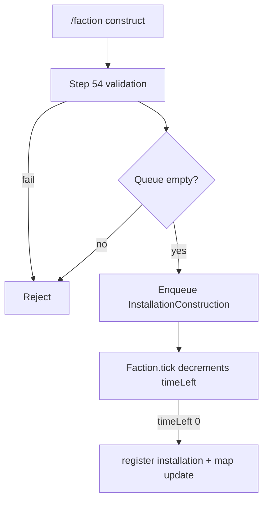
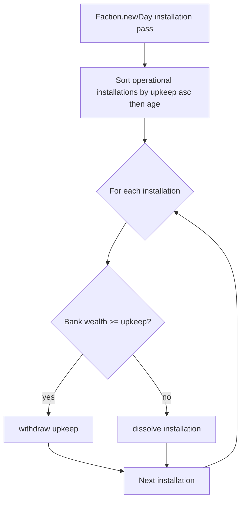

# Step 55.01 — Planning lock

**Plan + docs only.** Lock installation economy, construction, GUI, and payment rules before 55.02+ code.

**Repos:** `Workspace/simplefactions`  
**Depends on:** [00-index](./00-index.md) · [step-54/01-planning-lock](../step-54/01-planning-lock.md)  
**Authoritative gameplay doc (after 55.06):** [`Workspace/simplefactions/Documentation/Installations.md`](../../../../simplefactions/Documentation/Installations.md)

## Locked — config (`config.yml`)

Per kind under existing `installations:` block (`fort`, `port`, `airport`). Slot limits from step 54 remain unchanged.

```yaml
installations:
  fort:
    daily-upkeep: 50
    construction-time: 10  # 432000 (5 days)
    slots:
      static_emplacement: 8
  port:
    daily-upkeep: 20
    construction-time: 10  # 259200 (3 days)
    slots:
      ship: 10
  airport:
    daily-upkeep: 35
    construction-time: 10  # 259200 (3 days)
    slots:
      aircraft: 10
```

| Field | Type | Rule |
|-------|------|------|
| `daily-upkeep` | `double` | Denars charged **per operational installation per faction day** |
| `construction-time` | `int` | **Seconds** until build completes (dev: `10`; prod values in YAML comment) |

**Production reference (comments only in config):**

| Kind | Days | Seconds |
|------|------|---------|
| Fort | 5 | 432000 |
| Port | 3 | 259200 |
| Airport | 3 | 259200 |

## Locked — construction

| Rule | Value |
|------|--------|
| Queue size | **1** active construction per faction (not 3 like military) |
| Tick | Same as `MilitaryExpansion` — decrement `timeLeft` once per second in `Faction.tick()` |
| On `/faction construct` | Validate as step 54, then **enqueue**; do **not** register in `byId` until complete |
| Province lock | Reserve province+kind while queued or building (no second construct of same kind on that province) |
| Map export | Only **operational** installations in `installations[]` (no under-construction pins) |
| War | **No** block on starting construction during war — long build times are the balance |
| Cancel | Deconstruct (GUI confirm) on queued/active build cancels construction and frees the slot |



**Persistence:** Save queue entry on faction data (mirror `militaryQueue` pattern — kind, name, province, coords, `timeLeft`).

## Locked — daily upkeep

| Rule | Value |
|------|--------|
| Ledger enum | Rename `Cashflow.FORTS` → **`Cashflow.INSTALLATIONS`** (display: `#706964Installations`) |
| Ledger `getIncome(INSTALLATIONS)` | `-sum(daily-upkeep)` for each **operational** installation on faction main guild |
| Settlement | **Do not** double-charge in `populateDailyTransfers` — actual withdrawal happens in `Faction.newDay()` (mirror army, not trade_upkeep) |
| Under construction | **No** upkeep until operational |
| Payment order | In `Faction.newDay()`, **before** or **after** army upkeep (implement consistently; document in 55.04) |
| Cannot pay | **Destroy** that installation (dissolve + leader notify + map update) |
| Destroy order | **Cheapest `daily-upkeep` first**; tie-break **oldest first** (`startedAt` or queue completion timestamp) |



**Bankruptcy:** Negative balance is allowed (`wealth < 0` → `isBankrupt()`). Installation destruction is **explicit** on non-payment, not branch liquidation. Existing bankruptcy rules (ledger freeze, stability −100, block faction delete) unchanged.

## Locked — deconstruct confirm (GUI)

| Entry | Behaviour |
|-------|-----------|
| Installations list → click installation → Deconstruct | Open `§7Confirm Action` GUI (`confirmView`) |
| `/faction deconstruct <id>` | Same confirm GUI (no instant delete) |
| `/faction deconstruct` (no args) | Open **Installations list** GUI |
| Confirm (green) | Instant deconstruct (operational or cancel construction) |
| Cancel (red) | Return to installation **detail** view (or list if opened from command with id only) |
| Permission | Faction **leader** only (same as construct) |

Extend `InventoryManager` confirm handler with NamespacedKey **`installation`** + installation id (parallel to existing `regiment` and `dissolve` keys).

## Locked — faction GUI

**Hub button**

| Item | Value |
|------|--------|
| `MenuItemType` | New `INSTALLATIONS` |
| Faction view slot | **32** (row with Military 29, Dissolve 30, Diplomacy 31) |
| Icon | Relation **march** icon — `black_dye` CMD **24** from `config.yml` `relations:` list (same as diplomacy march) |
| Hub lore | `§7Click to view Installations` + summary: count by kind + total daily upkeep (`§e` values) |

**`INSTALLATIONS_VIEW`** (mirror `MILITARY_VIEW` layout)

| Slot | Content |
|------|---------|
| 10 | Summary item — total installations, total upkeep/day |
| 12+ | One **green concrete** per operational installation (paginate if needed later; v1: single page) |
| 39 | **Single queue slot** — active construction only (empty if idle) |
| 53 | Back → faction view |

**Installation list item lore** (match `MilitaryCreator` style):

- Display name (`StringFormatter.formatHex` / `#d4c9ae`)
- Kind, province id, block coords (`§7` / `§e`)
- `§7Upkeep: §e{upkeep}d/day`

**Queue item lore:**

- `§eBuilding {name}` (`{kind}`)
- Active: `§7Time left: §e{TimeFormatter.formatTime(timeLeft)}`
- (Only one slot — no “queued behind” state in v1)

**`INSTALLATION_DETAIL_VIEW`**

- Single installation (or construction) detail + **Deconstruct** button (leader only)
- Deconstruct → confirm GUI

**New `SFGUI` values:** `INSTALLATIONS_VIEW`, `INSTALLATION_DETAIL_VIEW`

Wire `InventoryUpdater` for live queue timer refresh (same pattern as military view).

## Locked — commands (summary)

| Command | Behaviour |
|---------|-----------|
| `/faction construct <kind> <name>` | Unchanged args; now enqueues construction |
| `/faction deconstruct` | Open installations GUI |
| `/faction deconstruct <id>` | Open confirm GUI for that id |

Tab-complete: existing deconstruct id completion unchanged.

## Locked — code touchpoints (SF)

| Area | Change |
|------|--------|
| `Cashflow.java` | `FORTS` → `INSTALLATIONS` |
| `Ledger.java` | Implement `INSTALLATIONS` income; remove `//TODO` |
| `Installation.java` / `InstallationData` | Optional `completedAt` for destroy sort tie-break |
| `installation/handler/` | `InstallationHandler` + `InstallationConstruction` + queue |
| `Faction.java` | `newDay()` installation upkeep pass; `tick()` construction tick |
| `FactionData` / `Database` | Persist construction queue |
| `Markers.java` | Export operational only |
| `FactionView` / `FactionCreator` | Hub button slot 32 |
| `InstallationView` / `InstallationCreator` | New (mirror MilitaryView) |
| `InventoryManager` | Confirm branch for `installation` |
| `CommandManager` | Deconstruct → GUI / confirm |

## Out of scope (step 55)

- Fort ZOC map layer ([step-43](../step-43/00-index.md))
- Upfront construction **cost** (denar payment at start) — time gate only
- Construct from GUI (command only for starting builds)
- VehicleFramework / slot enforcement
- ProvinceSystem / frontend changes (map already shows operational `installations[]` from step 54)

## Status

**Done** (2026-08-19).

## Next

[02-config-loader](./02-config-loader.md)
