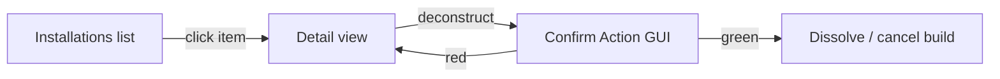

# Step 55.05 — Installations GUI and commands

**Repo:** `simplefactions`  
**Status:** **done** (2026-08-19)

Faction hub tab, list/detail views, GUI confirm deconstruct, command routing.

## GUI

| Component | Detail |
|-----------|--------|
| `MenuItemType.INSTALLATIONS` | Hub item slot **32**, march icon (`black_dye` CMD 24) |
| `SFGUI.INSTALLATIONS_VIEW` | Summary + green concrete grid + queue slot 39 + back 53 |
| `SFGUI.INSTALLATION_DETAIL_VIEW` | Lore + deconstruct button (leader) |
| `InstallationCreator` | Mirror `MilitaryCreator` lore/colours |
| `InstallationView` | Mirror `MilitaryView` click routing |
| `FactionView` | Open installations on slot 32 click |
| `InventoryManager` | Confirm handler: key `installation`, data = installation id |
| `InventoryUpdater` | Refresh queue time in open installations GUI |

## Deconstruct flow

## Commands

| Command | Action |
|---------|--------|
| `/faction deconstruct` | Open `INSTALLATIONS_VIEW` |
| `/faction deconstruct <id>` | `confirming.put` + `confirmView(p, f, "installation", id)` |

Leader-only; play sounds consistent with military/dissolve.

## Done when

- Faction leader opens hub → Installations → sees list + queue
- Click installation → detail → deconstruct → confirm → removed
- `/faction deconstruct` with no args opens list
- `/faction deconstruct greenfold` opens confirm directly

## Next

[06-docs-verify](./06-docs-verify.md)
