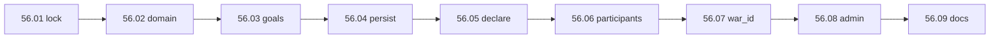

# Step 56 — War foundation

**Repo:** `Workspace/simplefactions`  
**Spec:** [Wars.md](../../../../simplefactions/Documentation/Wars.md) · [war-build-order.md](../../war-build-order.md)  
**Next step:** [57 — Pathfinder & campaign](../step-57/00-index.md)

## Goal

Replace legacy war scaffolding with **War v2**: single goal per war, validation, FSM, runtime persistence, test declare (no ticket/code), participants, and `war_id` hooks. **No pathfinder, battles, or map export yet.**

## Locked scope

| In scope | Out of scope |
|----------|----------------|
| `War` v2 domain model + JSON persistence | Declare codes (step **68**) |
| Goal validation (de jure rank, annex-if-no-settlements) | Campaign pathfinder (step 57) |
| Direct in-game declare for testing | Battles, voting, initiative |
| Sides / participants / ally call-to-arms (repurpose legacy) | Map `wars[]` export |
| `war_id` field on military commit stubs | Goal enforcement / reparations |

**Test declare:** `war.require_declare_code: false` until step 68.

## Build order

## Batches

| # | Batch | Summary |
|---|-------|---------|
| 1 | [01-planning-lock](./01-planning-lock.md) | Step 56 scope boundary + legacy inventory **done** |
| 2 | [02-domain-model](./02-domain-model.md) | `War` v2, enums, `WarMapper`, JSON DTOs **done** |
| 3 | [03-goal-validation](./03-goal-validation.md) | `WarGoalValidator`: rank gate, settlements block annex, target checks **done** |
| 4 | [04-persistence](./04-persistence.md) | Save on state change; `WarMapper` wired to `Database` **done** |
| 5 | [05-declare-flow](./05-declare-flow.md) | Diplomacy declare (no code); opinion threshold; civil-war flag **done** |
| 6 | [06-participants](./06-participants.md) | Subjects auto-in, ally calls, `Participant.update()` **done** |
| 7 | [07-war-id-stubs](./07-war-id-stubs.md) | `war_id` on levy/military commit records (stub API) **done** |
| 8 | [08-admin-commands](./08-admin-commands.md) | Fix `endwar`, war list, debug status **done** |
| 9 | [09-docs-verify](./09-docs-verify.md) | Unit tests, manual checklist, hub checklist tick **done** |

## Status

**Done** (2026-08-19). **56.01–56.09 complete.** **Next step:** [57 — Pathfinder & campaign](../step-57/00-index.md).

## Legacy

Repurpose `War/`, `WarManager`, diplomacy declare slot, JSON layout. Remove per-participant war goal GUI. See [Wars.md § Legacy](../../../../simplefactions/Documentation/Wars.md#legacy-system-to-replace).
