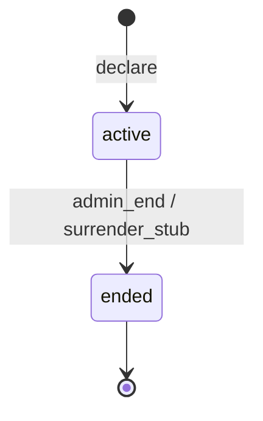
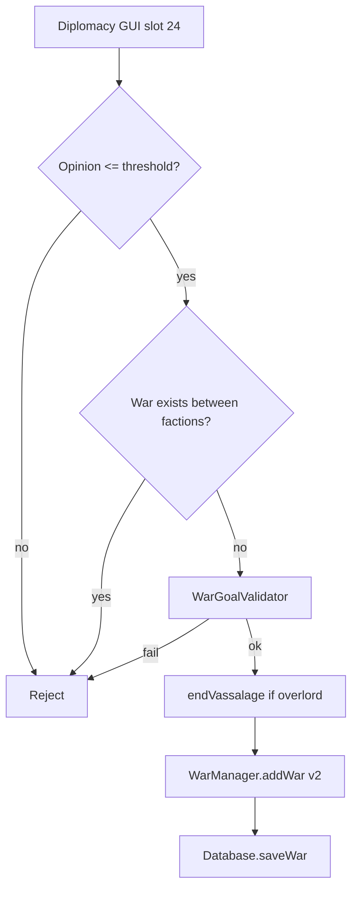

# Step 56.01 — Planning lock

**Plan + docs only.** Lock war foundation scope, v2 persistence shape, declare rules, and legacy inventory before 56.02+ code.

**Repos:** `Workspace/simplefactions`  
**Depends on:** [00-index](./00-index.md) · [Wars.md](../../../../simplefactions/Documentation/Wars.md) · [war-build-order.md](../../war-build-order.md)  
**Authoritative gameplay doc:** [Wars.md](../../../../simplefactions/Documentation/Wars.md)

## Goal

Lock step 56 boundaries so batches 56.02–56.09 do not creep into pathfinder, battles, declare codes, or map export.

---

## Locked — step 56 scope

| In scope | Out of scope |
|----------|----------------|
| War v2 domain model + `schemaVersion: 2` JSON | Declare codes → [step 68](../step-68/00-index.md) |
| Single war goal at declare time | Campaign pathfinder → [step 57](../step-57/00-index.md) |
| `WarGoalValidator` (validate only; no enforcement) | Goal enforcement / reparations → [step 62](../step-62/00-index.md) |
| Test declare (`war.require_declare_code: false`) | Battles, voting, initiative → steps [58](../step-58/00-index.md)–[60](../step-60/00-index.md) |
| Runtime persistence (save on every state change) | Map `wars[]` export → [step 67](../step-67/00-index.md) |
| Repurpose sides / allies / subjects / ally CTA | Warbands merge → [step 60](../step-60/00-index.md) |
| `war_id` on military commit stubs | Chronicle events → step 67+ |

---

## Locked — war goals (declare-time validation only)

One war = one goal. Chosen at declare; enforced in step 62.

| Goal ID (v2) | When valid | Validation in 56 | Enforcement |
|--------------|------------|------------------|-------------|
| `de_jure_annex` | Target de jure region has **no settlements** | Rank gate; attacker partially controls title; settlement scan | Step 62 |
| `subjugate` | Vassalize target faction | Valid target faction exists | Step 62 |
| `transfer_subject` | Move subject between overlords | Subject + target overlords valid per ticket | Step 62 |

### Legacy `wargoals.yml` ID mapping

| Legacy ID (`wargoals.yml`) | v2 goal | Step 56 |
|----------------------------|---------|---------|
| `annex` | `de_jure_annex` | Validate only |
| `subjugate` | `subjugate` | Validate only |
| `transfer_subject` | `transfer_subject` | Validate only |
| `tributary`, `revolt`, `independence`, `usurp`, `war_reparations` | — | **Not** v2 declare goals; drop from declare UI (step 62 or later if reintroduced) |

`Goal` enum in `enums/Goal.java` is narrowed/replaced in [56.02](./02-domain-model.md).

---

## Locked — war types (campaign shape, metadata only in 56)

Stored on war record for step 57+; not fully used until pathfinder ships.

| `warType` | Meaning |
|-----------|---------|
| `de_jure` | De jure title completion war |
| `subjugate` | Subjugation war (may overlap goal `subjugate`) |
| `transfer_subject` | Subject transfer war |
| `raid` | One-battle settlement raid → step [66](../step-66/00-index.md) |

Step 56 stores `warType` + `goal` on declare; campaign fields remain null.

---

## Locked — war states (FSM minimum)



| State | Meaning |
|-------|---------|
| `active` | War declared; campaign fields null until step 57 |
| `ended` | Terminal; `endReason` set |

**Deferred:** `pending` state (skip in v1 unless declare UI needs it).

### `endReason` subset in step 56

| Value | When |
|-------|------|
| `admin_end` | `/faction endwar` (after 56.08 fix) |
| `surrender` | Stub — full surrender flow in step 62 |

Full `endReason` enum (white peace, capital lost, etc.) locked in step 62.

---

## Locked — war leaders

| Field | Rule |
|-------|------|
| `attackerLeaderId` | Main attacker faction id at declare |
| `defenderLeaderId` | Main defender faction id at declare |

Surrender / white peace authority: war leaders only (step 62). Council override deferred.

---

## Locked — persistence (`plugins/SimpleFactions/Wars/war_{id}.json`)

### v2 shape

```json
{
  "schemaVersion": 2,
  "id": 0,
  "status": "active",
  "goal": "subjugate",
  "warType": "de_jure",
  "attackerLeaderId": "faction_a",
  "defenderLeaderId": "faction_b",
  "targetTitleId": "county_x",
  "objectiveProvinceId": null,
  "startedAt": "2026-08-19T12:00:00Z",
  "endedAt": null,
  "endReason": null,
  "attackers": {
    "leader": "faction_a",
    "participants": [
      {
        "leader": "faction_a",
        "subjects": ["vassal_1"],
        "allies": { "ally_1": true },
        "civilWar": false
      }
    ]
  },
  "defenders": {
    "leader": "faction_b",
    "participants": []
  }
}
```

| Field | Step 56 rule |
|-------|----------------|
| `schemaVersion` | **2** on all new writes |
| `objectiveProvinceId` | **null** until step 57 |
| `participants[].warGoals` (v1) | **Deprecated** on write; read for v1 migration in 56.04 |

### Save policy (56.04)

- Save on: create, participant/ally change, status change, end.
- Remove sole reliance on `onDisable()` save loop (keep as safety flush optional).

---

## Locked — config (`config.yml`)

New top-level `war:` block (defaults for dev until step 68):

```yaml
war:
  require_declare_code: false      # true only after step 68
  declare_opinion_threshold: -50     # matches diplomacy.yml war threshold
  initiative_per_side: 4           # consumed in step 58; defined now for stability
  declined_ally_stability_penalty: -30   # applied step 62 or 56.06 stub
```

| Field | Type | Rule |
|-------|------|------|
| `require_declare_code` | `boolean` | When `false`, diplomacy declare works without code (steps 56–67) |
| `declare_opinion_threshold` | `int` | Attacker opinion of target must be ≤ this value |
| `initiative_per_side` | `int` | Starting initiative per side (step 58) |
| `declined_ally_stability_penalty` | `int` | % stability debuff on declined call-to-arms |

---

## Locked — declare flow (test mode, no code)



- No declare code check when `require_declare_code: false`.
- Single goal selected at declare (replaces per-participant goal picker).
- Fix `numOnline() < 0` → `< 1` if online check retained ([56.05](./05-declare-flow.md)).

---

## Locked — legacy repurpose vs remove

| Keep / repurpose | Remove or stub in step 56 |
|------------------|---------------------------|
| `WarManager` registry + notifications | Per-participant `warGoals` on active declare path |
| `WarView` / `WarCreator` war list + participant views | Multi-target war goal picker GUI; **Switch sides** (independence rebellion) |
| `RelationView` declare slot (slot 24) | `WarManager.existsHostile()` (unused) |
| `WarRequest` + `RequestManager` ally CTA | Save-only-on-disable as sole persistence |
| `Database` war save/load + Gson DTOs | Legacy `Goal` enum values not in v2 declare set |
| `Side` / `Participant` structure | Warbands muster behavior changes → step 60 |
| `wargoals.yml` + `WarGoalLoader` | `annex` as separate from `de_jure_annex` in UI |

Full file list: [02-domain-model.md § Legacy file inventory](./02-domain-model.md#legacy-file-inventory).

---

## Known legacy bugs (fix in 56.08)

| Location | Bug |
|----------|-----|
| `CommandManager` `endwar` | `Integer warId = 0; Integer.parseInt(args[1]);` — parse result never assigned; always ends war id **0** |
| `RelationView` declare | `f.numOnline() < 0` — never true; online check never fires |

---

## Out of scope (explicit)

| Item | Step |
|------|------|
| Ticket / declare codes | **68** |
| Campaign line, objective province, pathfinder | **57** |
| Initiative, occupation, cursor | **58** |
| Battle window, voting | **59** |
| Warbands merge, battles, lives | **60–61** |
| Goal enforcement, reparations ledger | **62** |
| Forts, naval, inter-battle raids | **63–65** |
| Raid war type | **66** |
| `wars[]` map export | **67** |
| STAGING operator checklist | **56.09** |

---

## Deliverables

- [x] This file — full planning lock
- [x] Legacy file inventory in [02-domain-model](./02-domain-model.md)

## Status

**Done** (2026-08-19). **Next batch:** [56.02 — Domain model](./02-domain-model.md).
