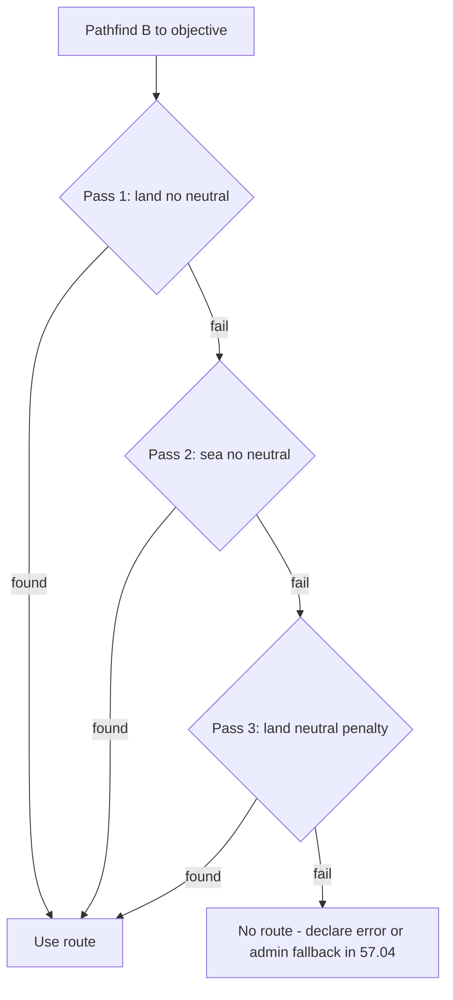

# Step 57.01 — Planning lock

**Plan + docs only.** Lock pathfinder scope, routing rules, border start, campaign line v1, persistence fields, and config before 57.02+ code.

**Repos:** `Workspace/simplefactions`  
**Depends on:** [00-index](./00-index.md) · [step-56](../step-56/00-index.md) · [Wars.md](../../../../simplefactions/Documentation/Wars.md) · [war-build-order.md](../../war-build-order.md)  
**Authoritative gameplay doc:** [Wars.md](../../../../simplefactions/Documentation/Wars.md)

## Goal

Lock step 57 boundaries so batches 57.02–57.05 do not creep into initiative, battles, map export, or raid war routes.

---

## Locked — step 57 scope

| In scope | Out of scope |
|----------|----------------|
| `ProvincePathfinder` module spec | Implementation → [57.02](./02-pathfinder.md) (TBD) |
| Three-pass route priority (land → sea → land+neutral) | Cursor movement → [step 58](../step-58/00-index.md) |
| Border-first campaign start (Step A) | Initiative pools → step 58 |
| Campaign polyline v1 (border → objective) | Battles, voting → steps 59–61 |
| Objective province picker spec | Goal enforcement → step 62 |
| `campaign_provinces[]` + fields on `War` | Raid war routes → step 66 |
| Config keys for pathfinder | Map `wars[]` export → step 67 |
| Declare hook + admin debug visibility | Declare codes → step 68 |

**57.01 itself:** lock doc + spec alignment only. **No Java changes.**

---

## Locked — pathfinder algorithm

### Graph inputs

| Source | Use |
|--------|-----|
| [`Input/province_neighbors.json`](../../../../simplefactions/src/main/resources/Input/province_neighbors.json) | Undirected adjacency edges |
| [`Input/provinces.txt`](../../../../simplefactions/src/main/resources/Input/provinces.txt) | Terrain per province id |
| [`config.yml` `terrain-modifiers`](../../../../simplefactions/src/main/resources/config.yml) | Base land difficulty (same philosophy as trade) |
| `Province.getOwner()` via `TitleManager` | Neutral vs belligerent classification |

**Code pitfall:** [`Province.isSea()`](../../../../simplefactions/src/main/java/me/Plugins/SimpleFactions/Map/Provinces/Province.java) returns true for **both** `WATER` and `SEA`. Pathfinder must use `terrain == Terrain.SEA` for ocean-only logic, **not** `isSea()`.

### Edge / node costs (path of least resistance)

- **Node enter cost** derived from terrain modifier (lower modifier = harder terrain = higher path cost).
- Reuse top-level `terrain-modifiers` table; optional `war.pathfinder.water_cost` override.
- **WATER** (rivers, lakes): always traversable on **land passes** at normal terrain cost (~`0.75` from config). Routes may cross water tiles so paths do not zigzag around every river.
- **SEA** (ocean): **impassable** on land passes 1 and 3 (infinite cost); only traversable in **pass 2**.
- **MOUNTAIN, BOG, etc.:** crossable but expensive; pathfinder prefers plains unless mountains are genuinely shorter.

Optional: reuse single-WATER-bridge adjacency from [`ProvinceHandler.isEffectivelyAdjacent()`](../../../../simplefactions/src/main/java/me/Plugins/SimpleFactions/Objects/Handler/ProvinceHandler.java) if raw graph is sparse; low WATER cost should suffice for v1.

### Neutral provinces

**Neutral** = province owner faction id **not** in the war belligerent set (attacker side + defender side: leaders, subjects, called allies).

| Pass | Neutral handling |
|------|------------------|
| **1** Land, no neutral | Blocked |
| **2** Sea, no neutral | Blocked |
| **3** Land + neutral | Allowed with heavy multiplier (`war.pathfinder.neutral_penalty`, default `8.0`) |

Run passes **in order**; first pass that finds a route wins.

### Three-pass route priority (locked)

1. **Land campaign** - land + WATER; no SEA; no neutral
2. **Sea campaign** - SEA hops between coastal belligerent provinces; no neutral
3. **Land + neutral fallback** - same traversability as pass 1; neutrals penalized

No sea-first routing; land is always preferred when possible.



---

## Locked — Step A: border start province `B`

**Intent:** shortest invasion corridor from **attacker–defender border** toward **objective province**, not capital-to-capital through messy borders.

1. Collect **border provinces**: attacker-owned province adjacent to defender-owned province (direct graph edge; owners from belligerent sides).
2. Resolve **objective province** per [Wars.md § Objective province](../../../../simplefactions/Documentation/Wars.md) (implementation in **57.03**).
3. For each candidate `B`, pathfind `B → objective` using passes 1→2→3; record total cost.
4. Pick `B` with **minimum cost** → `campaignStartProvinceId`.

**No land border fallback:** pick defender coastal province closest to attacker territory; use pass 2 if needed (exact tie-break in 57.02 tests).

---

## Locked — Step B: campaign line v1

**v1 polyline (step 57):**

- **`campaign_provinces[]`** = ordered path **`start B → objective`** (inclusive), using the winning pass from Step A.
- **`cursor_index`** = `0` at generation (movement rules in step 58).
- **Attacker-capital tail / counter-push merge** deferred to **step 58** (initiative backward push toward attacker capital).

Wars.md previously described merging paths to defender capital **and** attacker capital. v1 ships border→objective only; dual-capital merge ships with initiative in step 58.

---

## Locked — when pathfinder runs

| Trigger | Action |
|---------|--------|
| War declare (after validation) | Compute objective + campaign line; persist on `War` |
| Admin regen command (57.04) | Recompute for active wars (debug) |

**Raid war type** (`warType: raid`) uses a different route (settlement border distance) → step **66**, not 57.

---

## Locked — persistence fields (57.03 implements)

Align with [map-export-schema.json](../../assets/map-export-schema.json):

| Field | Type (target) | Step 57 rule |
|-------|---------------|--------------|
| `objectiveProvinceId` | **integer** | Fix current `String` on [`War.java`](../../../../simplefactions/src/main/java/me/Plugins/SimpleFactions/War/War.java) in **57.03** |
| `campaignProvinces` | `int[]` | Ordered polyline; null until computed |
| `cursorIndex` | `int` | Default `0`; unused until step 58 |
| `campaignStartProvinceId` | `int` (metadata) | Border pick `B`; useful for debug/export |

Save on campaign generation (same policy as 56.04 state changes).

### v2 JSON sketch (campaign fields populated)

```json
{
  "schemaVersion": 2,
  "id": 1,
  "status": "active",
  "goal": "subjugate",
  "warType": "subjugate",
  "objectiveProvinceId": 42,
  "campaignStartProvinceId": 17,
  "campaignProvinces": [17, 23, 31, 42],
  "cursorIndex": 0
}
```

Step 56 wars keep these fields **null** until pathfinder runs at declare (57.04) or backfill admin command.

---

## Locked — config (`config.yml`)

Add under existing `war:` block (values applied in **57.02**):

```yaml
war:
  require_declare_code: false
  declare_opinion_threshold: -50
  initiative_per_side: 4
  declined_ally_stability_penalty: -30
  pathfinder:
    neutral_penalty: 8.0
    sea_pass_enabled: true
    # water_cost: optional override; default = terrain-modifiers WATER
```

| Field | Type | Rule |
|-------|------|------|
| `pathfinder.neutral_penalty` | `double` | Cost multiplier for neutral provinces in pass 3 |
| `pathfinder.sea_pass_enabled` | `boolean` | When `false`, skip pass 2 (dev/testing only) |
| `pathfinder.water_cost` | `double` (optional) | Override WATER enter cost; default from `terrain-modifiers` |

Reuse top-level `terrain-modifiers` for land difficulty table.

---

## Locked — module layout (57.02+)

New package under `War/`, not embedded in trade/`ProvinceManager`:

| File (proposed) | Batch | Role |
|-----------------|-------|------|
| `War/pathfinder/ProvincePathfinder.java` | 57.02 | Dijkstra/A* over province graph |
| `War/pathfinder/PathfinderPass.java` | 57.02 | Pass 1/2/3 rule enum |
| `War/pathfinder/PathfinderResult.java` | 57.02 | Path, cost, pass used, start province |
| `War/pathfinder/BelligerentTerritory.java` | 57.02 | Neutral + border province helpers |
| `War/objective/ObjectiveProvincePicker.java` | 57.03 | Capital > settlement > centroid |

### Unit test cases (57.02 / 57.03)

| Case | Expect |
|------|--------|
| River between land tiles | Route crosses WATER; cheaper than 4-province detour |
| Ocean between coasts | Pass 1 fails; pass 2 uses SEA hops |
| Neutral blocks land corridor | Pass 1 fails; pass 3 routes with penalty |
| Messy long border | Step A picks border `B` with minimum B→objective cost |

---

## Locked — objective province (reference)

Implementation in **57.03**; rules unchanged from Wars.md:

| Condition | Pick |
|-----------|------|
| Title/region **capital** in set | Capital province |
| Else **largest settlement** | Province with largest settlement; capital settlement beats non-capital |
| No settlements | **Geometric center** of title/region provinces |

All capture/recapture battles occur **at this province**.

---

## Out of scope (explicit)

| Item | Step |
|------|------|
| `ProvincePathfinder` Java | **57.02** |
| `War` fields + mapper + objective picker | **57.03** |
| Declare hook + admin debug command | **57.04** |
| Cursor, initiative, occupation, dual-capital merge | **58** |
| Battle window, voting | **59** |
| Battles, lives, warbands | **60–61** |
| Goal enforcement | **62** |
| Raid routes | **66** |
| Map export | **67** |
| Declare codes | **68** |

---

## Deliverables

- [x] This file - full planning lock
- [x] [Wars.md](../../../../simplefactions/Documentation/Wars.md) § Campaign route aligned (WATER/SEA, neutral, Step B v1)
- [x] [00-index](./00-index.md) batch table updated

## Status

**Done** (2026-08-20). **Next batch:** 57.02 — `ProvincePathfinder` implementation.

**Post-57 spec note (2026-08-20):** [Wars.md](../../../../simplefactions/Documentation/Wars.md) adds **capital-closer-than-region-objective** at declare/regen (compare path cost from border **B**). Implement as a small `WarCampaignService` follow-up in step **58** or patch 57.x; algorithm unchanged.
