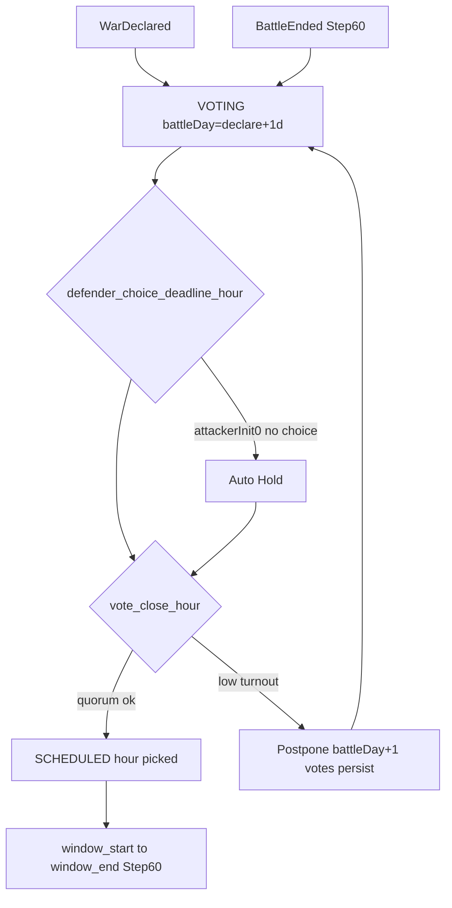

# Step 59.01 — Planning lock (battle scheduling)

**Plan + docs only.** Lock battle window, hour voting, vote/defender deadlines, postpone, autoresolve flags, Campaign GUI hour row, and persistence before 59.02+ code.

**Repos:** `Workspace/simplefactions`  
**Depends on:** [00-index](./00-index.md) · [step-58.01](../step-58/01-planning-lock.md) · [Wars.md](../../../../simplefactions/Documentation/Wars.md) · [war-build-order.md](../../war-build-order.md)  
**Authoritative gameplay doc:** [Wars.md](../../../../simplefactions/Documentation/Wars.md)

## Goal

Lock step 59 boundaries so batches 59.02–59.07 do not creep into battle runtime (60–61), goal apply (62), fort siege gates (63), map export (67), or declare codes (68).

**59.01 itself:** lock doc + Wars.md alignment only. **No Java changes.**

---

## Locked — step 59 scope

| In scope | Out of scope |
|----------|----------------|
| Vote open/close timeline, configurable Zulu hours | Warbands merge, battle engine (60–61) |
| Hour multi-select + `min(attacker, defender)` pick | `applyFoughtBattleOutcome` at battle end |
| Postpone (+1 battle day, no initiative, votes persist) | Surrender polish, reparations (62) |
| Dual-leader autoresolve flags only | Fort ZOC siege gates (63), naval (64) |
| Defender choice deadline + auto-Hold | Map `wars[]` emit (67) |
| Campaign GUI hour toggles + schedule info | Raid routes (66) |
| Admin `/faction warschedule` debug commands | Declare codes (68) |
| Persistence + `warstatus` schedule fields | Staff battle templates (60) |

---

## Locked — daily timeline (Zulu)

All clock times **UTC (Zulu)**. Defaults below are config (see [Config](#locked--config)).

```text
[ vote open ………… defender_deadline ……… vote_close ………… battle window ]
                              │                    │              │
                              │                    │              └── window_start–window_end
                              │                    └── vote_close_hour (default 16)
                              └── defender_choice_deadline_hour (default 12)
```

| Event | Config key (default) | Rule |
|-------|----------------------|------|
| **Hour vote open** | — | When a **next battle** is pending: at declare **or** after previous battle ends. **Does not** wait for battle province. |
| **Defender choice deadline** | `defender_choice_deadline_hour` (**12**) | On **battle day**, only when [attacker initiative = 0 branch](../step-58/01-planning-lock.md) (Hold / Counter-push / Accept white peace). |
| **Defender no choice** | — | Auto **Hold** (no counter-push). |
| **Hour vote close** | `vote_close_hour` (**16**) | On **battle day**: tally → schedule hour, postpone, or autoresolve. |
| **Battle window** | `window_start_hour`–`window_end_hour` (**20–24**) | Fought at scheduled hour (Step **60**). |

**Validation (59.02):** `defender_choice_deadline_hour` < `vote_close_hour` < `window_start_hour` (inclusive hour integers).

**Battle day** = UTC calendar day of this war's daily battle slot. **One battle per war per battle day** (`one_battle_per_day: true`).

### Scheduler flow



---

## Locked — first battle after declare

| Rule | Detail |
|------|--------|
| **First battle day** | **Calendar day after declare** (UTC). Declare Monday → first battle day **Tuesday** evening window. |
| **First vote open** | **At declare** (`battleSchedulePhase = VOTING`). No battle province required. |
| **First vote close** | `vote_close_hour` on that **first battle day**. |

Players may vote for multiple days before the first fight; the first fight cannot fall on declare day.

**Declare hook (59.06):** `battleDay = declareDate(UTC).plusDays(1)`, `battleSchedulePhase = VOTING`, votes map empty.

---

## Locked — vote open / close (all battles)

| Rule | Detail |
|------|--------|
| **Open trigger** | Next campaign battle pending (war active, not ended, daily slot available). |
| **Province not required** | Hour vote = attendance only. Site from [`CampaignProgressionService.resolveNextBattleNodes`](../../../../simplefactions/src/main/java/me/Plugins/SimpleFactions/War/progression/CampaignProgressionService.java) at vote close or battle start. |
| **Close trigger** | `vote_close_hour` on current **battle day**, regardless of when voting opened. |
| **After close (quorum ok)** | Set `scheduledBattleAt`, `scheduledBattleHour`, `scheduledBattleProvinceId`, `battleSchedulePhase = SCHEDULED`. |
| **After battle ends (60+)** | Re-open voting immediately; `battleDay` advances to next calendar day per one-battle-per-day. |

---

## Locked — postpone (low turnout)

When vote close fails quorum at `vote_close_hour`:

1. [`CampaignProgressionService.applyPostponedBattle(war)`](../../../../simplefactions/src/main/java/me/Plugins/SimpleFactions/War/progression/CampaignProgressionService.java) — **no** initiative spend, **no** cursor move.
2. **`battleDay` +1** (UTC calendar).
3. **Votes persist** (no reset).
4. **`battleSchedulePhase`** stays **`VOTING`** (or re-enters it).
5. Increment `postponementsThisCycle` (debug / `warstatus`).

Next close at `vote_close_hour` on the new battle day.

---

## Locked — defender choice vs hour vote

When **attacker initiative = 0** and defender has yellow choice UI (Step 58):

| By `defender_choice_deadline_hour` on battle day | Outcome |
|--------------------------------------------------|---------|
| Hold / Counter-push / Accept white peace | Unchanged Step 58 outcomes |
| No choice | **Auto Hold** |

Strategic choice locks **before** hour schedule locks **before** fight.

---

## Locked — hour pick & quorum

### Hour pick

- Each eligible player **multi-selects** all hours they can attend (within window).
- **Pick hour:** maximize `min(attacker_votes(H), defender_votes(H))`; tie → **earliest** hour.
- **Autoresolve:** only if **both** war leaders propose (separate from white peace); sets `AUTORESOLVE_PENDING` — Step **60** executes fight outcome.

### Eligible voters

**Online** members of factions **participating** in that war on a belligerent side:

- Main faction + subjects on that side
- **Called allies** on that side

(Offline members do not vote; denominator for smallest-side-full uses **eligible member count**, not online count.)

### Quorum

```yaml
war:
  battle_voting:
    min_players: 4
    require_smallest_side_full: true
    pass_if_either: true
    dev_min_players: 1          # test server only; see DEV-SHORTCUTS
```

| Rule | Detail |
|------|--------|
| **Pass if** | Total distinct voters ≥ `min_players` **OR** both sides meet smallest-side-full (when `pass_if_either: true`) |
| **Smallest side full** | Side with fewer **eligible members** has 100% of those members represented in `battleVotes` (any hour selected counts as voted) |
| **Fail** | Postpone (see above) |

---

## Locked — persistence (59.02 on `War` / `WarData`)

| Field | Type | Purpose |
|-------|------|---------|
| `battleSchedulePhase` | enum | `IDLE`, `VOTING`, `SCHEDULED`, `AUTORESOLVE_PENDING` |
| `battleDay` | date (UTC) | Current battle day for this war |
| `scheduledBattleAt` | instant | Chosen fight time |
| `scheduledBattleHour` | int | Zulu hour (debug / GUI) |
| `scheduledBattleProvinceId` | int? | Set at vote close |
| `battleVotes` | map UUID → hour set | Per-player multi-select |
| `autoresolveProposedByAttacker` | bool | Dual-leader autoresolve |
| `autoresolveProposedByDefender` | bool | Dual-leader autoresolve |
| `postponementsThisCycle` | int | Debug counter since last fought battle |

Extend [`WarMapper`](../../../../simplefactions/src/main/java/me/Plugins/SimpleFactions/War/WarMapper.java), [`WarDebugFormatter`](../../../../simplefactions/src/main/java/me/Plugins/SimpleFactions/War/WarDebugFormatter.java), round-trip tests in 59.02.

### `BattleSchedulePhase`

| Phase | Entry |
|-------|-------|
| `IDLE` | War ended or no pending battle (transitional) |
| `VOTING` | Vote open until `vote_close_hour` on `battleDay` |
| `SCHEDULED` | Hour picked; waiting for window (Step 60 starts fight) |
| `AUTORESOLVE_PENDING` | Both leaders agreed autoresolve |

---

## Locked — config

Full block loaded in 59.02 ([`ConfigLoader`](../../../../simplefactions/src/main/java/me/Plugins/SimpleFactions/Loaders/ConfigLoader.java)):

```yaml
war:
  battle_schedule:
    window_start_hour: 20
    window_end_hour: 24
    vote_close_hour: 16
    defender_choice_deadline_hour: 12
    one_battle_per_day: true
    first_battle_day_after_declare: true
  battle_voting:
    min_players: 4
    require_smallest_side_full: true
    pass_if_either: true
    dev_min_players: 1
```

Test server may shorten all hour keys (e.g. 10 / 11 / 12 / 13) if order constraint holds.

---

## Locked — Campaign GUI (extend Step 58)

**Navigation unchanged:** WarView → Campaign → [`CampaignView`](../../../../simplefactions/src/main/java/me/Plugins/SimpleFactions/Managers/Inventory/CampaignView.java).

| Row / slot | Content |
|------------|---------|
| **10–18** | Route (existing; page 9–19) |
| **28–32** | Hour toggles (one per window hour; max 5 at default 20–24). Selected = lime pane, unselected = gray |
| **4** | Info book: `battleDay`, vote close time, your selections, tally summary, `scheduledBattleAt` if `SCHEDULED` |
| **48** | Accept white peace (58) |
| **49–51** | Leader autoresolve propose (59.05) when allowed |

Hour toggles when `battleSchedulePhase == VOTING` and viewer is eligible voter. All lore via `StringFormatter.formatHex`.

Defender hold/counter-push yellow route clicks (58) remain; **12:00 auto-Hold** enforced by scheduler if no click.

---

## Locked — dev / solo testing

Admin-only **`/faction warschedule <warId> <subcommand>`** (59.06; permission `simplefactions.admin`):

| Subcommand | Effect |
|------------|--------|
| `opencvote` | Force `VOTING` |
| `closevote` | Run tally now (schedule or postpone) |
| `skipday` | `battleDay` +1 |
| `castvote <hour> [attacker\|defender\|both]` | Spoof votes for testing |
| `forcequorum` | Next close treated as quorum pass |
| `setscheduled <iso-instant>` | Jump to `SCHEDULED` (Step 60 prep) |

Plus `war.battle_voting.dev_min_players: 1` on test server.

**Remove before production:** all warschedule spoof + dev config overrides. See [DEV-SHORTCUTS.md](../../DEV-SHORTCUTS.md).

---

## Locked — module layout (59.02+)

| Path | Batch | Role |
|------|-------|------|
| `War/enums/BattleSchedulePhase.java` | 59.02 | Phase enum |
| `War/schedule/BattleWindowService.java` | 59.03 | Valid hours, instant math |
| `War/schedule/BattleVoteService.java` | 59.03 | Record votes, `pickHour` |
| `War/schedule/BattleQuorumService.java` | 59.03 | Quorum check |
| `War/schedule/BattleScheduleService.java` | 59.04–59.06 | Orchestration, tick hooks |
| `Managers/Inventory/CampaignView.java` | 59.05 | Hour row + info book |
| `Managers/Inventory/CampaignCreator.java` | 59.05 | Hour toggle items |
| `War/WarDebugFormatter.java` | 59.06 | Schedule JSON fields |
| `Managers/CommandManager.java` | 59.06 | `warschedule` admin |

---

## Batch split

| Batch | Deliverable |
|-------|-------------|
| **59.01** | This lock + Wars.md (**done**) |
| **59.02** | Domain model, persistence, config load + validation |
| **59.03** | Window + vote + quorum services + unit tests |
| **59.04** | Postpone, autoresolve, defender deadline auto-Hold |
| **59.05** | Campaign GUI hour toggles + schedule info |
| **59.06** | Scheduler tick, declare hook, `warschedule`, `warstatus` |
| **59.07** | Docs verify + staging checklist |

---

## Status

**Done** (2026-08-20). **Next batch:** [59.02 domain model](./02-domain-model.md) (TBD).
