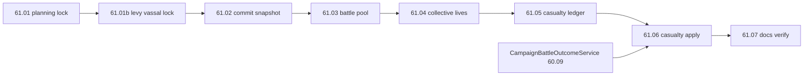

# Step 61 — Military & casualties

**Repo:** SF · [war-build-order.md](../../war-build-order.md) · [01-planning-lock.md](./01-planning-lock.md) · [Wars.md](../../../../simplefactions/Documentation/Wars.md)  
**Depends on:** [60](../step-60/00-index.md) · **Next:** [62](../step-62/00-index.md)

## Goal

Connect the war military model to campaign battles: freeze levy/regiment commits at declare, pick offense/defense pools by battle location, compute collective lives from commits, track battle casualties, and apply regiment losses when a campaign fight ends.

## Locked (61.01)

| Topic | Rule |
|-------|------|
| **Commit** | Fighters: live own regiments at battle time. Levy: nearest-fighter holder rows; frozen at declare + ally join; subtree drop on vassal break; no add on new vassal |
| **Battle pool** | Offense/defense by battle province + campaign phase, not declare side |
| **Militia** | Own land only; overlord militia excluded in vassal land |
| **Lives** | `max(min, livesPerRegiment × committed − playersAtStart)` for campaign field/siege |
| **Ledger** | Deaths + disconnects per side during campaign field/siege |
| **Apply** | Militia first, then proportional army/levy; debits commitment + faction slots |
| **Hook** | `CampaignBattleOutcomeService` after 60.09; skip manual (`warId null`) |

## Current gaps (pre-61)

| Gap | Today |
|-----|--------|
| War commitment snapshot | **61.02 done** — real counts + levy rows in memory |
| Battle pool resolver | **61.03 done** — `BattlePoolService` offense/defense + militia + levy |
| Battle lives | **61.04 done** — `BattleLivesService` at campaign `battle.start()` |
| Casualty ledger | **61.05 done** — `BattleCasualtyLedger` deaths + disconnects per side |
| Warband roster | Uses live `getManpowerNoLevy`, not war commit snapshot |
| Battle deaths | **61.06 done** — `BattleCasualtyService` debits commitments + slots |
| Outcome hook | **61.06 done** — casualties before progression/`openVote` |

## Batches

| Batch | Summary | Status |
|-------|---------|--------|
| [61.01 planning lock](./01-planning-lock.md) | Lives formula, militia, levy, casualty order, scope | **done** (2026-08-20) |
| [61.01b levy & vassal lock](./01b-levy-vassal-lock.md) | Nested vassal holder/source, cascade removal, schema | **done** (2026-08-20) |
| [61.02 war commitment](./02-war-commitment.md) | Real declare-time `WarCommitment` snapshot | **done** (2026-08-20) |
| [61.03 battle pool](./03-battle-pool.md) | Offense/defense + militia eligibility by province | **done** (2026-08-21) |
| [61.04 collective lives](./04-collective-lives.md) | Campaign lives at `battle.start()` | **done** (2026-08-21) |
| [61.05 casualty ledger](./05-casualty-ledger.md) | Track deaths/disconnects per side | **done** (2026-08-21) |
| [61.06 casualty apply](./06-casualty-apply.md) | Regiment losses + outcome hook + persist | **done** (2026-08-21) |
| [61.07 docs verify](./07-docs-verify.md) | Tests + staging checklist | **done** (2026-08-21) |

## Dependency flow

## Status

**Step 61 complete** (2026-08-21). **Extensions:** [61b battle dev mode](../step-61b/00-index.md) (shipped 2026-08-21), [61c campaign UX](../step-61c/00-index.md) (planned). **Next:** [61c](../step-61c/00-index.md) then [62 war end & goals](../step-62/00-index.md).
