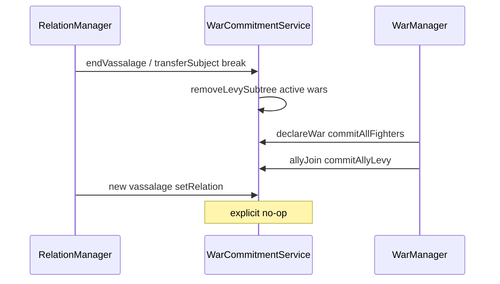

# Step 61.01b — Levy & vassal chain planning lock

**Done** (2026-08-20). **Plan + docs only.** Lock nested vassal levy attribution, nearest-fighter holder assignment, ally-join snapshots, vassal-break cascade removal, and `WarCommitment` levy schema before 61.02 code.

**Repos:** `Workspace/simplefactions`  
**Depends on:** [61.01 planning lock](./01-planning-lock.md) · [00-index](./00-index.md) · [Wars.md](../../../../simplefactions/Documentation/Wars.md)  
**Blocks:** [61.02 war commitment](./02-war-commitment.md)  
**Authoritative gameplay doc:** [Wars.md](../../../../simplefactions/Documentation/Wars.md)

## Goal

61.01 locked the four minimal military rules but left levy holder assignment and nested vassal chains underspecified. 61.01b closes those gaps so 61.02 does not double-count nested levies or miss bottom-level vassal break effects.

**61.01b itself:** lock doc + cross-doc alignment only. **No Java changes.**

---

## Locked — fighter set

**Fighters** on a war side = [`BattleSideMembers.collectParticipatingFactions`](../../../../simplefactions/src/main/java/me/Plugins/SimpleFactions/War/schedule/BattleSideMembers.java):

| Included | Excluded |
|----------|----------|
| Main participant leader(s) | Nested vassals (subject-of-subject) |
| **Direct subjects only** of each main participant ([`Participant`](../../../../simplefactions/src/main/java/me/Plugins/SimpleFactions/War/Participant.java) uses `RelationManager.getSubjects(leader)`) | Uncalled allies |
| **Called allies** (`allies.get(f) == true`) | Ally subjects (unless separately called) |

**Levy-only:** any faction not in the fighter set whose overlord chain reaches a fighter on the same side.

---

## Locked — four minimal rules (from 61.01, unchanged)

| # | Rule |
|---|------|
| **1** | **Fighter OR levy-only, never both.** |
| **2** | **Fighter own regiments are live** at each battle start (buildup counts). |
| **3** | **Levy is frozen** except at declare and ally join. |
| **4** | **Every levy row names who loses:** `holder → source → count`. |

---

## Locked — levy row assignment (nearest fighter holder)

**Do not** snapshot by calling `getLevies()` independently on every fighter. Main + subject fighters would duplicate nested sources because [`Military.getLevies()`](../../../../simplefactions/src/main/java/me/Plugins/SimpleFactions/Army/Military.java) rolls nested entries into the top overlord's list.

### Algorithm

1. Build `fighterSet` for the war side (`BattleSideMembers.collectParticipatingFactions`).
2. For each faction `S` in the same top realm as the side, **not** in `fighterSet`:
   - Walk `S → getOverlord → …` until hitting a faction `H` in `fighterSet`. If none found on this side, skip.
   - **`H` = holder**, **`S` = source** (one row per pair).
3. **Count** at snapshot moment: same math as `Military.getLevies()` for the contribution flowing from `S` up through intermediate non-fighter vassals to `H` (apply each hop's `LEVY` modifier %; cap by member count per existing military rules).
4. Skip any source already in `fighterSet`.

### Snapshot triggers

| Trigger | Scope |
|---------|--------|
| **War declare** | Levy snapshot for all fighters on both sides |
| **Ally join** | Levy snapshot for the **joining ally** only |
| **New vassalage** (overlord = main, subject fighter, or ally) | **No rows** |
| Subject buildup / levy % change | **No change** |

---

## Locked — vassal break cascade

When vassalage ends ([`RelationManager.endVassalage`](../../../../simplefactions/src/main/java/me/Plugins/SimpleFactions/Managers/RelationManager.java)) or [`transferSubject`](../../../../simplefactions/src/main/java/me/Plugins/SimpleFactions/Managers/RelationManager.java) (break + rebind):

Remove from every **active war** on affected side(s):

| Removed rows | Condition |
|--------------|-----------|
| `sourceFactionId == S` | Direct broken subject `S` |
| `sourceFactionId` in **subtree** of `S` | All `RelationManager.getSubjects` descendants recursively |
| `holderFactionId == S` | Fighter `S` leaves the side (overlord bond broken → [`Participant.update`](../../../../simplefactions/src/main/java/me/Plugins/SimpleFactions/War/Participant.java) drops subject): remove all levy rows held by `S` |

**transferSubject:** treat as break (remove subtree from old holder's war pool) + **do not** snapshot for new overlord.

**Fighter exit consequence (document only):** when a fighting subject breaks vassalage, `Side.isParticipating` becomes false; own regiments drop from the side pool automatically (live read). No separate war-exit redesign in 61.

---

## Locked — `WarCommitment` levy schema (61.02)

Extend record (code in 61.02):

| Field | Own regiment row | Levy row |
|-------|------------------|----------|
| `warId` | Active war id | Active war id |
| `factionId` | Fighter (self) | **Holder** fighter |
| `sourceFactionId` | null or self | **Source** (casualty debit target) |
| `regimentId` | militia / professional / … | `levy` |
| `count` | Casualty tracker; pool uses live slots | Frozen snapshot count |
| `committedAt` | Snapshot timestamp | Snapshot timestamp |

**Unique key (levy):** `(warId, holderFactionId, sourceFactionId, levy)`.

---

## Worked examples

### Example 1 — Chain M → V → V2 → V3 at declare

| Faction | Role | Levy rows |
|---------|------|-----------|
| M | Main fighter | none (unless M has levy-only direct subjects) |
| V | Subject fighter | `V ← V2`, `V ← V3` (nearest holder is V, not M) |
| V2 | Levy-only | (source only) |
| V3 | Levy-only (under V2) | (source only) |

**V3 breaks from V2:** remove `V ← V3` only.

**V2 breaks from V:** remove `V ← V2` **and** `V ← V3` (V3 is subtree under V2).

**V breaks from M:** remove all rows where `holderFactionId == V`; V's own regiments no longer count for the side.

### Example 2 — Ally join mid-war

Ally **A** accepts call with levy-only subject **S1** and nested **S2**:

- At join: snapshot `A ← S1`, `A ← S2` (nearest holder A)
- Main's levy pool unchanged

### Example 3 — New vassal mid-war

**S3** becomes vassal of M or A during war → **no new rows**. If S3 later breaks vassalage → nothing to remove (never committed).

---

## Locked — integration hooks (implement in 61.02)

| Call site | Action |
|-----------|--------|
| [`WarManager.declareWar`](../../../../simplefactions/src/main/java/me/Plugins/SimpleFactions/Managers/WarManager.java) | `commitAllParticipants` + nearest-holder levy snapshot per side |
| [`War.call`](../../../../simplefactions/src/main/java/me/Plugins/SimpleFactions/War/War.java) success path | Fighter commit for joiner + levy snapshot for joiner only |
| [`RelationManager.endVassalage`](../../../../simplefactions/src/main/java/me/Plugins/SimpleFactions/Managers/RelationManager.java) | `removeLevySubtree` on active wars |
| [`RelationManager.transferSubject`](../../../../simplefactions/src/main/java/me/Plugins/SimpleFactions/Managers/RelationManager.java) | Remove only (no re-snapshot) |
| [`RelationManager.setRelation`](../../../../simplefactions/src/main/java/me/Plugins/SimpleFactions/Managers/RelationManager.java) new vassalage | Explicit **no-op** for war levy |

---

## Verification (61.01b)

- [x] Fighter set defined and matches `BattleSideMembers`
- [x] Nearest-fighter holder algorithm documented with anti-double-count rationale
- [x] Subtree removal on vassal break (including bottom-level vassal)
- [x] Ally join levy add; new vassal no add; transferSubject remove-only
- [x] `sourceFactionId` schema locked for levy rows
- [x] Three worked examples in this doc
- [x] [Wars.md](../../../../simplefactions/Documentation/Wars.md) aligned
- [x] [61.02](./02-war-commitment.md) updated to reference 01b algorithms and tests

**Done when:** this file + [01-planning-lock](./01-planning-lock.md) + [00-index](./00-index.md) + [Wars.md](../../../../simplefactions/Documentation/Wars.md) aligned.
