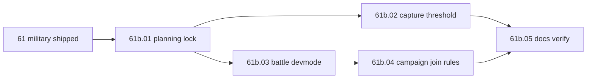

# Step 61b — Battle dev mode (solo staging)

**Repo:** SF · [war-build-order.md](../../war-build-order.md) · [01-planning-lock.md](./01-planning-lock.md) · [DEV-SHORTCUTS.md](../../DEV-SHORTCUTS.md)  
**Depends on:** [61](../step-61/00-index.md) (military & casualties shipped) · **Next:** [61c](../step-61c/00-index.md) (campaign UX; supersedes parts of 61b staging checklist)

## Goal

Enable a **solo operator** on the test server to walk the **attacker-side** campaign battle pipeline: warband roster, collective lives, deaths/casualties, capture points, and battle end - without needing real co-players online. Defender-side feel is out of scope (second tester later).

## Shipped (61b)

| Gap (pre-61b) | Resolution |
|-----|--------|
| Capture points needed 3 players at zone | `battle.capture_min_players: 1` (61b.02) |
| No phantom roster for solo warband testing | `/battle devmode` + phantom UUIDs (61b.03) |
| Campaign slots vs collective lives mismatch | Roster cap = preview lives; slot bypass (61b.04) |
| Wrong-side battle join | Side membership check (61b.04) |

## Locked scope (61b.01)

| In scope | Out of scope |
|----------|--------------|
| `/battle devmode on\|off\|status` (volatile, admin, reset on restart) | Persist devmode in config or war save |
| Phantom warband members when devmode on (manual + campaign create) | NPC bots at capture zones |
| Capture min players **1** (config, prod default) | Defender-side auto-fill for solo |
| Campaign join: side check + cap = side collective lives | Removing faction slot system globally |
| Skip faction `WarbandSlot` limits for **campaign** warbands (`battle.warId != null`) | Raid/staff battle rule changes beyond capture threshold |
| DEV-SHORTCUTS + Wars.md staging notes | Step 62 goal apply |

## Batches

| Batch | Summary | Status |
|-------|---------|--------|
| [61b.01 planning lock](./01-planning-lock.md) | Phantom member rules, join cap, capture threshold, devmode toggle | **done** (2026-08-21) |
| [61b.02 capture threshold](./02-capture-threshold.md) | Config `battle.capture_min_players`; replace hardcoded 3 | **done** (2026-08-21) |
| [61b.03 battle devmode](./03-battle-devmode.md) | `BattleDevMode` + command + phantom seed on warband create | **done** (2026-08-21) |
| [61b.04 campaign join rules](./04-campaign-join-rules.md) | Side check, lives roster cap, campaign slot bypass | **done** (2026-08-21) |
| [61b.05 docs verify](./05-docs-verify.md) | Tests, DEV-SHORTCUTS, solo staging checklist | **done** (2026-08-21) |

## Dependency flow

## Solo staging target (attacker path)

Run on test server (checklist in [05-docs-verify](./05-docs-verify.md)):

1. `/battle devmode on`
2. Declare war, `/faction warstatus` shows commitments
3. Vote + schedule campaign battle (`dev_min_players: 1`)
4. Create/join warband (you + 10 phantoms in devmode)
5. `/battle join` - side check + lives cap enforced
6. Battle starts - boss bar lives from 61 formula (real online players only in `playersAtStart`)
7. Stand on capture point - progress with **1** player
8. `/kill` - collective lives + casualty ledger + 61.06 apply on end
9. War returns to `VOTING`, commitments decreased
10. Restart server - devmode off, phantoms gone

## Status

**Step 61b complete** (2026-08-21). **Next:** [61c campaign UX](../step-61c/00-index.md) (signup flow, template cleanup, E2E verify).
