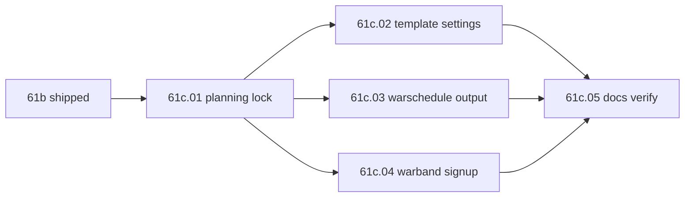

# Step 61c — Campaign UX & template cleanup

**Repo:** SF · [war-build-order.md](../../war-build-order.md) · [01-planning-lock.md](./01-planning-lock.md) · [DEV-SHORTCUTS.md](../../DEV-SHORTCUTS.md)  
**Depends on:** [61b](../step-61b/00-index.md) (battle dev mode shipped) · **Next:** [62](../step-62/00-index.md)

## Goal

Align campaign battle UX with product intent: **battle templates = rule defaults only** (no map geometry), **`/faction warschedule` = readable feedback** (not JSON dumps), **campaign warbands auto-created and auto-enrolled** with **explicit player signup** (no assumed war-leader fighter), and a **full E2E verify pipeline** from declare through battle loop to war end (goal enforcement still step 62).

## Gaps (pre-61c)

| Gap | Today |
|-----|--------|
| Templates seed spawns, jails, capture points from YAML | [`BattleFactory.applyTemplate`](../../../../simplefactions/src/main/java/me/Plugins/SimpleFactions/War/battle/engine/BattleFactory.java) + [`battle-templates.yml`](../../../../simplefactions/src/main/resources/battle-templates.yml) |
| `warschedule` success dumps full `WarDebugFormatter` JSON | [`CommandManager`](../../../../simplefactions/src/main/java/me/Plugins/SimpleFactions/Managers/CommandManager.java) after every subcommand |
| War leader auto-added to campaign warband if online | [`Warband(War, Participant, offense)`](../../../../simplefactions/src/main/java/me/Plugins/SimpleFactions/War/battle/warband/Warband.java) constructor |
| Players told to `/battle join` for campaign | [`CampaignBattleLaunchService.broadcastJoinMessage`](../../../../simplefactions/src/main/java/me/Plugins/SimpleFactions/War/battle/campaign/CampaignBattleLaunchService.java) |
| 61b staging checklist uses manual warband + battle join | [61b.05](../step-61b/05-docs-verify.md) (superseded by 61c.05) |
| `Wars.md` says staff set spawns/points in templates | [Wars.md](../../../../simplefactions/Documentation/Wars.md) staff-light row |

## Locked scope (61c.01)

| In scope | Out of scope |
|----------|--------------|
| Templates apply **settings only** at campaign create | Province-specific template files (future) |
| Staff place spawns/jails/points via existing `/battle edit` | New map editor UI |
| Per-subcommand formatted `warschedule` feedback | Changing vote FSM (59) |
| Campaign warband shell at battle prep; **signup required** | Removing manual `/warband create` globally |
| First signup = warband leader; war leader signup **promotes** to leader | War-leader forced into battle |
| Auto side + battle enrollment unchanged | Step 62 goal apply / surrender loop |
| Full E2E verify doc + DEV-SHORTCUTS update | Defender-side solo auto-fill |

## Batches

| Batch | Summary | Status |
|-------|---------|--------|
| [61c.01 planning lock](./01-planning-lock.md) | Template rules, warschedule output, warband signup, leader promotion | **done** (2026-08-21) |
| [61c.02 template settings-only](./02-template-settings-only.md) | Strip layout from YAML; `applyCampaignDefault` settings-only | **done** (2026-08-21) |
| [61c.03 warschedule output](./03-warschedule-output.md) | Formatted per-subcommand feedback; keep JSON on `warstatus` only | **done** (2026-08-21) |
| [61c.04 campaign warband signup](./04-campaign-warband-signup.md) | Empty shell, signup leader rules, messaging fixes | **done** (2026-08-21) |
| [61c.05 docs verify](./05-docs-verify.md) | E2E pipeline checklist, Wars.md, DEV-SHORTCUTS, indexes | **done** (2026-08-21) |
| [61c.06 warband list & naming](./06-warband-list-naming.md) | Pending-leader GUI fix, battle/warband display names | **done** (2026-08-21) |
| [61c.07 campaign warband hotfixes](./07-campaign-warband-hotfixes.md) | Side warbands, lives-only join, mid-battle rules, staff shortcuts | **done** (2026-08-21) |
| [61c.08 campaign warband UX](./08-campaign-warband-ux.md) | Battle edit name, tab completion, devmode battlecreate fill, GUI refresh, lives display | **done** (2026-08-21) |
| [61c.09 battle warband persistence](./09-battle-warband-persistence.md) | JSON autosave, resume in-progress fights, one manual battle, GUI delete, orphan warband purge | **done** (2026-08-21) |
| [61c.10 battle side fast edit](./10-battle-side-fast-edit.md) | Side Edit GUI for spawn/jail/point; `capture_points_enabled` template flag | **done** (2026-08-21) |
| [61c.11 battle setup hardening](./11-battle-setup-hardening.md) | Bounds validation, point delete GUI, campaign warband ensure | **done** (2026-08-21) |

## Dependency flow



## Campaign player flow (target)

```text
declare war → vote / warschedule dev → campaign battle created
→ faction warbands exist on correct sides (auto)
→ players /warband list → join to sign up (opt-in to fight)
→ staff sets spawns/points on battle
→ battle starts → fight → casualties → VOTING reopens
→ repeat … → war ends (admin / white peace now; goal win in 62)
```

## Status

**Done** (2026-08-21). Batches 01-08 complete. **Next:** [62 war end & goals](../step-62/00-index.md).
