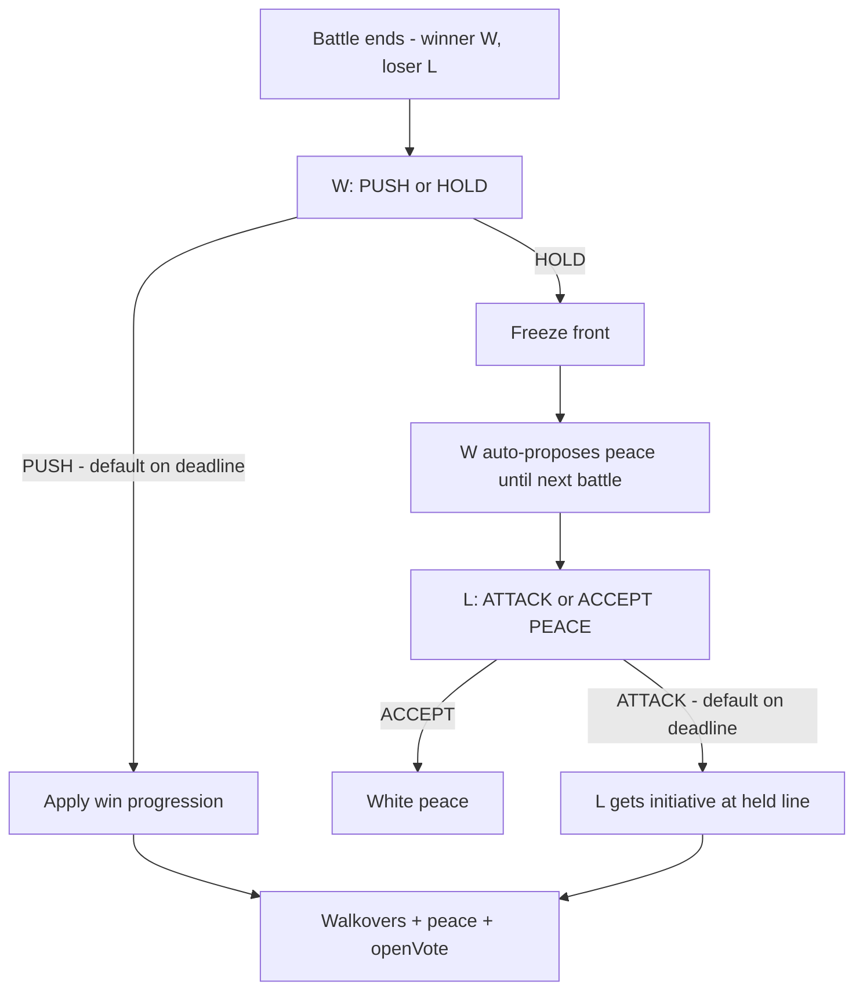

# Step 62.01 — Campaign progression lock (capability model)

**Plan + docs only.** Lock the initiative-based campaign refactor, post-battle Push/Hold choice, military walkovers, and symmetric white peace **before** 62.02+ implementation.

**Repos:** `Workspace/simplefactions`  
**Depends on:** [step-58](../step-58/00-index.md) (shipped) · [step-61](../step-61/00-index.md) (shipped) · [Wars.md](../../../../simplefactions/Documentation/Wars.md)  
**Supersedes for runtime progression:** step 58 sections on `CampaignPhase`, war-role defender choice, and asymmetric white peace reach checks (shipped code must be refactored to match this lock).

**Authoritative gameplay doc after implementation:** [Wars.md](../../../../simplefactions/Documentation/Wars.md) (updated in 62.07 docs batch).

## Goal

Replace the fragile war-role + `CampaignPhase` progression FSM with a single **capability + initiative** model. War declare roles (aggressor / defender coalitions) remain for setup, persistence, goals, and reparations only.

---

## Locked — war roles (declare-time only)

| War roles used for | Not used for after declare |
|--------------------|----------------------------|
| Who declared (aggressor coalition = `war.attackers`) | Who schedules the next battle |
| Campaign axis generation (`WarCampaignService`) | Battle offensive / defensive pools |
| First initiative holder (aggressor coalition) | Cursor movement direction |
| War goal apply, surrender, reparations (aggressor pays if loses badly) | Hold / Push choice eligibility |
| Battle JSON side labels (`attacker` / `defender` battle sides map to coalitions) | White peace proposal asymmetry |
| GUI coalition tint (blue/red), occupation lists `occupied_by_*` | `needsDefenderChoice` gating |

**Runtime rule:** once the campaign is live, only **coalition** (`Side`), **initiative holder**, **push target**, and **capabilities** matter.

---

## Locked — campaign axis (unchanged from step 58)

```text
← AGGRESSOR CAPITAL … … B … … OBJECTIVE →
                        ↑
                   cursorIndex (first battle at B)
```

- Index **0** = aggressor coalition capital (left).
- **Objective** = right terminus (`objectiveProvinceId`).
- Capitulation targets are **geometric** on this axis:
  - **Aggressor coalition:** steps from `cursorIndex` to objective index.
  - **Defender coalition:** steps from `cursorIndex` to aggressor capital index (usually 0).

---

## Locked — runtime state (replaces `CampaignPhase` for logic)

### Persisted fields (new / renamed)

| Field | Type | Meaning |
|-------|------|---------|
| `initiativeHolderSide` | coalition key | Which coalition may schedule / is battle-offensive (`attackers` \| `defenders`). Replaces `initiativeHolder: BelligerentRole`. |
| `initiativeFuelAggressor` | int | Fuel for aggressor coalition (JSON may keep `initiativeAttacker` name). |
| `initiativeFuelDefender` | int | Fuel for defender coalition (JSON may keep `initiativeDefender` name). |
| `pushTarget` | enum | What the initiative holder is pushing toward (see below). |
| `postBattleChoicePhase` | enum | `NONE` \| `WINNER_PUSH_HOLD` \| `LOSER_ATTACK_PEACE`. |
| `postBattleWinnerCoalition` | coalition key | Who won the last battle (for choice UI). |
| `postBattleChoiceResolved` | boolean | Replaces `defenderChoiceResolved`. |
| `lastBattleOffensiveCoalition` | coalition key | Pusher at battle start (for fuel spend). |
| `holdPeaceProposalActive` | boolean | Holder proposed peace via Hold; cleared when next campaign battle ends. |

### `CampaignPushTarget` (replaces `CampaignPhase` in code paths)

| Value | Meaning |
|-------|---------|
| `TOWARD_OBJECTIVE` | Initiative holder pushes toward higher index / objective. |
| `TOWARD_AGGRESSOR_CAPITAL` | Initiative holder pushes toward index 0 / aggressor capital. |
| `RETAKE_OBJECTIVE` | Battle at objective while aggressor coalition holds it (`objectiveHeldBy`). |

`CampaignPhase` may remain in JSON during migration as a **derived** field for old saves; new logic must not branch on it.

### Initiative rules (locked)

| Rule | Detail |
|------|--------|
| Start | Aggressor coalition holds initiative; both coalitions get `N` fuel (config, default 4). |
| Battle offensive | Initiative holder at battle **start** = battle offensive coalition. |
| Fuel spend | **Battle offensive coalition** loses 1 fuel when the campaign battle ends. |
| Postponed vote day | No fuel spent; holder unchanged (step 59). |
| Winner | Battle winner becomes initiative holder after choices resolve (unless Hold flow assigns attack to loser). |

---

## Locked — `CampaignCapabilityService` (single brain)

All scheduling, peace, walkover, and pool logic calls this service. No ad-hoc `CampaignPhase` switches elsewhere.

### Primitives

```text
canAttack(war, coalition):
  fuel(coalition) >= 1
  AND offensiveRegiments(war, nextBattleProvince(war), coalition) >= 1
  AND coalition == initiativeHolderSide
  AND postBattleChoicePhase == NONE

canDefend(war, provinceId, coalition):
  defensiveRegiments(war, provinceId, coalition) >= 1

canReachTarget(war, coalition):
  fuel(coalition) >= stepsToCapitulationTarget(war, coalition)
  AND canAttack(war, coalition)

stepsToCapitulationTarget(war, coalition):
  abs(cursorIndex - capitulationTargetIndex(war, coalition))

battleOffensiveCoalition(war):
  initiativeHolderSide while push is active

nextBattleProvince(war):
  single green node from pushTarget + cursor + cadence rules
```

### Regiment counts

Use `BattlePoolService` with explicit `PoolMode.OFFENSIVE` / `DEFENSIVE` at the province. Offensive coalition is `battleOffensiveCoalition(war)`, **not** `BelligerentRole` or `CampaignPhase`.

---

## Locked — white peace

### Passive auto-propose (strategic exhaustion)

| Condition | Result |
|-----------|--------|
| `!canReachTarget(war, coalition)` | That coalition **auto-proposes** white peace. |
| Both coalitions proposed | **Automatic white peace**. |
| Enemy leader accepts proposal | White peace (GUI). |

Symmetric for **either** coalition.

### Immediate stalemate

| Condition | Result |
|-----------|--------|
| Neither coalition `canAttack()` | **Immediate white peace**. |
| One `canAttack`, other `!canDefend` at next node | **Military walkover** (chain). |
| Both `!canDefend` at next node | **Immediate white peace**. |

### Hold-born peace proposal (active)

Battle **winner** chooses **Hold** → that coalition auto-proposes white peace until the **next campaign battle ends**. Cleared on next fought battle or walkover resolution.

---

## Locked — military walkover

After battle resolution and Push/Hold choices, **before** `openVote`:

1. Resolve `nextBattleProvince` when `postBattleChoicePhase == NONE`.
2. If holder `canAttack()` and opponent `!canDefend(province)`: auto-apply holder victory (progression + occupation, no casualties).
3. Repeat until fightable, choice pending, or war ends.
4. Both `!canDefend`: immediate white peace.

Walkovers spend offensive fuel and increment `campaignBattlesFought`.

---

## Locked — post-battle choice (replaces defender hold / counter-push)

**Replaces:** `needsDefenderChoice`, yellow hold/counter map nodes, `applyDefenderHold` / `applyDefenderCounterPush`.

### Flow



### PUSH (winner)

- **Offensive winner:** cursor moves along `pushTarget`; occupation applied.
- **Defensive winner:** cursor moves one step toward winner's capitulation target (counter-push equivalent).
- Initiative → winner. No hold-born peace flag.

**Deadline:** battle-day `defender_choice_deadline_hour` → auto-**PUSH**.

### HOLD (winner)

- Front frozen (no extra cursor move from choice; capture from battle stands).
- Winner auto-proposes peace until next battle ends.
- **Loser** chooses **ATTACK** or **ACCEPT PEACE** only (cannot Hold).

### Loser response (winner held only)

| Choice | Effect |
|--------|--------|
| ACCEPT PEACE | War ends white peace. |
| ATTACK | Loser gets initiative; schedules at held province. |

**Deadline:** auto-**ATTACK**.

### GUI

- Winner war leader: **Push** / **Hold** (campaign view, right after battle).
- Loser war leader (if winner held): **Attack** / **Accept white peace**.
- No yellow hold/counter provinces on the route row.

---

## Locked — battle end pipeline

```text
BattleEndedEvent / admin winbattle
  → casualties (if real battle)
  → snapshot lastBattleOffensiveCoalition; spend offensive fuel
  → postBattleChoicePhase = WINNER_PUSH_HOLD
  → after choice: progression + occupation
  → resolveWalkovers()
  → recalculatePeaceProposals()
  → neither canAttack → end war
  → openVote()
```

---

## Locked — implementation batches

| Batch | Scope |
|-------|--------|
| **62.02** | `CampaignCapabilityService` + tests; coalition initiative; `pushTarget` |
| **62.03** | Pool/lives by coalition offensive; symmetric white peace |
| **62.04** | Push/Hold + Attack/Peace; remove yellow nodes |
| **62.05** | Walkover chain; unified outcome pipeline |
| **62.06** | Remove phase logic from progression; admin strings |
| **62.07** | Wars.md + regression tests |

---

## Locked — test scenarios

1. Offensive win + Push: cursor advances, fuel from offensive coalition.
2. Win + Hold → loser Attack → schedule at held line.
3. Win + Hold → loser Accept → white peace.
4. Winner deadline → auto-Push.
5. Loser deadline (after Hold) → auto-Attack.
6. Aggressor coalition wins defensively during enemy counter-push → Push/Hold (not war-role gated).
7. Symmetric `!canReachTarget` proposals.
8. Neither `canAttack` → immediate peace.
9. Walkover chain to capital or fightable node.
10. Hold peace flag clears after next battle.
