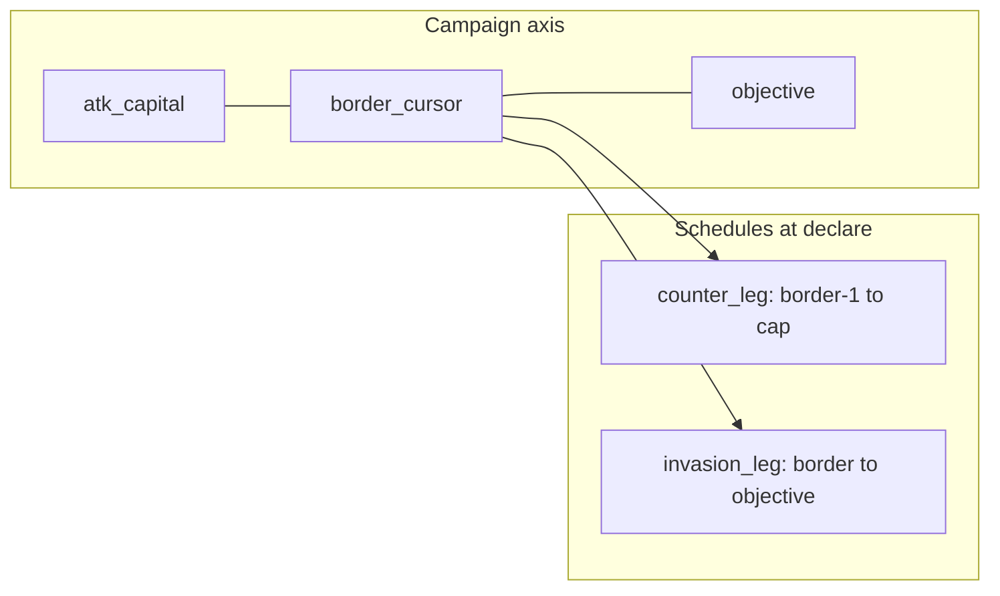

# Step 70.01 — Per-side caps & initiative lock

**Plan + docs only.** Lock slot legs, trim semantics, asymmetric initiative, config, and persistence before 70.02+ code.

**Repos:** `Workspace/simplefactions`, `Workspace/ProvinceSystem/Planning`  
**Depends on:** [step 64.01](../step-64/01-planning-lock.md) (schedule model), [step 64.05](../step-64/05-trim-initiative.md) (trim + initiative, partially superseded), [step 65.01](../step-65/01-planning-lock.md) (naval slots on schedule)  
**Authoritative gameplay summary (after 70.06):** [Wars.md](../../../../simplefactions/Documentation/Wars.md)

**Status:** **Done** (2026-08-23).

---

## Problem

Step 64 ships a **single** battle schedule from border toward objective and sets **identical** initiative fuel for both coalitions from that list's size. Counter-push moves the cursor left on the axis but does not have its own schedule; `CampaignScheduleService` always advances the invasion schedule forward.

| Area | Today (64/65) | Target (step 70) |
|------|---------------|------------------|
| Schedule | One list, border → objective only | Two legs, trimmed independently |
| Cap | `max_battles` = total invasion slots (default 4) | `max_battles_per_leg` per direction (default 4 each; up to 8 total) |
| Initiative | `ceil(trimmed.size × 1.5)` for **both** sides | Per side from **that leg's** slot count |
| Counter-push | Cursor moves left; invasion schedule index only | Counter leg schedule + `campaignCounterScheduleIndex` |



---

## Locked — leg definitions

**Axis:** `campaignProvinces` from `WarCampaignService.populateCampaign`: `mergeAxisPaths(attackerCapital → border, border → objective)`.

At declare: `cursorIndex = borderStartIndex` (unchanged).

| Leg | Axis walk | First battle province | Terminal required slot |
|-----|-----------|----------------------|------------------------|
| **Invasion** | `borderIndex → objectiveIndex` (increasing) | `campaignProvinces[borderIndex]` (border; first battle counts) | Required `FIELD` at `objectiveProvinceId` (unchanged from 64) |
| **Counter** | `borderIndex - 1 → aggressorCapitalIndex` (decreasing) | `campaignProvinces[borderIndex - 1]` — **not** border | Required `FIELD` at aggressor capital when capital province is on axis |

**Hop counting:** Cap applies to **schedule slot count** after natural build + trim, not raw province steps along the axis. Natural slot rules from 64/65 (field cadence, fort ZOC siege, port naval, naval invasion) apply on **each leg independently**.

### Edge cases

| Case | Behavior |
|------|----------|
| `borderIndex == 0` (capital at border) | Counter leg empty → `counter_count = 0` → defender fuel `0` |
| `borderIndex == objectiveIndex` | Invasion leg is border + objective only; trim still respects per-leg cap |
| Aggressor capital not on axis | Counter leg walks to axis index `0`; if index 0 is not capital, no required capital slot (log warning at declare) |
| Shared border province | Invasion first battle at border; counter first battle at `borderIndex - 1` only (no duplicate border slot on counter leg) |

---

## Locked — natural slots (per leg)

Reuse [64.01 natural slot rules](../step-64/01-planning-lock.md) and [65 port sea ZOC](../step-65/01-planning-lock.md) on each leg segment:

| Slot | Invasion leg | Counter leg |
|------|--------------|-------------|
| Field cadence | Every `provinces_between_battles` from border toward objective | Same cadence walking **left** from `borderIndex - 1` toward capital |

Default `provinces_between_battles` changes from **1** (dev) to **3** per [70b.01](../step-70b/01-planning-lock.md) (config in 70b.02).
| Siege | Fort ZOC on axis segment | Same |
| Naval / invasion | Sea runs on segment | Same (sea runs detected when walking decreasing indices) |
| Required terminal | Objective province | Aggressor capital (when on axis) |

Siege slot `provinceId` remains the **axis tile where ZOC is first entered** on that leg (unchanged from 64).

---

## Locked — trim

Each leg trimmed **independently** via `CampaignScheduleTrimmer` with existing drop priority:

1. Non-required `FIELD`
2. `NAVAL_INVASION`
3. `NAVAL`
4. `SIEGE`
5. Never drop `required` objective / capital slot

| Leg | Trim anchor | Drop order within tier |
|-----|-------------|------------------------|
| **Invasion** | Objective index | Farthest from objective first (highest axis index first — existing 64 behavior) |
| **Counter** | Aggressor capital index | Farthest from capital first (**highest** axis index on counter segment first — mirror of invasion) |

Config reader name (70.02): `CampaignScheduleTrimmer.maxBattlesPerLegForGoal(WarGoalType)`.

If trim cannot reach cap without dropping required slots, keep required + sieges + as many fields as fit; log warning (unchanged from 64).

---

## Locked — initiative

```text
initiativeAttacker = ceil(invasion_leg_slot_count × war.initiative_factor)
initiativeDefender = ceil(counter_leg_slot_count × war.initiative_factor)
```

| Rule | Detail |
|------|--------|
| `initiative_factor` | Default **1.5** (`war.initiative_factor` in config) |
| Basis | **Final** trimmed slot count per leg at declare |
| Re-siege inserts at runtime | Do **not** recompute fuel (unchanged from 64) |
| `canReachTarget` / `stepsToCapitulationTarget` | Unchanged in step 70; stalemate checks keep axis-distance logic |

### Examples (`initiative_factor = 1.5`)

| Invasion slots | Counter slots | Attacker fuel | Defender fuel |
|----------------|---------------|---------------|---------------|
| 4 | 2 | 6 | 3 |
| 3 | 3 | 5 | 5 |
| 4 | 0 | 6 | 0 |
| 1 | 4 | 2 | 6 |

---

## Locked — config schema

```yaml
war:
  initiative_factor: 1.5
  goals:
    DE_JURE_ANNEX:
      max_battles_per_leg: 4
    SUBJUGATE:
      max_battles_per_leg: 4
    TRANSFER_SUBJECT:
      max_battles_per_leg: 4
```

**Loader (70.02):**

- Read `war.goals.<GOAL>.max_battles_per_leg` first.
- Fall back to `war.goals.<GOAL>.max_battles` (deprecated alias, same semantics as per-leg cap).
- Default **4** if neither key is set.
- Silent alias: if only `max_battles` is present, use it without deprecation log spam.

**Semantics change:** `max_battles` in 64 meant **total** invasion schedule cap. In 70 it is an alias for **per-leg** cap (each direction may have up to N slots).

Ship `config.yml` with `max_battles_per_leg`; keep `max_battles` readable for one release.

---

## Locked — persistence (dual indices)

| Field | Role |
|-------|------|
| `campaignBattleSchedule` | Invasion leg (existing JSON name; semantics narrowed to border → objective) |
| `campaignCounterSchedule` | **NEW** — counter leg slots |
| `campaignScheduleIndex` | Next slot index on **invasion** leg |
| `campaignCounterScheduleIndex` | **NEW** — next slot index on **counter** leg |

Slot shape unchanged: `provinceId`, `kind`, `required`, optional `fortInstallationId`, optional `portInstallationId`.

### Active schedule resolution (70.04)

| `pushTarget` | Active schedule | Active index |
|--------------|-----------------|--------------|
| `TOWARD_OBJECTIVE` | `campaignBattleSchedule` | `campaignScheduleIndex` |
| `TOWARD_AGGRESSOR_CAPITAL` | `campaignCounterSchedule` | `campaignCounterScheduleIndex` |
| `RETAKE_OBJECTIVE` | invasion schedule at objective | `campaignScheduleIndex` |

- Switching `pushTarget` does **not** reset the other leg's index (back-and-forth preserves both positions).
- Re-siege insert targets the **active** leg's schedule at the active index (extend 64 behavior).

### Legacy load

| Missing field | Default |
|---------------|---------|
| `campaignCounterSchedule` | Empty list |
| `campaignCounterScheduleIndex` | `0` |
| Fuel values | Use persisted `initiativeAttacker` / `initiativeDefender`; do not recompute from schedule on load |

Wars declared before step 70 behave as today until re-declared.

---

## Locked — declare pipeline (70.02–70.03)

```text
invasionNatural  = CampaignScheduleBuilder.build(war, axis, borderIndex, objectiveIndex, ...)
counterNatural   = CampaignScheduleBuilder.buildCounter(war, axis, borderIndex, aggressorCapitalIndex, ...)
invasionTrimmed  = CampaignScheduleTrimmer.trim(invasionNatural, maxBattlesPerLeg(goal))
counterTrimmed   = CampaignScheduleTrimmer.trim(counterNatural, maxBattlesPerLeg(goal), capitalIndex)
war.setCampaignBattleSchedule(invasionTrimmed)
war.setCampaignCounterSchedule(counterTrimmed)
war.setCampaignScheduleIndex(0)
war.setCampaignCounterScheduleIndex(0)
applyInitiativeFromLegs(war, invasionTrimmed, counterTrimmed)
FortControlService.initializeAtDeclare(war)   # unchanged
```

Replace symmetric `applyInitiativeFromSchedule(war, singleList)`.

---

## Locked — supersession of step 64.05

**Superseded:**

| 64.05 rule | Replacement |
|------------|-------------|
| `fuel = ceil(trimmedSchedule.size() × factor)` for both coalitions | Per-leg counts → asymmetric fuel (above) |
| `max_battles` as **total** schedule cap | `max_battles_per_leg` per direction |

**Unchanged from 64/65:**

- `CampaignBattleKind` slot model and template mapping
- War-time fort control (`fortControllers`)
- Naval slot detection on sea runs
- Trim priority tiers (within each leg)
- Re-siege insert does not recompute fuel
- Battle zone removal (64.08)

---

## Locked — out of scope (step 70)

| Item | Notes |
|------|-------|
| Pathfinder / wilderness-first routing | Separate work |
| Route GUI / warstatus | 70.05 |
| `Wars.md` gameplay summary | 70.06 |
| Map `wars[]` export | Step 68 |
| Live war migration | Re-declare to rebuild legs and fuel |
| Align `canReachTarget` with leg slot counts | Optional follow-up |

---

## Downstream batches

| Batch | Delivers |
|-------|----------|
| **70.02** | `buildCounter`, dual trim, config alias in `ConfigLoader` |
| **70.03** | `applyInitiativeFromLegs`, mapper persistence |
| **70.04** | `activeSchedule` / dual index progression, re-siege on active leg |
| **70.05** | Campaign route GUI + `warstatus` counter leg fields |
| **70.06** | `Wars.md` update, full test pass |

---

## Done when (70.01)

- [x] Leg definitions, trim, initiative, config, persistence locked with no TBDs
- [x] Supersession of 64.05 documented
- [x] Cross-links to 64.01 / 64.05 / 65.01
- [x] [00-index.md](./00-index.md) lists batches 70.01–70.06 with 70.01 **done**
