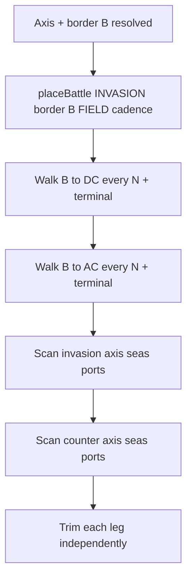

# Step 70d.01 — Planning lock (`placeBattle` pipeline)

> **Superseded for FB legs and axis insertion** by [02-planning-lock-fb.md](./02-planning-lock-fb.md) (70d.02, locked 2026-08-23).  
> Keep this file as the original v1 sketch. Use **02** as implementation authority for 70d.03–70d.08.

**Plan + docs only.**  
**Supersedes:** schedule insertion rules in [64.01](../step-64/01-planning-lock.md), [70b.01](../step-70b/01-planning-lock.md) leg-walk sections, and all logic in `CampaignScheduleBuilder` that directly appends slots.

---

## Principle

```text
Nothing adds a campaign battle except placeBattle(...).
```

All cadence, forts, ports, objectives, and dedupe live inside `placeBattle` (and small walk loops that call it).

---

## Inputs (unchanged from declare)

After `WarCampaignService.populateCampaign` pathfinding:

| Field | Meaning |
|-------|---------|
| `campaignProvinces[]` | Full axis: AC ... border B ... DC |
| `cursorIndex` | Index of border province B on axis |
| `campaignStartProvinceId` | Province id at B (border fight anchor) |
| `objectiveProvinceId` | Defender invasion terminal (regional objective or capital per goal rules) |
| Attacker capital | `war.getAttackers().getLeader().getCapital()` |
| `N` | `war.battle_cadence.provinces_between_battles` (default 3) |
| `max_battles_per_leg` | Hard cap 4 per leg at load |

---

## Two legs — what each list is for

Persistence stays **two arrays** (fight progression unchanged):

| Leg | JSON field | Geographic segment | Terminal objective |
|-----|------------|-------------------|-------------------|
| **Invasion** | `campaignBattleSchedule` | Border B → defender objective (DC) | `objectiveProvinceId` (required field) |
| **Counter** | `campaignCounterSchedule` | Border B → attacker capital (AC) | Attacker capital (required field) |

**Fight order** within a leg = append order during that leg's walk.  
**GUI row order** (70c) = merge both legs, sort by `campaignProvinces.indexOf(provinceId)` ascending (AC left, DC right).

A province may appear in **both** legs only if walks on each side place battles there (rare; allowed).

---

## Build pipeline (strict order)

All steps use the **same** `placeBattle` implementation with a `ScheduleLeg` argument.



### Phase 1 — Border anchor (invasion leg only)

On border province B:

```text
placeBattle(INVASION, borderProvinceId, trigger=CADENCE_OR_BORDER)
```

This is always the **first invasion slot** (index 0). The border field and the "first battle" marker refer to this slot (same tile; no separate "saved border" field beyond `campaignStartProvinceId`).

### Phase 2 — Invasion land walk (before any sea pass)

Walk axis indices from `cursorIndex` toward `objectiveIndex` (increasing), **one step per province**.

At each step `i` (including terminal):

1. If `i == cursorIndex`: skip (border already placed in phase 1).
2. If `offset % N == 0` from border (`offset = abs(i - cursorIndex)`): `placeBattle(INVASION, provinceId, CADENCE)`.
3. If entering a province in **enemy fort ZOC** (and fort not already on campaign): `placeBattle(INVASION, fortHomeProvinceId, FORT_ZOC)` — battle at **fort province**, not ZOC tile.
4. At `objectiveIndex`: `placeBattle(INVASION, objectiveProvinceId, OBJECTIVE)` (required terminal).

### Phase 3 — Counter land walk (mirror of phase 2)

Walk from `cursorIndex` toward attacker capital index (decreasing), **before sea passes**.

At each step `i`:

1. If `i == cursorIndex`: skip (border is invasion-only anchor; counter starts at `cursorIndex - 1`).
2. Counter cadence origin = `cursorIndex - 1`; `offset = abs(i - (cursorIndex - 1))`.
3. If `offset % N == 0` and `i != cursorIndex`: `placeBattle(COUNTER, provinceId, CADENCE)`.
4. Fort ZOC: same as invasion but `ScheduleLeg.COUNTER` and fort owned by enemy of **defender coalition** on counter walk.
5. At attacker capital index: `placeBattle(COUNTER, capitalProvinceId, OBJECTIVE)` (required).

Counter never places the border B slot; invasion owns border index 0.

### Phase 4 — Sea / port passes (after both land walks)

Scan sea runs on the axis segment for each leg direction.

**Invasion sea scan** (B → DC): for each enemy **defender** port covering a sea province on the segment:

```text
placeBattle(INVASION, seaProvinceId, NAVAL, portId)
```

**Counter sea scan** (B → AC): for each enemy **attacker** port covering sea on the segment:

```text
placeBattle(COUNTER, seaProvinceId, NAVAL, portId)
```

**Naval replaces first invasion battle** (user lock): if invasion sea battle is placed **before** the first invasion slot has been fought (declare-time: always true for slots after phase 1), **prepend** the naval slot as invasion index 0. The border field remains in the list at index 1 (same province/slot as before; not deleted). Chronologically naval is first fight; border field is still the land battle at B.

```text
invasion schedule after prepend: [NAVAL@sea, FIELD@B, ...rest]
```

Counter leg has no "first battle" prepend rule unless specified later.

### Phase 5 — Trim (per leg)

Same policy as 70c fix:

| Leg | Drop policy |
|-----|-------------|
| **Invasion** | Drop optional fields from **objective side** first; **never** drop invasion index 0 after naval prepend (naval) or index 0/1 pair (naval+border); never drop `required` |
| **Counter** | Drop optional fields from **border-adjacent** side first (wilderness near B); never drop `required` |

Then cap to `max_battles_per_leg` (4).

---

## `placeBattle` — single entry point

```java
// Conceptual; exact API in 70d.02
enum BattleTrigger { CADENCE, BORDER, OBJECTIVE, FORT_ZOC, NAVAL }

void placeBattle(
    War war,
    ScheduleLeg leg,
    int provinceId,
    BattleTrigger trigger,
    @Nullable String fortInstallationId,
    @Nullable String portInstallationId)
```

### Shared state (per build, per leg)

- `Set<String> scheduledFortIds` — fort installation ids already on **either** leg (dedupe across campaign).
- `Set<String> scheduledPortIds` — port ids already used for NAVAL on this leg.
- Append target list: invasion or counter schedule builder list.

### Rule priority (evaluate top to bottom)

| # | Condition | Action |
|---|-----------|--------|
| 1 | `provinceId` is SEA and no enemy port covers it | **skip** |
| 2 | `trigger == NAVAL` and port already scheduled on this leg | **skip** |
| 3 | `trigger == NAVAL` and invasion leg and no invasion slots yet OR prepend rule active | **prepend** NAVAL slot at `provinceId` + `portId`; return |
| 4 | Province in fort ZOC (or trigger FORT_ZOC) | Resolve `battleProvince = fort.homeProvince`; if `fort.id` in `scheduledFortIds` → **skip**; else append **SIEGE** at `battleProvince`, add fort id |
| 5 | Province is leg **objective** (`OBJECTIVE` trigger or terminal step) | Append **FIELD** `required=true` at `provinceId` (or upgrade existing FIELD at same province to required) |
| 6 | Fort province and fort already on campaign | **skip** (no duplicate siege) |
| 7 | `trigger == CADENCE` or `BORDER` | Append **FIELD** `required=false` at `provinceId` if no identical FIELD already at same province+leg (siege/naval at same province allowed) |
| 8 | Else | **skip** |

### Same province, multiple battles

Allowed. Examples:

- Siege at fort province + required objective field at capital (705): siege slot then required field slot.
- Border province in fort ZOC: siege at fort province (713); border field at B (709) from phase 1 — two provinces, not two at same id unless ZOC anchor equals B.

If objective and fort coincide on one province: place **SIEGE** first (rule 4), then **required FIELD** (rule 5) — two slots same province, different kinds.

### Kinds mapping

| Trigger / outcome | `CampaignBattleKind` | `required` |
|-------------------|----------------------|------------|
| CADENCE, BORDER | `FIELD` | false |
| OBJECTIVE | `FIELD` | true |
| FORT_ZOC | `SIEGE` | false |
| NAVAL | `NAVAL` | false |

No separate `NAVAL_INVASION` kind in new pipeline unless runtime still needs it; landing at border is the existing border FIELD slot, not a second kind.

---

## Walk cadence (locked)

```text
offset = abs(axisIndex - cadenceOriginIndex)
place cadence battle when offset % N == 0
```

| Leg | `cadenceOriginIndex` |
|-----|----------------------|
| Invasion | `cursorIndex` (border B) |
| Counter | `cursorIndex - 1` |

Terminal objective placement runs **in addition** to cadence (may duplicate province; `placeBattle` dedupes same-kind FIELD, upgrades to required for objective).

---

## First battle / border / GUI

| Concept | Rule |
|---------|------|
| **First battle (fight)** | Invasion schedule index 0 (naval if prepended, else border field) |
| **Border B** | `campaignStartProvinceId`; invasion FIELD slot at B (index 0 or 1 after naval prepend) |
| **GUI marker** | Under invasion slot at `campaignStartProvinceId` (first invasion slot at that province) |
| **GUI sort** | Geographic by axis index (70c); not append order |

---

## Brume vs Lantan acceptance (after implement + regen)

Axis: `452, 782, 758, 757, 672, 709, 713, 705`. B = 709.

**Counter** (append order): cadence fields toward 452, required at 452.  
**Invasion**: border field 709; cadence/siege toward 705; Greenfort siege at **713** (fort province); required field at 705.  
**GUI left-to-right**: `452 - 782 - 672 - [709] - 713 siege - 705`.

If sea + Lan harbour: naval prepended before border field in invasion list; border field unchanged at 709.

---

## Delete / replace in code (70d.02+)

Remove direct schedule mutation from:

- `appendAxisStep`, `appendSeaCrossingSlots`, `addSiegeIfAbsent`, `addFieldIfAbsent`, `addInvasionSlot`, `ensureRequiredTerminalSlot`, `removeInvasionSlot`

Replace with walk loops + `placeBattle` only.

---

## Done when (70d.01 sketch)

- [x] Full pipeline documented
- [x] Leg contents and build order locked
- [x] `placeBattle` priority table locked
- [ ] User sign-off
- [ ] Implementation batches 70d.02+
