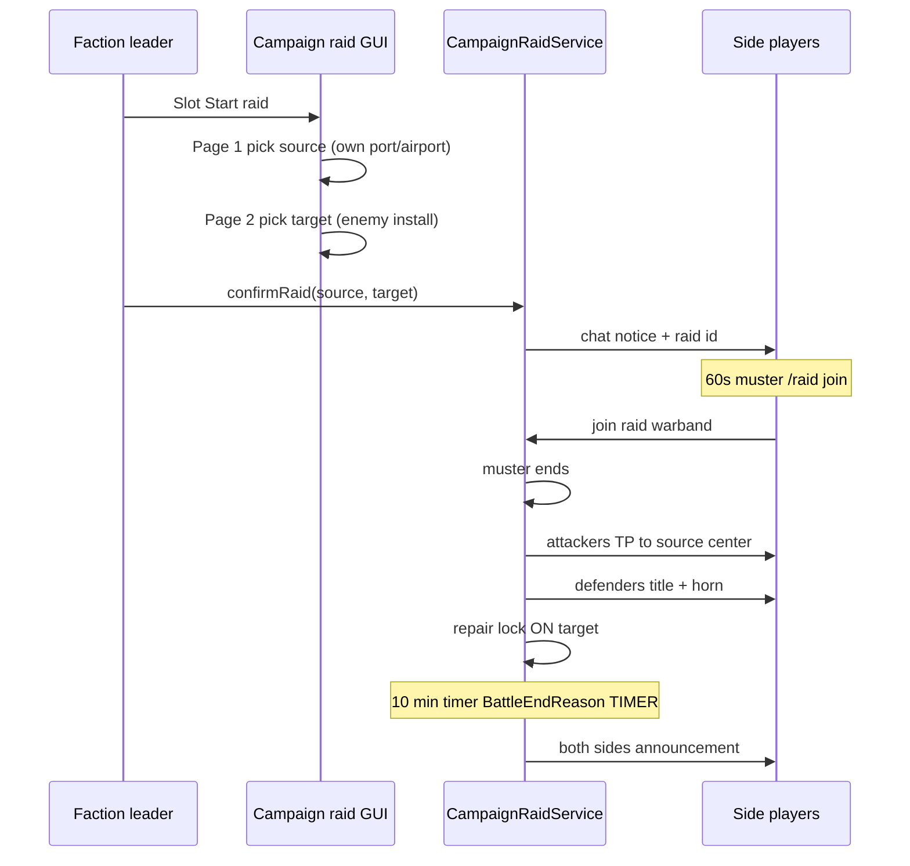

# Step 71.01 — Planning lock (campaign raids)

**Plan + docs only.**  
**Authority for:** all 71.02–71.11 implementation batches.  
**Status:** done (2026-08-25)

**Gameplay docs (update in 71.11):** [`Wars.md`](../../../../simplefactions/Documentation/Wars.md) · [`Installations.md`](../../../../simplefactions/Documentation/Installations.md) · [`AGENTS.md`](../../../../simplefactions/AGENTS.md)

**Depends on:** [step 78](../step-78/01-planning-lock.md) (raid window config, installation picks for **battle** vehicle pool only), [step 59](../step-59/01-planning-lock.md) (battle day / vote close), [step 61c](../step-61c/01-planning-lock.md) (campaign warband signup), [step 64](../step-64/01-planning-lock.md) (siege forts in play for battles).

**Not this step:** [step 67](../step-67/00-index.md) **pillage war** (one-battle border settlement war type). Rename "raid war" → **pillage war** in step 67 docs when that step is planned; do not conflate with campaign raids.

---

## Terminology

| Term | Meaning |
|------|---------|
| **Campaign raid** | 19-20 CET inter-battle installation assault (this step) |
| **Pillage war** | Step 67 war type / one-shot border settlement plunder |
| **Staff raid battle** | Manual `BattleType.RAID` with capture point (existing dev tool; unchanged) |

Player-facing strings use **campaign raid** or **raid** in the battle-day context only.

---

## Principles

1. **Opportunity, not scoring.** The plugin opens a timed fight window; players judge success by damage done. No raid "winner" side, no pillage ledger in 71.
2. **Installation-to-installation.** Every campaign raid has an attacker **source** (own port/airport) and defender **target** (enemy installation).
3. **One raid per coalition side per battle day.** Either coalition may still raid if the other already did (retaliation same day).
4. **One active campaign raid per war** at a time (global mutex).
5. **Separate warbands.** Raid warbands are ephemeral; never reuse campaign side warband ids.
6. **Picks ≠ raid exposure.** Installation picks (78) control battle vehicle in-play and intel only; **all operational** enemy installations remain raid targets.
7. **No em dashes** in player-facing strings.

---

## Daily timeline (battle day)

Uses `war.battle_schedule` **Europe/Paris** hours from [step 78](../step-78/02-battle-raid-schedule.md).

```text
[ vote_close + pick lock … raid CALL window … campaign warband signup … main battle ]
        16:00                    19:00-20:00              20:00-21:00           21:00-24:00
```

| Phase | Default (Paris) | Rule |
|-------|-----------------|------|
| Installation picks lock | 16:00 | `vote_close_hour` (unchanged 78) |
| **Raid call window** | 19:00-20:00 | May **initiate** a campaign raid only |
| **Campaign warband signup** | **Blocked** 19:00-20:00; **open** 20:00-21:00 | See warband lock below |
| Main campaign battle | 21:00-24:00 | Unchanged |

**In-flight raids** may continue past 20:00 until the fight timer ends (~10 min after muster). Latest typical end ~20:11 if called at 19:59; earliest ~19:11 if called at 19:00.

Config (new under `war.campaign_raid`):

| Key | Default | Meaning |
|-----|---------|---------|
| `muster_seconds` | `60` | Join window after leader confirms source + target |
| `duration_seconds` | `600` | Fight timer after muster ends |
| `repair_lock_hours` | `48` | Block place/break near target after raid **starts** |
| `intruder_damage_interval_ticks` | `10` | Province intruder damage cadence |
| `intruder_damage_amount` | `4` | Hearts or raw damage per tick (implementation detail) |

---

## Who can launch

| Actor | Rule |
|-------|------|
| Faction **leader** on a belligerent side | May open launch GUI and confirm a raid |
| Which leader spends the quota | **First to confirm** consumes the **whole side's** one raid for that `battleDay` |
| Other leaders same side | Blocked until next battle day |
| Staff | Admin bypass out of scope |

---

## Source & target eligibility

### Source (attacker staging installation)

- Owned by launching faction (direct ownership).
- **Operational** (`InstallationHandler`, not under construction).
- Kind: **`port` or `airport` only**.
- **Not** required to be in `battleInstallationPicks` for the day.

### Target (defender installation)

- Owned by an **enemy** belligerent faction.
- **Operational**.
- Kind: **`port`, `airport`, or `fort`** (any operational enemy installation).
- **Not** filtered by enemy committed picks (supersedes 78.07 for campaign raids).

### Raid kind (UI / validation)

| `RaidKind` | Source kind | Target kind |
|------------|-------------|-------------|
| `NAVAL` | `port` | `port` |
| `AIR` | `airport` | `airport` |
| `FORT` | `port` or `airport` | `fort` |

Cross-kind raids (port → airport) are **invalid**.

### Window & quota gates

1. `BattleScheduleService.isRaidWindowOpen(war, now)` — call time only.
2. Attacker coalition has not used `campaignRaidsUsed[sideKey]` for current `battleDay`.
3. No other `activeCampaignRaidId` on the war (global mutex).
4. War active; both factions participating.

**78.07 `RaidTargetService`:** Repurpose or replace for campaign raids in **71.03**. Committed-pick filter applies only to battle vehicle eligibility (78), not campaign raid targets.

---

## Launch flow



1. Leader opens **Start raid** from campaign view (slot TBD in 71.04).
2. Two-page GUI: **source** list → **target** list (filtered by eligibility).
3. On confirm: persist raid, broadcast to **online members of attacker coalition**, start muster timer.
4. `/raid join <id>` — any online belligerent on **attacker** side; must **not** already be in any warband.
5. After `muster_seconds`: consume side quota, create/start `BattleType.RAID` campaign battle, teleport **attackers** to **source** installation center (construct location).
6. **Defenders:** title `§cRAID INCOMING` / subtitle `§eDefend <installation name>`; goat horn (`Sound.ITEM_GOAT_HORN_SOUND_2`, same as declare war). **No teleport.**
7. Auto-create **defender raid warband**; add all **online** defenders not in a warband; **on login** during active raid, add eligible defenders to defender raid warband if not in another warband.
8. Fight runs `duration_seconds`; end with **`BattleEndReason.TIMER`**, `winningSideId = null`.
9. Announce end to both coalitions; clear mutex; delete ephemeral raid warbands.

**Leader disconnect during muster:** Raid still launches at muster end. Raid warband uses normal **first-joiner / war-leader promotes** leader rules (61c).

---

## Warband rules

| Rule | Detail |
|------|--------|
| Raid warband ids | `campaign_raid_<warId>_<battleDay>_<side>` (atk/def) — ephemeral |
| Join raid | `/raid join <raidId>` during muster **or** active fight (if not already in a warband) |
| Campaign warband | `/warband` signup **blocked** while `isRaidWindowOpen` on battle day |
| After 20:00 | Campaign warband signup **unblocked** until main battle (1h window) |
| Mutual exclusion | Cannot join raid if in **any** warband (including campaign shell with members) |
| Defender auto-add | Online at raid start + login during raid → defender raid warband if warband-free |

---

## Fight rules (campaign raid battle)

Uses new template `campaign_raid_template` (distinct from staff `raid_template`).

| Rule | Value |
|------|-------|
| Capture points | **None** — do not seed raid capture point |
| Win condition | **Timer only** (`BattleEndReason.TIMER`); attackers all dead ends early (defender holds) |
| Attacker lives | **One each** — death or disconnect = out (`RaidAttackerEliminationService`) |
| Attacker respawn | Source installation center (only matters if eliminated mid-fight teleport edge cases) |
| Defender respawn | **Infinite** at **target** installation center |
| `keep_inventory` | `true` (battle death handler clears drops; no AngelChest integration) |
| Province fence | **None** (64.08) |
| Intruders | Players on attacker side in **target province** who are **not** raid participants (or already eliminated) take fast damage + leave message; **normal death** (no battle keepInventory) |

**Early end:** If all attackers eliminated before timer, end with `winningSideId = defender` (optional) or still `TIMER` with null winner — **prefer defender win** for clean battle cleanup only; no strategic scoring.

---

## Installation damage & repair embargo

### Damage gating (vehicles + fortifications/runways)

Block damage to installation-tied entities/blocks unless installation is **vulnerable**:

```text
vulnerable(installationId) iff
  active campaign raid uses it as source OR target, OR
  active campaign battle uses it (committed pick or siege fort in play), OR
  staff battle explicitly targets it
```

Reuse `installations.yml` `radius` (80) for bomb/explosion/block-break protection near non-vulnerable installations. Staff exempt.

### Repair embargo

| Rule | Detail |
|------|--------|
| Scope | **Target installation only** (not source) |
| Area | Target province + `radius` from installation center |
| Start | When fight phase begins (muster end), not when raid completes |
| Duration | `repair_lock_hours` (default 48) from start |
| Blocks | Place and break (non-staff) |
| Repeat raids | **Allowed** on same installation even if embargo active |
| End of raid | Embargo **continues** until expiry |

Persist per installation: `raidRepairLockUntil` map on war JSON or installation-scoped store (71.09).

---

## Persistence (war JSON)

```json
{
  "campaignRaidsUsed": {
    "aggressor": "2026-08-25",
    "defender": null
  },
  "activeCampaignRaidId": "cr_w1_2026-08-25",
  "raidRepairLockUntil": {
    "fort-lan": "2026-08-27T20:00:00+02:00"
  }
}
```

**Campaign raid object** (in-memory + optional `plugins/SimpleFactions/CampaignRaids/` or war sub-doc):

| Field | Rule |
|-------|------|
| `id` | `cr_<warId>_<battleDay>_<seq>` or uuid |
| `warId` | Parent war |
| `battleDay` | UTC date |
| `attackerSideKey` | `aggressor` / `defender` coalition |
| `launcherFactionId` | Who confirmed |
| `sourceInstallationId` | Attacker staging |
| `targetInstallationId` | Defender target |
| `raidKind` | `NAVAL` / `AIR` / `FORT` |
| `state` | `MUSTER` → `FIGHTING` → `ENDED` |
| `musterEndsAt` | Instant |
| `fightEndsAt` | Instant |
| `battleId` | Linked `BattleType.RAID` when fighting |

Clear `activeCampaignRaidId` on end; reset `campaignRaidsUsed` side keys when `battleDay` advances.

---

## Campaign GUI

| Element | Detail |
|---------|--------|
| Entry | **Start raid** button on campaign view (slot TBD 71.04; disabled outside raid call window or if side quota spent) |
| Sub-view | Two-page picker: sources → targets |
| Back | Returns to campaign view |
| Status lore | Side quota used / enemy quota used / raid in progress |

---

## Chat messages (draft; finalize in 71.04)

| Situation | Message |
|-----------|---------|
| Not leader | `§cOnly your faction leader can launch a campaign raid.` |
| Outside window | `§cCampaign raids can only be called between 19:00 and 20:00 on battle day.` |
| Side quota spent | `§cYour coalition has already launched its raid for this battle day.` |
| Global mutex | `§cAnother campaign raid is already in progress.` |
| Raid called | `§e<campaign> raid called on §c<target>§e! §7/raid join <id> §e(60s)` |
| Join fail (warband) | `§cLeave your warband before joining a campaign raid.` |
| Warband signup blocked | `§cCampaign warband signup opens after the raid window (20:00).` |
| Raid started | `§cCampaign raid underway at §e<target>§c!` |
| Raid ended | `§7Campaign raid at §e<target> §7has ended.` |
| Intruder | `§cYou are not part of this raid. Leave the area!` |

No em dashes.

---

## Integration points

| System | Hook |
|--------|------|
| `BattleScheduleService` | Raid call window; warband signup block predicate |
| `CampaignWarbandSignupService` | Reject signup during raid window (71.08) |
| `BattleFactory` / `CampaignBattleLaunchService` | New `CampaignRaidLaunchService` — do not use campaign field/siege launch path |
| `BattleEndSupport` | Add `BattleEndReason` to event; timer end |
| `RaidAttackerEliminationService` | Reuse for attacker one-life |
| `RaidRespawnService` | Defender spawn at target center; attacker elimination at source |
| `ProvincePresenceService` | Intruder detection in target province |
| `BattleInstallationInPlayService` | Battle vulnerability only (78.10); raid uses separate vulnerable set |

---

## Out of scope (71)

- Pillage war type (step 67)
- Raid success scoring / damage metrics / chronicle hooks (optional later)
- Map pins for active raids
- AngelChest plugin integration
- Changing installation pick rules (78)
- Staff manual raid battles (existing GUI)

---

## Build order

See [00-index.md](./00-index.md).

## Verify (every batch)

```powershell
cd simplefactions; mvn test
```
