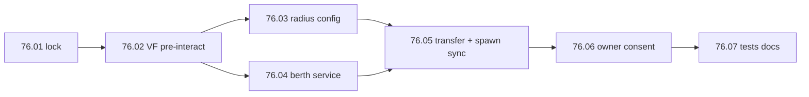

# Step 76 — Installation vehicle berth

**Repos:** `vehicleframework` + `simplefactions`  
**Depends on:** vehicle category config in [`vehicles.yml`](../../../../simplefactions/src/main/resources/vehicles.yml) and [`installations.yml`](../../../../simplefactions/src/main/resources/installations.yml) (shipped)  
**Type:** Gameplay feature (installations + personal vehicles)  
**Status:** done (2026-08-24)

## Problem

| Issue | Root cause |
|-------|------------|
| Personal vehicles cannot berth at faction installations | No transfer flow; registry supports `INSTALLATION` mode but nothing sets it |
| Right-click always opens VF seat GUI | [`VehicleManager.vehicleInteract`](../../../../vehicleframework/src/main/java/net/tfminecraft/VehicleFramework/Managers/VehicleManager.java) calls `seatInteract` with no cancellable pre-hook |
| No geographic berth rules | Installations have center coords and province, but no radius config or enforcement |
| No slot enforcement | `installations.yml` `slots.<category>` loaded but unused at runtime |

## Goal

1. **VF events** — `VehiclePreInteractEvent` (cancel blocks seat GUI); `VehicleSpawnEvent` (SF syncs owner on load).
2. **Bounds** — vehicle must be in installation province and within configured `radius` of center.
3. **Capacity** — sum vehicle `size` per category at installation must not exceed `slots.<category>`.
4. **Command** — `/faction transfervehicle <installationId>` (faction leader); right-click vehicle to complete.
5. **Consent** — if another player owns the vehicle: owner online, within `consent-proximity-blocks` of vehicle, `/faction accept`.
6. **VF owner** — berthed vehicles use `player_<factionLeader>`; SF syncs on spawn when leader changed. VF has no faction logic.

Planning lock (rules, config, messages, touch map): [01-planning-lock.md](./01-planning-lock.md).

## Build order



**Note:** All SF listeners (`VehicleTransferListener`, `VehicleSpawnListener`) live in SimpleFactions. VF only publishes generic events; it does not know about factions or berths.

## Batches

| Batch | Doc | Scope | Status |
|-------|-----|-------|--------|
| **76.01** | [01-planning-lock.md](./01-planning-lock.md) | Lock rules, config keys, VF event contract, messages | **done** (2026-08-24) |
| **76.02** | [02-vf-pre-interact-event.md](./02-vf-pre-interact-event.md) | `VehiclePreInteractEvent` + hook in `VehicleManager` | **done** (2026-08-24) |
| **76.03** | [03-installation-radius-config.md](./03-installation-radius-config.md) | `radius` in `installations.yml` + `InstallationBounds` | **done** (2026-08-24) |
| **76.04** | [04-berth-service.md](./04-berth-service.md) | `InstallationVehicleService` `canRegister` / `register` | **done** (2026-08-24) |
| **76.05** | [05-transfer-command.md](./05-transfer-command.md) | VF `VehicleSpawnEvent`; SF transfer command, transfer listener, leader owner sync | **done** (2026-08-24) |
| **76.06** | [06-owner-consent.md](./06-owner-consent.md) | `VehicleTransferConsentRequest` + `/faction accept` | **done** (2026-08-24) |
| **76.07** | [07-tests-docs.md](./07-tests-docs.md) | Unit tests, `Installations.md`, `mvn test` | **done** (2026-08-24) |

**76.01 locked:** VF event name, bounds rules, consent flow; see [01-planning-lock.md](./01-planning-lock.md#locked-decisions-7601).

Run **76.02** before any SF listener work. **76.03** and **76.04** can run in parallel after 76.02.

## Out of scope

- Installation GUI list of berthed vehicles
- Un-berth / return vehicle to personal ownership
- Faction ledger charge for berthed vehicle upkeep (personal upkeep stops on berth only)
- ProvinceSystem map export of berthed vehicles
- Requiring faction leader to stand inside installation radius (vehicle location only)

## Verify (every batch)

```bash
cd vehicleframework && mvn test    # after 76.02+
cd simplefactions && mvn test      # after 76.03+
```

## Done when

- [x] `VehiclePreInteractEvent` fires before seat GUI; cancel prevents `seatInteract` — **VF 1.1.8 shipped (76.02)**
- [x] `VehicleSpawnEvent` fires on spawn; SF syncs berthed vehicle owner to current faction leader (76.05)
- [x] `installations.yml` has per-kind `radius` + root consent/timeout keys
- [x] Berthed vehicles use VF owner `player_<leader>` (not `faction_<id>`) (76.05)
- [x] Leader can berth own personal vehicle at supported installation with capacity
- [x] Other-owner transfer requires online consent within proximity (76.06)
- [x] Chat feedback for bounds, province, capacity (no em dashes) (76.07)
- [x] `Installations.md` documents berth flow (76.07)
- [x] Full SF + VF test suites green (76.07)
