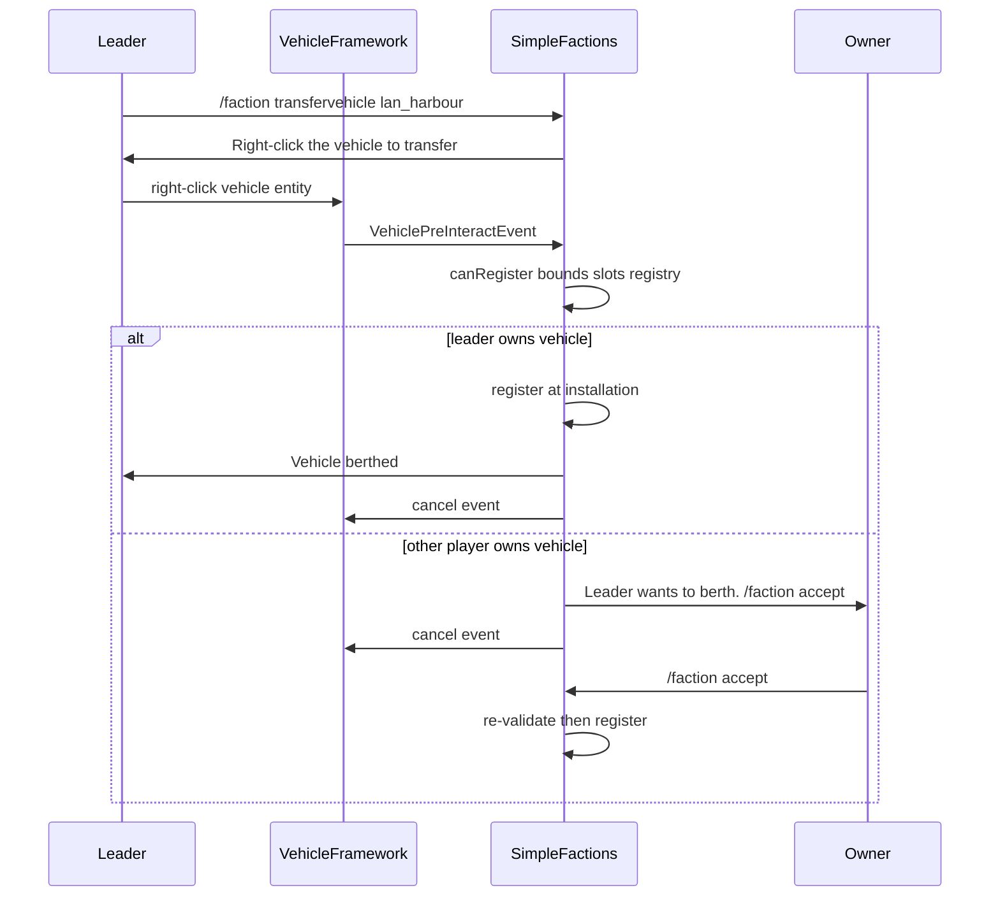

# Step 76.01 — Planning lock (installation vehicle berth)

**Plan + docs only.**  
**Authority for:** all 76.02–76.07 implementation batches. Do not change locked rules mid-batch without updating this file.  
**Status:** **done** (2026-08-24)

**Gameplay doc (after 76.07):** [`simplefactions/Documentation/Installations.md`](../../../../simplefactions/Documentation/Installations.md)

---

## Locked decisions (76.01)

| Decision | Value | Batch |
|----------|-------|-------|
| VF hook | `VehiclePreInteractEvent`; cancel skips seat selection | 76.02 |
| Command | `/faction transfervehicle <installationId>` (faction leader only) | 76.05 |
| Consent | Other owner: online, within `consent-proximity-blocks` of **vehicle**, `/faction accept` | 76.06 |
| Bounds | Same province as installation **and** horizontal distance from center `<= radius` | 76.03 |
| Capacity | Sum `size` per category at installation `<= slots.<category>` | 76.04 |
| Berth API | `InstallationVehicleService.canRegister` / `register` (not methods on POJO `Installation`) | 76.04 |
| Registry after berth | `OwnershipMode.INSTALLATION`, `installationId` set | 76.04 |
| VF owner after berth | `player_<factionLeaderName>` on `ActiveVehicle` owner data (current leader at berth time) | 76.04 / amend in 76.05 |
| Leader sync on spawn | SF reconciles VF owner to current installation faction leader when vehicle spawns/loads | 76.05 |
| Personal upkeep | Stops on berth (`VehicleUpkeepService` already skips non-`PERSONAL`) | 76.04 |
| Pending session | One per leader; replaced on new command; timeout from config | 76.05 |

---

## Principles

1. **Vehicle location is the gate.** Berth checks apply to the **vehicle entity** position, not the leader's position.
2. **Re-validate on consent accept.** Vehicle may move between click and accept; run full `canRegister` again.
3. **Fail loud in chat.** Every `canRegister` failure maps to a specific player message (no silent deny).
4. **VF is SF-agnostic.** VehicleFramework only fires generic Bukkit events (`VehiclePreInteractEvent`, `VehicleSpawnEvent`). SimpleFactions owns all faction/berth logic in SF listeners and services. **Never** add SimpleFactions imports or faction rules to VF.
5. **VF owns interact timing.** SimpleFactions listens to `VehiclePreInteractEvent`; do not rely on cancelling Bukkit `PlayerInteractEntityEvent` alone (VF handler does not respect it).
6. **VF owner is always a player entry.** Berthed vehicles use `player_<leaderName>` (same format as personal vehicles). SF registry (`INSTALLATION` + `installationId`) is the source of truth for faction berth; VF owner is kept in sync with the **current** faction leader.
7. **Category ids are plural.** Slot keys match `vehicles.yml` categories (`ships`, not `ship`).

---

## Config lock (`installations.yml`)

**File:** [`simplefactions/src/main/resources/installations.yml`](../../../../simplefactions/src/main/resources/installations.yml)

### Root keys (76.03)

```yaml
consent-proximity-blocks: 20
transfer-request-timeout-seconds: 60
```

| Key | Type | Rule |
|-----|------|------|
| `consent-proximity-blocks` | `int` | Owner must be within this distance of **vehicle** to receive or accept consent |
| `transfer-request-timeout-seconds` | `int` | Leader pending session and owner consent request expiry |

### Per kind (add to fort / port / airport)

```yaml
fort:
  radius: 80
  daily-upkeep: 50
  construction-time: 10
  slots:
    static_emplacements: 8
port:
  radius: 80
  daily-upkeep: 20
  construction-time: 10
  slots:
    ships: 8
airport:
  radius: 80
  daily-upkeep: 35
  construction-time: 10
  slots:
    aircraft: 10
```

| Field | Type | Rule |
|-------|------|------|
| `radius` | `int` | Required per kind; `> 0`. Horizontal distance from `centerX`/`centerZ` to vehicle entity (XZ plane, ignore Y) |
| `slots.<category>` | `int` | Already loaded; must match a category id in [`vehicles.yml`](../../../../simplefactions/src/main/resources/vehicles.yml) |

**Dev default:** `radius: 80` (5 chunks). Production may tune per kind.

**Not in `config.yml`.** Installations live only in `installations.yml`.

---

## VF event contract (76.02)

### Class

- **Package:** `net.tfminecraft.VehicleFramework.Events.VehiclePreInteractEvent`
- **Extends:** `org.bukkit.event.player.PlayerEvent`
- **Implements:** `org.bukkit.event.Cancellable`
- **Fields:** `Player` (from `PlayerEvent`), `ActiveVehicle vehicle`

Pattern reference: [`FurnitureInteractEvent`](../../../../interactiblefurniture/src/main/java/net/tfminecraft/events/FurnitureInteractEvent.java).

### Fire point

In [`VehicleManager.vehicleInteract`](../../../../vehicleframework/src/main/java/net/tfminecraft/VehicleFramework/Managers/VehicleManager.java):

1. After `ActiveVehicle v` is resolved from clicked entity
2. After admin `pendingTakeover` branch returns
3. **Before** containers, destroy/repair, fuel, sneak-tow, lead, skin, name tag, and `seatInteract`

```java
VehiclePreInteractEvent pre = new VehiclePreInteractEvent(p, v);
Bukkit.getPluginManager().callEvent(pre);
if (pre.isCancelled()) {
    e.setCancelled(true);
    return;
}
```

### Semantics

- Listeners may cancel to block **all** default interact handling for that click (including seat GUI).
- SimpleFactions **transfer listener** (`VehicleTransferListener` in SF) runs at default priority unless a batch doc specifies otherwise. This is **not** a VF listener; VF only publishes the event.

---

## VF spawn event contract (76.05)

Generic hook so SF can sync berthed-vehicle owners when entities enter the world. **No SF dependency in VF.**

### Class

- **Package:** `net.tfminecraft.VehicleFramework.Events.VehicleSpawnEvent`
- **Extends:** `org.bukkit.event.Event` (not cancellable)
- **Fields:** `ActiveVehicle vehicle`

### Fire point

In [`VehicleManager.spawn`](../../../../vehicleframework/src/main/java/net/tfminecraft/VehicleFramework/Managers/VehicleManager.java), after `register(vehicle)`:

```java
Bukkit.getPluginManager().callEvent(new VehicleSpawnEvent(vehicle));
```

Covers chunk-load respawn (`SpawnManager` tick path) and admin/command spawns with persisted `IncompleteVehicle` data.

### Semantics

- SF listens and checks `PlayerVehicleRegistry` for `INSTALLATION` mode on `vehicle.getUUID()`.
- If berthed: resolve installation → owning faction → `faction.getLeader()`; if VF owner differs from `player_<leader>`, call `setOwner`.
- If leader offline or installation missing: skip or log; do not clear berth registry.

---

## Player flow



### Step 1 — Command (76.05)

- **Who:** faction leader (`FactionManager.getByLeader`)
- **Args:** operational installation id belonging to leader's faction
- **On success:** store `VehicleTransferSession` (installation id, expiry = now + `transfer-request-timeout-seconds`)
- **On new command:** replace existing session for that leader
- **Tab complete:** faction installation ids (same ids as deconstruct)

### Step 2 — Right-click (76.05 / 76.06)

- **SF** listener on `VehiclePreInteractEvent` when leader has active session (`VehicleTransferListener`)
- Lookup `PlayerVehicleRecord` by `vehicle.getUUID()`
- Run `InstallationVehicleService.canRegister`
- **Own vehicle:** register, clear session, cancel event, success message
- **Other owner:** if owner offline or too far from vehicle, fail with chat; else `RequestManager.addRequest(owner, VehicleTransferConsentRequest)`, cancel event, notify both players

### Step 3 — Accept (76.06)

- [`RequestManager.accept`](../../../../simplefactions/src/main/java/me/Plugins/SimpleFactions/Managers/RequestManager.java) new branch for `VehicleTransferConsentRequest`
- Re-run full `canRegister`; on success `register` and notify proposer + owner
- Uses `transfer-request-timeout-seconds` for request expiry (not default 6s `Request` timeout)

---

## Berth service (76.04)

**Class:** `me.Plugins.SimpleFactions.vehicles.InstallationVehicleService`

### `canRegister(Installation installation, ActiveVehicle vehicle, PlayerVehicleRecord record)`

Returns `CanRegisterResult` enum (not `boolean`):

| Result | Meaning |
|--------|---------|
| `OK` | May register |
| `NOT_IN_REGISTRY` | No SF record for this vehicle uuid |
| `ALREADY_BERTHED` | Record already `INSTALLATION` mode |
| `UNKNOWN_TYPE` | Type id not in `vehicles.yml` categories |
| `UNSUPPORTED_CATEGORY` | Kind has `slots.<category>` capacity 0 or missing |
| `NO_CAPACITY` | `usedSize + vehicleSize > capacity` |
| `OUT_OF_RADIUS` | Vehicle XZ distance from installation center `> radius` |
| `WRONG_PROVINCE` | `provinceAt(vehicleLoc) != installation.getProvince()` |

Province lookup: [`BattlePlacementValidator.provinceAt`](../../../../simplefactions/src/main/java/me/Plugins/SimpleFactions/War/battle/engine/core/BattlePlacementValidator.java).

Distance: `sqrt((vx - centerX)^2 + (vz - centerZ)^2)` on block coords; format to **one decimal** in messages.

### `register(Installation installation, ActiveVehicle vehicle, PlayerVehicleRecord record, Faction faction)`

1. Update registry record: `INSTALLATION`, `installationId`
2. Set VF `ownerData` owner to `player_<faction.getLeader()>` (use same `player_` prefix as [`VehicleIntegrationListener`](../../../../simplefactions/src/main/java/me/Plugins/SimpleFactions/vehicles/VehicleIntegrationListener.java))
3. Persist via `SimpleFactions.saveVehicleRegistry()`

**76.04 shipped with `faction_<id>`** — amend in 76.05 via `InstallationVehicleOwnerSync` helper (see [05-transfer-command.md](./05-transfer-command.md)).

### Leader owner sync (76.05)

**Class:** `me.Plugins.SimpleFactions.vehicles.InstallationVehicleOwnerSync`

| Method | Purpose |
|--------|---------|
| `expectedOwner(Faction faction)` | Returns `player_<faction.getLeader()>` |
| `syncIfBerthed(ActiveVehicle vehicle)` | If registry row is `INSTALLATION`, resolve installation faction and current leader; update VF owner when stale |
| `syncOnSpawn(ActiveVehicle vehicle)` | Called from SF `VehicleSpawnListener` on `VehicleSpawnEvent` |

Faction membership is **not** stored in VF owner strings. Only the current leader name is written so VF permission checks work out of the box.

### Slot accounting

`usedCategorySize(installationId, categoryId)` = sum of `VehiclesConfigLoader.getSize(typeId)` for all registry records with matching `installationId` and category.

Extend [`PlayerVehicleRegistry`](../../../../simplefactions/src/main/java/me/Plugins/SimpleFactions/vehicles/PlayerVehicleRegistry.java) with queries by `installationId` as needed.

---

## Chat messages (locked copy)

**No em dashes** in player-facing strings.

| Situation | Message |
|-----------|---------|
| Command armed | `§aRight-click the vehicle to transfer it to <installation name>.` |
| Out of radius | `§cVehicle must be within <radius> blocks of <name> (currently <distance>).` |
| Wrong province | `§cVehicle must be in province <required> (currently <actual>).` |
| No capacity | `§c<installation name> has no space for <category> (<used>/<capacity> used).` |
| Unsupported category | `§cThis installation does not support <category> vehicles.` |
| Not in registry | `§cThis vehicle is not registered for faction upkeep.` |
| Already berthed | `§cThis vehicle is already berthed at an installation.` |
| Consent prompt (owner) | `§e<leader> wants to berth your <type> at <installation>. It will become a faction vehicle. §7/faction accept` |
| Owner offline | `§cThe vehicle owner must be online to transfer this vehicle.` |
| Owner too far | `§cThe vehicle owner must be within <n> blocks of the vehicle.` |
| Success | `§aVehicle berthed at <installation name>.` |
| Consent declined / timeout | `§cVehicle transfer request expired or was cancelled.` |
| Not leader | `§cYou need to be a faction leader to transfer vehicles.` |
| Unknown installation | `§cUnknown installation id.` |
| No pending session | `§cYou are not transferring a vehicle. Use /faction transfervehicle <id>.` |

Placeholders: `<distance>` one decimal; `<category>` lowercase category id from config.

---

## Code touch map

| Batch | Repo | Main files |
|-------|------|------------|
| 76.02 | VF | `Events/VehiclePreInteractEvent.java`, `Managers/VehicleManager.java` |
| 76.03 | SF | `installations.yml`, `InstallationKindConfig.java`, `InstallationConfigLoader.java`, `installation/InstallationBounds.java` |
| 76.04 | SF | `vehicles/InstallationVehicleService.java`, `PlayerVehicleRegistry.java` |
| 76.05 | VF + SF | VF: `Events/VehicleSpawnEvent.java`, `VehicleManager.spawn`; SF: `InstallationVehicleOwnerSync.java`, `VehicleTransferSession.java`, `VehicleTransferListener.java`, `VehicleSpawnListener.java`, `CommandManager.java`, `TabCompletion.java`, `SimpleFactions.java` |
| 76.06 | SF | `Objects/Request/VehicleTransferConsentRequest.java`, `RequestManager.java` |
| 76.07 | SF + VF | loader tests, `Installations.md`, `AGENTS.md` |

---

## Out of scope (step 76)

- Installation GUI berth list / detail view
- Un-berth / return to personal ownership
- Faction `Cashflow` charge for berthed vehicles
- Map export of berthed vehicles in `map_markers.json`
- Requiring leader inside installation radius
- Vehicles not in `PlayerVehicleRegistry` (built before SF tracking): show `NOT_IN_REGISTRY` only

---

## Verify (76.01)

- [x] [`00-index.md`](./00-index.md) and this file exist under `step-76/`
- [x] Slot keys documented as plural (`ships`, `static_emplacements`, `aircraft`)
- [x] No reference to `config.yml` `installations:` block
- [x] VF event contract specifies cancel-before-seat behavior

---

## Related docs

- [`Installations.md`](../../../../simplefactions/Documentation/Installations.md) — installation kinds, construct, upkeep (update in 76.07)
- [`vehicles.yml`](../../../../simplefactions/src/main/resources/vehicles.yml) — categories, `upkeep`, `size`
- [`AGENTS.md`](../../../../simplefactions/AGENTS.md) — package layout for new vehicle code
