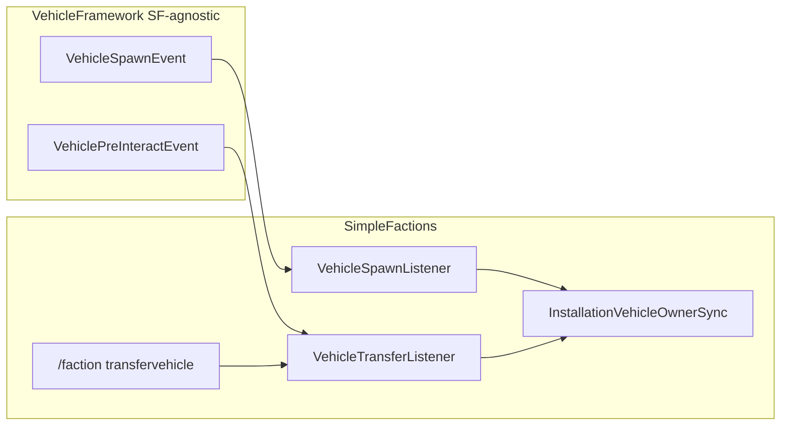

# Step 76.05 — Transfer command + owner sync

**Depends on:** [76.04](./04-berth-service.md)  
**Repos:** `vehicleframework` + `simplefactions`  
**Status:** done (2026-08-24)

## Goal

Wire the berth flow end-to-end in **SimpleFactions only** (plus one generic VF spawn event). Faction leaders use `/faction transfervehicle`, right-click a vehicle, and SF handles validation, registry, VF owner, and chat. VF never imports or references SimpleFactions.

Authority: [01-planning-lock.md](./01-planning-lock.md).

## Architecture



| Component | Repo | Role |
|-----------|------|------|
| `VehiclePreInteractEvent` | VF | Already shipped (76.02); cancel blocks seat GUI |
| `VehicleSpawnEvent` | VF | **New**; fired after `VehicleManager.spawn` |
| `VehicleTransferListener` | SF | Listens to `VehiclePreInteractEvent`; runs transfer session flow |
| `VehicleSpawnListener` | SF | Listens to `VehicleSpawnEvent`; syncs berthed vehicle owner to current leader |
| `InstallationVehicleOwnerSync` | SF | Shared owner read/write: `player_<leaderName>` |

## Tasks

### VF (minor, SF-agnostic)

1. Add [`VehicleSpawnEvent`](../../../../vehicleframework/src/main/java/net/tfminecraft/VehicleFramework/Events/VehicleSpawnEvent.java)
2. Fire from [`VehicleManager.spawn`](../../../../vehicleframework/src/main/java/net/tfminecraft/VehicleFramework/Managers/VehicleManager.java) after `register(vehicle)`
3. Bump VF to **1.1.9**; update SF `pom.xml` dependency

### SF — amend 76.04 owner

4. Add `InstallationVehicleOwnerSync` with `expectedOwner(Faction)`, `syncIfBerthed(ActiveVehicle)`
5. Change `InstallationVehicleService.register` to call `ownerSync.applyLeaderOwner(vehicle, faction)` instead of `faction_<id>`
6. Update `InstallationVehicleServiceTest` expected owner to `player_<leader>`

### SF — transfer command (self-transfer only; consent in 76.06)

7. `VehicleTransferSession` (leader uuid, installation id, expiry)
8. `/faction transfervehicle <installationId>` in `CommandManager` + tab complete
9. `VehicleTransferListener` on `VehiclePreInteractEvent`: session + `canRegister` + `register` + chat + cancel event
10. `VehicleSpawnListener` on `VehicleSpawnEvent`: `ownerSync.syncIfBerthed(vehicle)`
11. Register listeners and services in `SimpleFactions`

## VF owner rules (locked)

| When | VF `ownerData` owner | Source of truth |
|------|----------------------|-----------------|
| Personal vehicle built | `player_<constructor>` | Registry `PERSONAL` |
| On berth | `player_<faction.getLeader()>` | Registry `INSTALLATION` + `installationId` |
| On spawn/load (chunk tick path) | Re-sync to `player_<currentLeader>` if registry is `INSTALLATION` and owner stale | SF registry + installation → faction |

**Do not** use `faction_<factionId>` in VF owner strings. VF has no faction concept.

## `InstallationVehicleOwnerSync`

```java
public final class InstallationVehicleOwnerSync {
    public static String expectedOwner(Faction faction) { ... }  // player_<leader>
    public void applyLeaderOwner(ActiveVehicle vehicle, Faction faction) { ... }
    public void syncIfBerthed(ActiveVehicle vehicle) { ... }
}
```

`syncIfBerthed` flow:

1. Lookup `PlayerVehicleRecord` by `vehicle.getUUID()`
2. If missing or not `INSTALLATION`, return
3. Resolve `installationId` → `Installation` → owning `Faction` via `InstallationHandler` / `FactionManager`
4. Compare `vehicle.getOwnerData().getOwner()` to `expectedOwner(faction)`
5. If different, `setOwner(expected)` (no registry write unless persisting owner is needed elsewhere)

## Chat messages

Use locked copy from [01-planning-lock.md](./01-planning-lock.md#chat-messages-locked-copy). Map each `CanRegisterResult` to the correct message in the transfer listener.

## Verify

```powershell
cd vehicleframework; mvn test
cd simplefactions; mvn test
```

Manual: berth own vehicle; relog; change faction leader; chunk-unload/reload vehicle; confirm VF owner matches new leader.

## Done when

- [x] `VehicleSpawnEvent` fires from VF spawn path
- [x] `register` sets `player_<leader>` not `faction_<id>`
- [x] Spawn listener syncs stale berthed owners to current leader
- [x] `/faction transfervehicle` arms session; right-click completes self-transfer
- [x] Chat feedback for all `canRegister` failures
- [x] SF `pom.xml` uses `vehicleframework-1.1.9.jar`

## Out of scope

- Other-owner consent (`VehicleTransferConsentRequest`, 76.06)
- Leader-change hook while vehicle already loaded without respawn (optional follow-up; spawn sync covers chunk cycles)
- Installation GUI berth list
