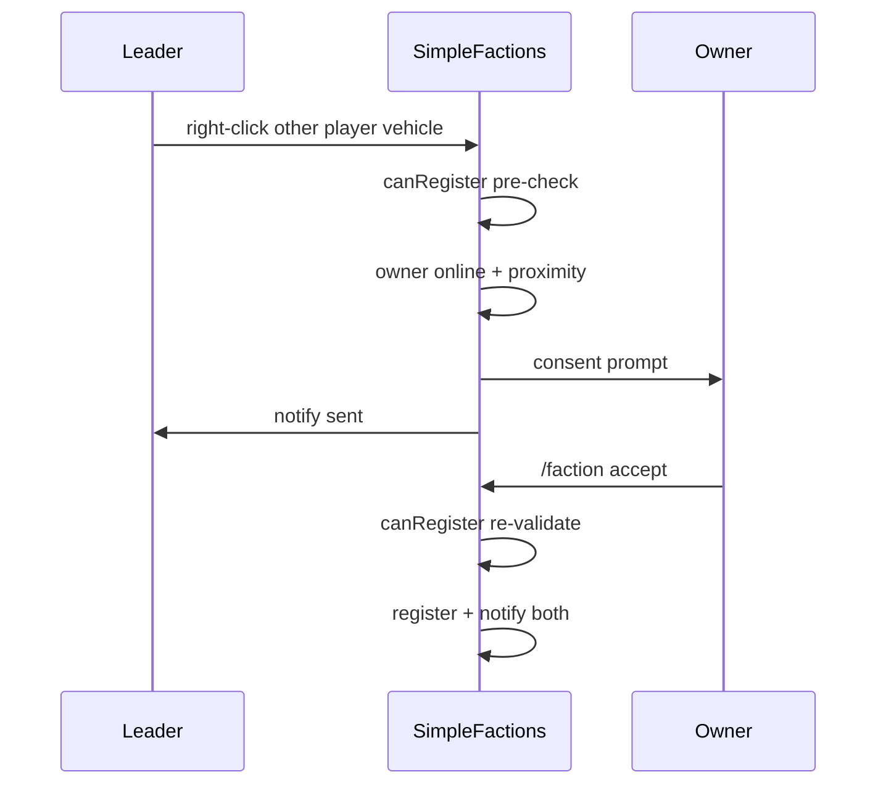

# Step 76.06 — Owner consent for vehicle transfer

**Depends on:** [76.05](./05-transfer-command.md)  
**Repos:** `simplefactions` only (no VF changes)  
**Status:** done (2026-08-24)

## Goal

When a faction leader right-clicks another player's personal vehicle during an armed transfer session, SF sends a timed consent request to the vehicle owner. The owner accepts with `/faction accept` (no faction-leader requirement). Accept re-runs full `canRegister` validation before registering.

Authority: [01-planning-lock.md](./01-planning-lock.md).

## Flow



## Components

| File | Role |
|------|------|
| [`VehicleTransferConsentRequest.java`](../../../../simplefactions/src/main/java/me/Plugins/SimpleFactions/Objects/Request/VehicleTransferConsentRequest.java) | Request payload; timeout from `transfer-request-timeout-seconds` |
| [`VehicleTransferConsentService.java`](../../../../simplefactions/src/main/java/me/Plugins/SimpleFactions/vehicles/VehicleTransferConsentService.java) | `sendConsentRequest`, `acceptRequest`, `notifyExpired` |
| [`VehicleTransferListener.java`](../../../../simplefactions/src/main/java/me/Plugins/SimpleFactions/vehicles/VehicleTransferListener.java) | Other-owner branch: online, proximity, pre-check, consent |
| [`RequestManager.java`](../../../../simplefactions/src/main/java/me/Plugins/SimpleFactions/Managers/RequestManager.java) | Accept branch + timeout `notifyExpired` |
| [`CommandManager.java`](../../../../simplefactions/src/main/java/me/Plugins/SimpleFactions/Managers/CommandManager.java) | `/faction accept` for non-leader vehicle owners |

## Pre-consent gates (leader click)

1. Owner online (`Bukkit.getPlayer(record.getPlayerUuid())`)
2. Owner within `consent-proximity-blocks` of **vehicle** (horizontal distance via `InstallationBounds`)
3. `InstallationVehicleService.canRegister` pre-check (same as self-transfer)

On success: `VehicleTransferConsentService.sendConsentRequest`, clear leader session, cancel interact.

## Accept path

1. `RequestManager.getRequest(owner)` must be `VehicleTransferConsentRequest`
2. `owner.getUniqueId()` must equal `req.getOwnerUuid()`
3. Resolve proposer faction/leader and installation
4. Resolve live `ActiveVehicle` via `VehicleFramework.getVehicleManager().get(vehicleUuid)`
5. **Re-run** `canRegister(installation, vehicle, record)`
6. On `OK`: `register`, `berthSuccess` to owner + online proposer, clear proposer session
7. On failure: `VehicleTransferMessages.forResult` to owner (+ proposer if online)

## `/faction accept` fix

Vehicle owners are often not faction leaders. `CommandManager` now accepts `VehicleTransferConsentRequest` before the leader-only gate.

## Chat messages (locked)

| Method | Message |
|--------|---------|
| `consentPrompt` | `§e<leader> wants to berth your <type> at <installation>. It will become a faction vehicle. §7/faction accept` |
| `ownerOffline` | `§cThe vehicle owner must be online to transfer this vehicle.` |
| `ownerTooFar(n)` | `§cThe vehicle owner must be within <n> blocks of the vehicle.` |
| `consentExpired` | `§cVehicle transfer request expired or was cancelled.` |
| `consentSent` | `§aSent vehicle transfer request to <owner>.` |

## Tests

| Test | Coverage |
|------|----------|
| `VehicleTransferConsentRequestTest` | Timeout uses config fixture |
| `VehicleTransferConsentServiceTest` | Accept registers; rejects wrong acceptor |
| `VehicleTransferMessagesTest` | Consent/owner/offline/tooFar/expired/sent strings |

## Verify

```powershell
cd simplefactions; mvn test
```

## Done when

- [x] Leader right-click on another player's vehicle sends consent when owner online and within `consent-proximity-blocks`
- [x] Owner accepts via `/faction accept` without being faction leader
- [x] Accept re-runs full `canRegister` then `register`
- [x] Timeout uses `transfer-request-timeout-seconds` and sends locked expiry message
- [x] All pre-consent `canRegister` failures still map to locked chat copy

## Out of scope

- Installation GUI berth list
- Un-berth
- Re-check owner proximity on accept (only `canRegister` re-run per lock)
- `Installations.md` full berth section (76.07)
