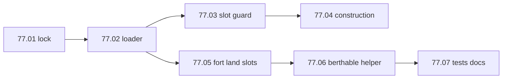

# Step 77 — Vehicle config v2 (personal limits + land berths)

**Repos:** `simplefactions` only  
**Depends on:** step 76 (installation vehicle berth), shipped [`vehicles.yml`](../../../../simplefactions/src/main/resources/vehicles.yml)  
**Type:** Gameplay feature (personal vehicle limits + fort land berths)  
**Status:** **done** (2026-08-24)

## Problem

| Issue | Root cause |
|-------|------------|
| `per-person`, `ignore-limit`, `default-per-person` in `vehicles.yml` are ignored | [`VehiclesConfigLoader`](../../../../simplefactions/src/main/java/me/Plugins/SimpleFactions/Loaders/VehiclesConfigLoader.java) only loads `upkeep` and `size` |
| Players can build duplicate types (e.g. 3x cloudskimmer) | [`VehicleSlotGuard`](../../../../simplefactions/src/main/java/me/Plugins/SimpleFactions/vehicles/VehicleSlotGuard.java) only checks total `countPersonal` |
| Trains should bypass total personal cap | No `ignore-limit` handling |
| Land vehicles cannot berth at forts | [`installations.yml`](../../../../simplefactions/src/main/resources/installations.yml) has no `land_vehicles` slot |
| Future battle rules need berthable vs non-berthable categories | No `isBerthableCategory` helper yet |

## Goal

1. **Loader** — read `default-per-person`, per-type `per-person`, `ignore-limit` from `vehicles.yml`.
2. **Construction guard** — enforce per-type cap + total cap (excluding `ignore-limit` types) at `BeginVehicleConstructionEvent`.
3. **Fort land berths** — `land_vehicles: 2` on fort; installation capacity still sums `size` (unchanged from 76).
4. **Battle prep** — `isBerthableCategory(categoryId)` helper for step 78+ (no battle UI/logic in 77).
5. **Docs + tests** — lock rules, update fixtures, `mvn test` green.

Planning lock (rules, config, messages, touch map): [01-planning-lock.md](./01-planning-lock.md).

## Build order



**Note:** Personal slot counting is **per vehicle** (ignores `size`). Installation berth capacity still **sums `size`** per category (step 76 behavior).

## Batches

| Batch | Doc | Scope | Status |
|-------|-----|-------|--------|
| **77.01** | [01-planning-lock.md](./01-planning-lock.md) | Lock rules, config keys, construction contract, battle-prep rules | **done** (2026-08-24) |
| **77.02** | [02-vehicles-config-loader.md](./02-vehicles-config-loader.md) | `VehicleTypeConfig` + `VehiclesConfigLoader` extensions | **done** (2026-08-24) |
| **77.03** | [03-slot-guard.md](./03-slot-guard.md) | Registry queries + `VehicleSlotGuard.checkCanBuild` | **done** (2026-08-24) |
| **77.04** | [04-construction-guard.md](./04-construction-guard.md) | `VehicleIntegrationListener` + construction messages | **done** (2026-08-24) |
| **77.05** | [05-fort-land-berths.md](./05-fort-land-berths.md) | `installations.yml` `land_vehicles: 2` on fort | **done** (2026-08-24) |
| **77.06** | [06-berthable-category.md](./06-berthable-category.md) | `isBerthableCategory` helper (battle prep) | **done** (2026-08-24) |
| **77.07** | [07-tests-docs.md](./07-tests-docs.md) | Tests, `Installations.md`, `AGENTS.md`, `mvn test` | **done** (2026-08-24) |

**77.01 locked:** per-type vs total limits, train `ignore-limit`, fort-only `land_vehicles`; see [01-planning-lock.md](./01-planning-lock.md#locked-decisions-7701).

Run **77.02** before guard/construction work. **77.05** can run in parallel with **77.03** after **77.02**.

## Out of scope

- Battle/raid vehicle selection UI and enforcement (step 78+)
- Un-berth / return vehicle to personal ownership
- New installation kinds (depot/garage)
- Changing installation capacity from size-sum to vehicle-count
- VF changes

## Verify (every batch)

```bash
cd simplefactions && mvn test
```

## Done when

- [x] Planning lock and index exist (77.01)
- [x] `vehicles.yml` keys `default-per-person`, `per-person`, `ignore-limit` loaded and enforced at construction
- [x] Total cap excludes `ignore-limit` types; per-type cap includes all types
- [x] Fort accepts `land_vehicles` berth (capacity 2 by size)
- [x] `isBerthableCategory` ready for battle batches
- [x] Docs + full `mvn test` green
