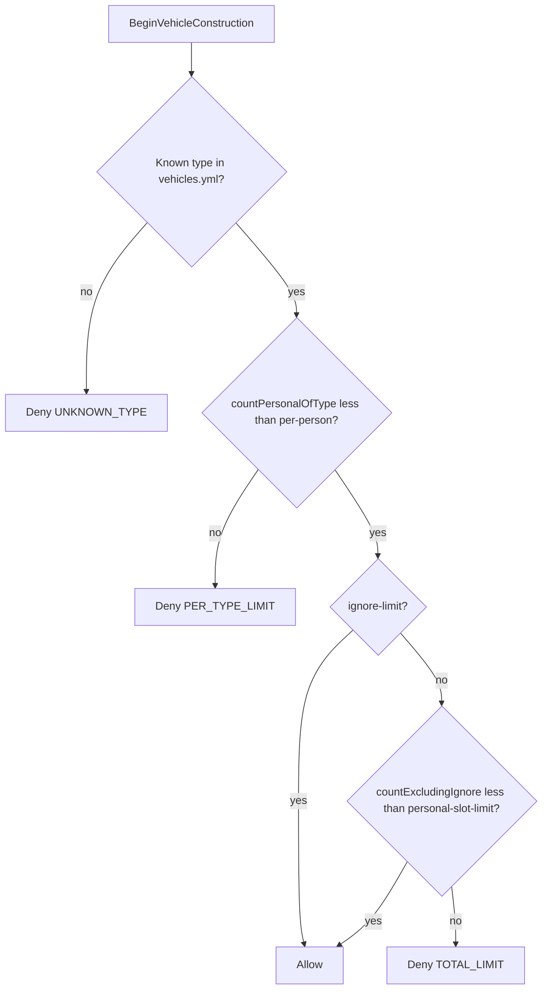

# Step 77.01 — Planning lock (vehicle config v2)

**Plan + docs only.**  
**Authority for:** all 77.02–77.07 implementation batches. Do not change locked rules mid-batch without updating this file.  
**Status:** **done** (2026-08-24)

**Gameplay doc (update in 77.07):** [`simplefactions/Documentation/Installations.md`](../../../../simplefactions/Documentation/Installations.md)

**Depends on:** step 76 (installation vehicle berth).

---

## Locked decisions (77.01)

| Decision | Value | Batch |
|----------|-------|-------|
| Total personal cap | `personal-slot-limit` (shipped: **3**); counts only non-`ignore-limit` vehicles | 77.03 |
| Per-type cap | `default-per-person: 1`; per-type `per-person` override (land: **3**) | 77.02 / 77.03 |
| Train bypass | `ignore-limit: true` skips total cap; per-type still applies | 77.03 |
| Personal counting | **1 vehicle = 1 slot** (ignores `size`) | 77.03 |
| Installation counting | **Sum `size`** per category (unchanged from 76) | 77.05 |
| Land berths | `land_vehicles` on **fort only**, capacity **2** (size units) | 77.05 |
| Train berths | `train` category has **no** installation slot anywhere | 77.01 |
| Construction gate | `BeginVehicleConstructionEvent` + blueprint type id | 77.04 |
| Battle prep | `isBerthableCategory(id)` helper only; **no battle logic** in step 77 | 77.06 |
| Future battle rule | Personal OK when category not berthable (e.g. train); berthable types need installation pool (step 78+) | documented only |

---

## Principles

1. **Two limit layers:** per-type (`per-person`) and total (`personal-slot-limit`); both enforced at construction.
2. **`ignore-limit` is total-only.** Trains do not count toward `personal-slot-limit` but still respect `per-person`.
3. **`size` is for installations only.** Behemoth (`size: 4`) = 1 personal slot, 4 airport berth units (max 2 behemoths in `aircraft: 10`).
4. **Categories are plural.** `land_vehicles`, `ships`, `static_emplacements`, `aircraft`, `train`.
5. **Fail loud in chat.** Distinct messages for total cap vs per-type cap vs unknown type.
6. **No em dashes** in player-facing strings.
7. **Battle eligibility is out of scope for 77** but the future rule is locked here so step 78+ does not re-debate it.
8. **Step 76 berth rules unchanged.** Province, radius, consent, and size-based installation capacity remain as locked in [step 76](../step-76/01-planning-lock.md).

---

## Config lock (`vehicles.yml`)

**File:** [`simplefactions/src/main/resources/vehicles.yml`](../../../../simplefactions/src/main/resources/vehicles.yml)

### Root keys

```yaml
personal-slot-limit: 3
default-per-person: 1
default-upkeep: 4
```

| Key | Type | Rule |
|-----|------|------|
| `personal-slot-limit` | `int` | `>= 0`; `0` = unlimited total (existing semantics) |
| `default-per-person` | `int` | `>= 1`; used when type omits `per-person` |
| `default-upkeep` | `double` | Optional fallback when type omits `upkeep` (implement in 77.02 if needed; all shipped types have explicit `upkeep` today) |

### Per-type keys (under `categories.<category>.<type>`)

| Key | Type | Rule |
|-----|------|------|
| `upkeep` | `double` | Required unless `default-upkeep` fallback is implemented |
| `size` | `int` | Required; `> 0`; used for **installation** capacity only |
| `per-person` | `int` | Optional; overrides `default-per-person` |
| `ignore-limit` | `bool` | Optional; default `false`; excludes type from total personal cap |

### Category inventory (shipped)

| Category | Installation host | Notes |
|----------|-------------------|-------|
| `static_emplacements` | fort | existing (76) |
| `land_vehicles` | fort | **new** slot in 77.05 (`land_vehicles: 2`) |
| `ships` | port | existing (76) |
| `aircraft` | airport | existing (76) |
| `train` | none | all types have `ignore-limit: true` |

### Shipped per-type highlights

| Category | Type | `per-person` | `ignore-limit` | `size` |
|----------|------|--------------|----------------|--------|
| `land_vehicles` | horse_cart, wooden_cart, small_car | **3** | false | 1 |
| `train` | simple_locomotive | 1 (default) | **true** | 1 |
| `train` | coal_car, passenger_car | **3** | **true** | 1 |
| `aircraft` | behemoth | 1 (default) | false | **4** |
| `aircraft` | cloudskimmer | 1 (default) | false | 1 |
| `ships` | cruiser | 1 (default) | false | **2** |

### Worked examples

- Player with 3 personal slots: 1 cloudskimmer + 1 gunboat + 1 horse_cart OK; 2nd cloudskimmer blocked (per-type 1).
- Player: 3 horse_carts OK (per-type 3), 4th horse_cart blocked.
- Player: 3 ships + unlimited trains OK (trains ignore total cap; each train type still per-type limited).
- Fort: 2 horse_carts berthed (size 1 + 1) fills `land_vehicles: 2`; 3rd blocked at fort.
- Airport: 2 behemoths (4+4=8) + 2 biplanes (1+1=2) = 10/10 capacity.

---

## Config lock (`installations.yml` amendment, 77.05)

**File:** [`simplefactions/src/main/resources/installations.yml`](../../../../simplefactions/src/main/resources/installations.yml)

Add to **fort only** (port and airport unchanged):

```yaml
fort:
  radius: 80
  daily-upkeep: 50
  construction-time: 10
  slots:
    static_emplacements: 8
    land_vehicles: 2
```

| Rule | Detail |
|------|--------|
| `land_vehicles` host | **Fort only** (no port/airport land slots) |
| Capacity | Sum of vehicle `size` at fort for `land_vehicles` category `<= 2` |
| `train` | Must **not** appear in any installation `slots` block |

---

## Construction guard contract (77.04)

**Hook:** [`BeginVehicleConstructionEvent`](../../../../vfbuilders/src/main/java/net/tfminecraft/VFBuilders/events/BeginVehicleConstructionEvent.java) in [`VehicleIntegrationListener`](../../../../simplefactions/src/main/java/me/Plugins/SimpleFactions/vehicles/VehicleIntegrationListener.java).

**Resolve type id:** from `event.getBlueprint()` (same resolution as `VehicleConstructEvent` in the same listener).

### Check order



### API shape (77.03)

Replace `VehicleSlotGuard.isPersonalSlotAvailable(player, registry)` with:

```java
VehicleSlotGuard.checkCanBuild(playerUuid, vehicleTypeId, registry)
// returns OK | TOTAL_LIMIT | PER_TYPE_LIMIT | UNKNOWN_TYPE
```

**Registry helpers (77.03):**

- `countPersonalOfType(UUID playerUuid, String vehicleTypeId)`
- `countPersonalExcludingIgnoreLimit(UUID playerUuid)` — skip types with `ignore-limit: true`

---

## Chat messages (locked copy)

**No em dashes** in player-facing strings.

| Situation | Message |
|-----------|---------|
| Total cap | `§cYou have reached your personal vehicle limit (<n>).` |
| Per-type cap | `§cYou already have the maximum number of <type> vehicles (<n>).` |
| Unknown type | `§cThis vehicle type is not registered for faction upkeep.` |

Placeholders: `<type>` = vehicle type id from config (e.g. `cloudskimmer`, `horse_cart`); `<n>` = the limit that was exceeded.

---

## Battle-prep contract (77.06, documented only)

**No battle logic in step 77.** Implement helper only.

```text
isBerthableCategory(categoryId) =
  exists InstallationKind k where getCategorySlotCapacity(k, categoryId) > 0

isBerthableType(vehicleTypeId) =
  isBerthableCategory(getCategoryId(vehicleTypeId))
```

### Future rule (step 78+, not 77)

When a battle selects which installations supply vehicles:

```text
personal vehicle battle-eligible iff
  NOT isBerthableType(vehicleTypeId)
  OR registry mode is INSTALLATION at a battle-selected installationId
```

| Category | `isBerthableCategory` | Future personal battle use |
|----------|----------------------|--------------------------|
| `train` | false | always allowed as personal |
| `aircraft` | true | only from selected airport berth |
| `land_vehicles` | true | only from selected fort berth |
| `ships` | true | only from selected port berth |
| `static_emplacements` | true | only from selected fort berth |

Example: personal cloudskimmer cannot be used in battle unless berthed at a selected airport. Personal train cars can always be used.

---

## Code touch map

| Batch | Repo | Main files |
|-------|------|------------|
| 77.02 | SF | `vehicles/VehicleTypeConfig.java`, `Loaders/VehiclesConfigLoader.java` |
| 77.03 | SF | `vehicles/PlayerVehicleRegistry.java`, `vehicles/VehicleSlotGuard.java` |
| 77.04 | SF | `vehicles/VehicleIntegrationListener.java`, `vehicles/VehicleConstructionMessages.java` (new) |
| 77.05 | SF | `installations.yml`, `vehicles/InstallationVehicleServiceTest` fixtures |
| 77.06 | SF | `VehiclesConfigLoader` or `vehicles/VehicleCategoryRules.java` |
| 77.07 | SF | `Documentation/Installations.md`, `AGENTS.md`, tests |

---

## Out of scope (step 77)

- Battle/raid vehicle selection UI and enforcement
- Un-berth / return to personal ownership
- New installation kinds (depot/garage)
- Changing installation capacity from size-sum to vehicle-count
- VF / VFBuilders changes

---

## Verify (77.01)

- [x] [`00-index.md`](./00-index.md) and this file exist under `step-77/`
- [x] Locked rules match shipped [`vehicles.yml`](../../../../simplefactions/src/main/resources/vehicles.yml) and intended fort `land_vehicles: 2` amendment
- [x] Future battle rule documented without implementing it
- [x] No em dashes in locked chat copy

---

## Related docs

- [Step 76 lock](../step-76/01-planning-lock.md) — berth flow, installation capacity, consent
- [`vehicles.yml`](../../../../simplefactions/src/main/resources/vehicles.yml) — categories, upkeep, size, per-person, ignore-limit
- [`installations.yml`](../../../../simplefactions/src/main/resources/installations.yml) — installation slots (fort land amendment in 77.05)
- [`AGENTS.md`](../../../../simplefactions/AGENTS.md) — package layout (update in 77.07)
