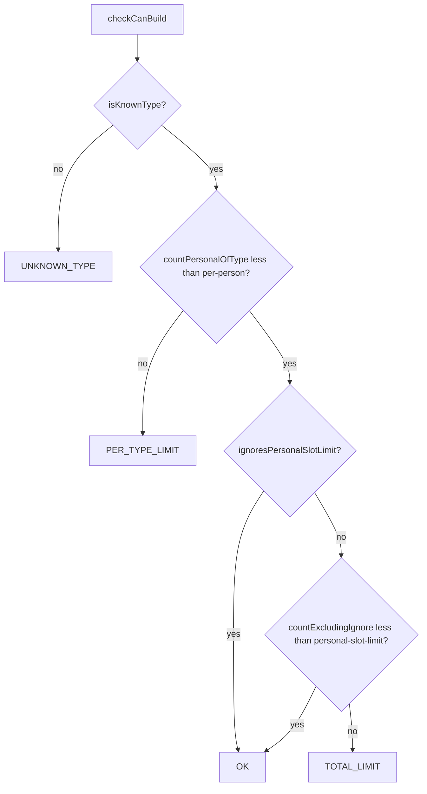

# Step 77.03 — Slot guard

**Depends on:** [77.02](./02-vehicles-config-loader.md)  
**Repo:** `simplefactions`  
**Status:** done (2026-08-24)

## Goal

Add registry counting helpers and `VehicleSlotGuard.checkCanBuild` with the locked check order from [01-planning-lock.md](./01-planning-lock.md). Construction listener wiring and chat messages are [77.04](./04-construction-guard.md).

## Tasks

1. `CanBuildResult` enum: `OK`, `TOTAL_LIMIT`, `PER_TYPE_LIMIT`, `UNKNOWN_TYPE`
2. `PlayerVehicleRegistry.countPersonalOfType` and `countPersonalExcludingIgnoreLimit`
3. `VehicleSlotGuard.checkCanBuild(playerUuid, vehicleTypeId, registry)`
4. Unit tests in `VehicleSlotGuardTest` and `PlayerVehicleRegistryTest`

## Check order



## API

```java
CanBuildResult VehicleSlotGuard.checkCanBuild(UUID playerUuid, String vehicleTypeId, PlayerVehicleRegistry registry)

int PlayerVehicleRegistry.countPersonalOfType(UUID playerUuid, String vehicleTypeId)
int PlayerVehicleRegistry.countPersonalExcludingIgnoreLimit(UUID playerUuid)
```

`isPersonalSlotAvailable` kept unchanged until 77.04 replaces the listener call site.

## Rules

| Rule | Detail |
|------|--------|
| Per-type cap | `countPersonalOfType >= per-person` blocks |
| Total cap | `countPersonalExcludingIgnoreLimit >= personal-slot-limit` blocks |
| `ignore-limit` | Skips total cap only; per-type still applies |
| `personal-slot-limit: 0` | Unlimited total (existing semantics) |
| Counting | 1 vehicle = 1 personal slot (ignores `size`) |

## Verify

```powershell
cd simplefactions; mvn test "-Dtest=VehicleSlotGuardTest,PlayerVehicleRegistryTest"
cd simplefactions; mvn test
```

## Done when

- [x] `CanBuildResult` enum exists
- [x] Registry query helpers implemented
- [x] `checkCanBuild` implements locked check order
- [x] Tests cover per-type, total, ignore-limit, unlimited total, unknown type
- [x] Full `mvn test` green
- [x] [00-index](./00-index.md) updated

## Out of scope

- `VehicleIntegrationListener` / construction messages (77.04)
- `installations.yml` land berths (77.05)
- `isBerthableCategory` (77.06)
