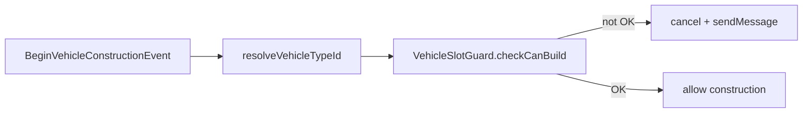

# Step 77.04 — Construction guard

**Depends on:** [77.03](./03-slot-guard.md)  
**Repo:** `simplefactions`  
**Status:** done (2026-08-24)

## Goal

Wire `VehicleSlotGuard.checkCanBuild` into `BeginVehicleConstructionEvent` and map results to locked chat messages.

Authority: [01-planning-lock.md](./01-planning-lock.md#construction-guard-contract-7704).

## Tasks

1. `VehicleConstructionMessages.forResult(CanBuildResult, vehicleTypeId)`
2. Update `VehicleIntegrationListener.onBeginVehicleConstruction` to resolve blueprint type id, call `checkCanBuild`, cancel + message on deny
3. Remove legacy `VehicleSlotGuard.isPersonalSlotAvailable`
4. `VehicleConstructionMessagesTest` for locked copy

## Flow



## Locked messages

| Result | Message |
|--------|---------|
| `TOTAL_LIMIT` | `§cYou have reached your personal vehicle limit (<n>).` |
| `PER_TYPE_LIMIT` | `§cYou already have the maximum number of <type> vehicles (<n>).` |
| `UNKNOWN_TYPE` | `§cThis vehicle type is not registered for faction upkeep.` |

## Verify

```powershell
cd simplefactions; mvn test "-Dtest=VehicleConstructionMessagesTest,VehicleSlotGuardTest"
cd simplefactions; mvn test
```

## Done when

- [x] `VehicleConstructionMessages` maps all `CanBuildResult` values
- [x] Listener uses `checkCanBuild` + blueprint type resolution
- [x] `isPersonalSlotAvailable` removed
- [x] Message tests green; full `mvn test` green
- [x] [00-index](./00-index.md) updated

## Out of scope

- `installations.yml` land berths (77.05)
- `isBerthableCategory` (77.06)
- `Installations.md` / `AGENTS.md` (77.07)
