# Step 78 — Battle installation picks & raid windows

**Repos:** `simplefactions` only  
**Depends on:** [step 77](../step-77/00-index.md) (vehicle berth + `VehicleCategoryRules`), [step 59](../step-59/00-index.md) (battle scheduling), [step 58](../step-58/00-index.md) (campaign GUI)  
**Type:** Gameplay feature (coalition installation commitment, raid prep, battle vehicle pool)  
**Status:** done

## Problem

| Issue | Root cause |
|-------|------------|
| No way to commit installations for a campaign battle | Step 65 deferred per-battle installation pick UI |
| Berthable vehicles have no battle eligibility rule | Step 77 documented only; no battle hook |
| Raid targets undefined | Step 71 planned without committed-installation filter |
| Battle and raid hours overlap | Current window 20-24 UTC; raids need separate 19-20 CET slot before main battle |

## Goal

1. **Installation picks** — faction leaders select operational installations per battle day from campaign GUI (march icon, same pattern as faction hub).
2. **Lock at vote close** — picks editable until `vote_close_hour` (16 UTC); frozen together with hour vote.
3. **Post-lock visibility** — enemy sees committed installations only after lock.
4. **Schedule** — main campaign battle **21-24 CET**; inter-battle raids **19-20 CET** (config in UTC).
5. **Vehicle eligibility** — berthable vehicles at a **committed** port/airport or the **active siege fort** (owner faction); trains/non-berthable always OK (step 77 rule).
6. **Raids (71)** — may only target enemy installations in that faction's committed set for the current battle day.

Planning lock: [01-planning-lock.md](./01-planning-lock.md).

## Build order

```mermaid
flowchart LR
  lock[78.01 lock] --> schedule[78.02 schedule windows]
  schedule --> persist[78.03 pick persistence]
  persist --> gui[78.04 campaign GUI]
  gui --> intel[78.05 post-lock intel]
  intel --> vehicles[78.06 vehicle eligibility]
  vehicles --> raids[78.07 raid targets]
  raids --> eligibility[78.09 pick eligibility]
  eligibility --> siege[78.10 siege in-play]
  siege --> verify[78.08 docs tests]
```



**Note:** Step **71** (raid battle launch) builds on **78.07** for target filtering and raid window config from **78.02**.

## Batches

| Batch | Doc | Scope | Status |
|-------|-----|-------|--------|
| **78.01** | [01-planning-lock.md](./01-planning-lock.md) | Lock picks, lock time, visibility, schedule CET mapping, vehicle + raid rules | done |
| **78.02** | [02-battle-raid-schedule.md](./02-battle-raid-schedule.md) | `config.yml` battle 21-24 CET + raid 19-20 CET; `RaidWindowService` / schedule predicates | done |
| **78.03** | [03-installation-pick-service.md](./03-installation-pick-service.md) | War JSON persistence, `BattleInstallationPickService`, clear on battle-day advance | done |
| **78.04** | [04-campaign-gui-picks.md](./04-campaign-gui-picks.md) | Campaign view installations button + pick sub-GUI (leader only) | done |
| **78.05** | [05-post-lock-intel.md](./05-post-lock-intel.md) | Enemy-visible committed list after vote close; hidden before lock | done |
| **78.06** | [06-battle-vehicle-eligibility.md](./06-battle-vehicle-eligibility.md) | `VehicleCategoryRules` + registry; committed-set check for campaign battles | done |
| **78.07** | [07-raid-target-filter.md](./07-raid-target-filter.md) | Raid target allowlist from committed sets; hook for step 71 launch | done |
| **78.09** | [09-pick-eligibility.md](./09-pick-eligibility.md) | Port/airport-only picks; occupation control filter | done |
| **78.10** | [10-siege-fort-in-play.md](./10-siege-fort-in-play.md) | Siege fort in-play for battle vehicles | done |
| **78.08** | [08-tests-docs.md](./08-tests-docs.md) | `Wars.md`, `Installations.md`, tests, `mvn test` | done |

## Locked decisions (78.01)

| Decision | Value |
|----------|-------|
| Who picks | **Faction leader only** (each faction on a side independently) |
| Lock time | **`vote_close_hour`** (16 UTC default); same moment as hour vote tally |
| Empty pick | **Nothing in play** — no berthable vehicle pool; installation not raid-targetable |
| Pre-lock visibility | **Hidden** from enemy |
| Post-lock visibility | Enemy sees committed installations |
| Pick limit | **None** — any subset of own eligible operational installations |
| Pickable kinds | **`port`, `airport` only** (78.09) |
| Territory | Must control installation province (78.09) |
| Siege fort vehicles | Active schedule `SIEGE` fort in play for owner (78.10) |
| Reset | **Every battle day** — must re-select after advance |
| Battle window | **21-24 CET** (stored as UTC in config) |
| Raid window | **19-20 CET** (stored as UTC in config; step 71 launches raids) |

## Out of scope

- Raid war type (step 67)
- Un-berth / return vehicles to personal ownership
- Fort raid targeting (step **71**)
- Map export of committed installations (optional later)

## Verify (every batch)

```bash
cd simplefactions && mvn test
```

## Done when

- [x] Planning lock and index exist (78.01)
- [x] Battle and raid windows configured (21-24 / 19-20 CET intent)
- [x] Leaders can pick installations in campaign GUI until vote close
- [x] Enemy sees commits only after lock
- [x] Berthable vehicles require committed installation or siege fort for campaign battle use
- [x] Raid target filter uses committed sets (71 can launch)
- [x] Docs + full `mvn test` green
