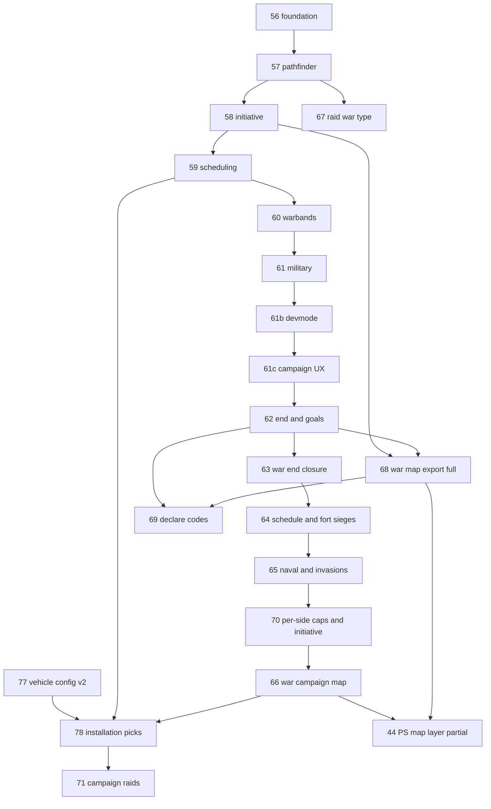

# War system — build order (locked)

**Spec:** [simplefactions/Documentation/Wars.md](../../simplefactions/Documentation/Wars.md) (planning lock v1.0)  
**Locked:** 2026-08-19 (updated: declare codes deferred to **step 69**)

## Principle

Build and test the automated war system **without declare codes** first. Staff/ticket codes gate production declare only after the full loop is proven (**step 69**).

## Steps overview

| Step | Name | Repo | Depends on | Summary |
|------|------|------|------------|---------|
| **[56](./batches/step-56/00-index.md)** | War foundation | SF | Wars.md lock | War v2 model, goals, FSM, persistence, test declare (no code), participants, `war_id` stubs |
| **[57](./batches/step-57/00-index.md)** | Pathfinder & campaign | SF | 56 | `ProvincePathfinder`, border start, route priority, campaign line, objective province |
| **[58](./batches/step-58/00-index.md)** | Initiative & occupation | SF | 57 | Initiative pools, cursor, per-battle occupation (bulge), counter-push, white peace |
| **[59](./batches/step-59/00-index.md)** | Battle scheduling | SF | 58 | Configurable vote/defender deadlines, hour voting (`min` rule), postpone (votes persist), dual-leader autoresolve, admin `warschedule` |
| **[60](./batches/step-60/00-index.md)** | Warbands merge & battle runtime | SF | 59 | Province tracker, field/siege/raid battles, templates, naval variant, join command |
| **[61](./batches/step-61/00-index.md)** | Military & casualties | SF | 60 | Lives, offense/defense by location, militia rules, levy commit, regiment losses |
| **[61b](./batches/step-61b/00-index.md)** | Battle dev mode (solo staging) | SF | 61 | Devmode toggle, phantom warbands, capture min 1, campaign join cap |
| **[61c](./batches/step-61c/00-index.md)** | Campaign UX & template cleanup | SF | 61b | Template settings-only, warschedule formatted output, warband signup, E2E verify |
| **[62](./batches/step-62/00-index.md)** | War end & goals | SF | 61c | Capability-based campaign progression ([62.01 lock](./batches/step-62/01-campaign-progression-lock.md)); white peace, Push/Hold (goal apply deferred) |
| **[63](./batches/step-63/00-index.md)** | War end closure | SF | 62 | Surrender, stalemate peace, battle victory, winner chat (no goal apply) |
| **[64](./batches/step-64/00-index.md)** | Campaign schedule & fort sieges | SF | 63, 57, 60 | Battle schedule at declare, fort ZOC sieges, war-time fort control, trim, initiative, GUI kinds, remove battle zones |
| **[65](./batches/step-65/00-index.md)** | Naval & invasions | SF | 64 | Port ZOC naval battles, naval invasion slots, war ZOC export |
| **[70](./batches/step-70/00-index.md)** | Per-side battle caps & initiative | SF | 64, 65, 62 | Two-legged schedule trim; asymmetric declare fuel; counter-push schedule |
| **[70b](./batches/step-70b/00-index.md)** | Campaign schedule simplicity | SF (+ PS optional) | 70, 66 | Cadence 3; schedule-only GUI; counter wilderness battles; export align |
| **[70c](./batches/step-70c/00-index.md)** | Geographic route GUI | SF | 70b | Axis-left-to-right row; no pagination; border-B marker; cap 4/leg |
| **[70d](./batches/step-70d/00-index.md)** | Chronological leg schedules (`placeBattle`) | SF | 70c | FB→DT / (B−1)→AC lists; axis-order insert; **done** |
| **[75](./batches/step-75/00-index.md)** | War package reorganization | SF | 70d stable | Repackage `War/schedule` + battle engine; `AGENTS.md`; no gameplay change — **done** (2026-08-24) |
| **[66](./batches/step-66/00-index.md)** | War campaign map | SF + PS | 70, 58, 42 | Smooth campaign line + battle pins on web map (`wars[]` route slice) |
| **[78](./batches/step-78/00-index.md)** | Battle installation picks | SF | 77, 59, 58 | Leader picks, lock at vote close, raid/battle CET windows, vehicle eligibility, raid target filter — **done** (2026-08-24) |
| **[71](./batches/step-71/00-index.md)** | Campaign raids (inter-battle) | SF | 78, 59, 61c, 64 | Installation assaults 19-20 CET; one per side/day; timer fights; damage gating |
| **[67](./batches/step-67/00-index.md)** | Pillage war type | SF | 57, 60 | One-battle border settlement pillage (rename from "raid war") |
| **[68](./batches/step-68/00-index.md)** | War map export (full) | SF | 58–63, 66 | Occupation, chronicle; extends `wars[]` beyond step 66 route |
| **[44](./batches/step-44/00-index.md)** | War map layer | PS | 66, 68 | Occupation tint on website (route ships in 66) |
| **[69](./batches/step-69/00-index.md)** | Declare codes & ticket gate | SF | 63+ (full loop tested) | Ticket → code → in-game declare; production gate |

**Chronicle (step 45):** war events hook in after **67**; not a separate war step.

## Dependency graph

## Minimum playable path

**56 → 57 → 58 → 59 → 60 → 61 → 61c → 62 → 66 → 44 (route only)**

Steps **63–65**, **70**, **66**, **71**, **67**, and **68** extend the loop. Occupation tint needs **68** after **66** route ships.

## Status

| Step | Status |
|------|--------|
| 44.01 planning lock | **done** |
| 56.01 planning lock | **done** (2026-08-19) |
| 56.02 domain model | **done** (2026-08-19) |
| 56.03 goal validation | **done** (2026-08-19) |
| 56.04 persistence | **done** (2026-08-19) |
| 56.05 declare flow | **done** (2026-08-19) |
| 56.06 participants | **done** (2026-08-19) |
| 56.07 war_id stubs | **done** (2026-08-19) |
| 56.08 admin commands | **done** (2026-08-19) |
| 56.09 docs verify | **done** (2026-08-19) |
| 57.01 planning lock | **done** (2026-08-20) |
| 57.02 pathfinder | **done** (2026-08-20) |
| 57.03 campaign line | **done** (2026-08-20) |
| 57.04 integration | **done** (2026-08-20) |
| 57.05 docs verify | **done** (2026-08-20) |
| 57 | **done** — [Pathfinder & campaign](./batches/step-57/00-index.md) |
| 58.01 planning lock | **done** (2026-08-20) |
| 58.02 domain model | **done** (2026-08-20) |
| 58.03 progression core | **done** (2026-08-20) |
| 58.04 occupation zone | **done** (2026-08-20) |
| 58.05 Campaign GUI | **done** (2026-08-20) |
| 58.06 integration | **done** (2026-08-20) |
| 58.07 docs verify | **done** (2026-08-20) |
| 58 | **done** — [Initiative & occupation](./batches/step-58/00-index.md) |
| 59.01 planning lock | **done** (2026-08-20) |
| 59.02 domain model | **done** (2026-08-20) |
| 59.03 vote tally | **done** (2026-08-20) |
| 59.04 schedule orchestration | **done** (2026-08-20) |
| 59.05 Campaign GUI | **done** (2026-08-20) |
| 59.06 scheduler + warschedule | **done** (2026-08-20) |
| 59.07 docs verify | **done** (2026-08-20) |
| 59 | **done** — [Battle scheduling](./batches/step-59/00-index.md) |
| 60–64 | **done** — see batches [60](./batches/step-60/00-index.md)–[64](./batches/step-64/00-index.md) |
| 66 | **done** (2026-08-23) — [War campaign map](./batches/step-66/00-index.md) |
| 66.01 planning lock | **done** (2026-08-23) |
| 66.02 SF wars export | **done** (2026-08-23) |
| 66.03 PS schema passthrough | **done** (2026-08-23) |
| 66.04 FE campaign line | **done** (2026-08-23) |
| 66.05 FE battle markers | **done** (2026-08-23) |
| 66.06 docs verify | **done** (2026-08-23) |
| 67–68, 71 | planned ([71](./batches/step-71/00-index.md) planning lock **71.01** 2026-08-25) |
| 78.01 planning lock | **done** (2026-08-24) |
| 78.02-78.07 schedule, picks, GUI, intel, vehicles, raids | **done** (2026-08-24) |
| 78.09 pick eligibility | **done** (2026-08-24) |
| 78.10 siege fort in-play | **done** (2026-08-24) |
| 78.08 docs verify | **done** (2026-08-24) |
| 78 | **done** — [Battle installation picks](./batches/step-78/00-index.md) |
| 71.01 planning lock | **done** (2026-08-25) |
| 71.02 campaign raid state | **done** (2026-08-25) |
| 71.03 source/target eligibility | **done** (2026-08-25) |
| 71.04 launch GUI | **done** (2026-08-25) |
| 71.05 muster / raid join | **done** (2026-08-25) |
| 71.06 raid warbands | **done** (2026-08-25) |
| 71.07 raid battle runtime | **done** (2026-08-25) |
| 71.08 campaign warband signup lock | **done** (2026-08-25) |
| 61.01 planning lock | **done** (2026-08-20) |
| 61.01b levy & vassal lock | **done** (2026-08-20) |
| 61.02 war commitment | **done** (2026-08-20) |
| 61.03 battle pool | **done** (2026-08-21) |
| 61.04 collective lives | **done** (2026-08-21) |
| 61.05 casualty ledger | **done** (2026-08-21) |
| 61.06 casualty apply | **done** (2026-08-21) |
| 61.07 docs verify | **done** (2026-08-21) |
| 61 | **done** — [Military & casualties](./batches/step-61/00-index.md) |
| 61b.01 planning lock | **done** (2026-08-21) |
| 61b.02 capture threshold | **done** (2026-08-21) |
| 61b.03 battle devmode | **done** (2026-08-21) |
| 61b.04 campaign join rules | **done** (2026-08-21) |
| 61b.05 docs verify | **done** (2026-08-21) |
| 61b | **done** — [Battle dev mode](./batches/step-61b/00-index.md) |
| 61c.01 planning lock | **done** (2026-08-21) |
| 61c.02 template settings-only | **done** (2026-08-21) |
| 61c.03 warschedule output | **done** (2026-08-21) |
| 61c.04 campaign warband signup | **done** (2026-08-21) |
| 61c.05 docs verify | **done** (2026-08-21) |
| 61c.06 warband list & naming | **done** (2026-08-21) |
| 61c.07 campaign warband hotfixes | **done** (2026-08-21) |
| 61c | **done** — [Campaign UX & template cleanup](./batches/step-61c/00-index.md) |
| 62 | **done** — [War end & goals / campaign capability](./batches/step-62/00-index.md) |
| 63 | **done** (2026-08-22) — [War end closure](./batches/step-63/00-index.md) |
| 64 | **done** (2026-08-23) — [Campaign schedule & fort sieges](./batches/step-64/00-index.md) |
| 65 | **done** (2026-08-23) — [Naval & invasions](./batches/step-65/00-index.md) |
| 70.01 planning lock | **done** (2026-08-23) |
| 70 | **done** (2026-08-23) — [Per-side battle caps & initiative](./batches/step-70/00-index.md) |
| 70b | **done** (2026-08-23) — [Campaign schedule simplicity](./batches/step-70b/00-index.md) |
| 70d | **done** (2026-08-23) — [Chronological leg schedules](./batches/step-70d/00-index.md) |
| 75 | **done** (2026-08-24) — [War package reorganization](./batches/step-75/00-index.md) |
