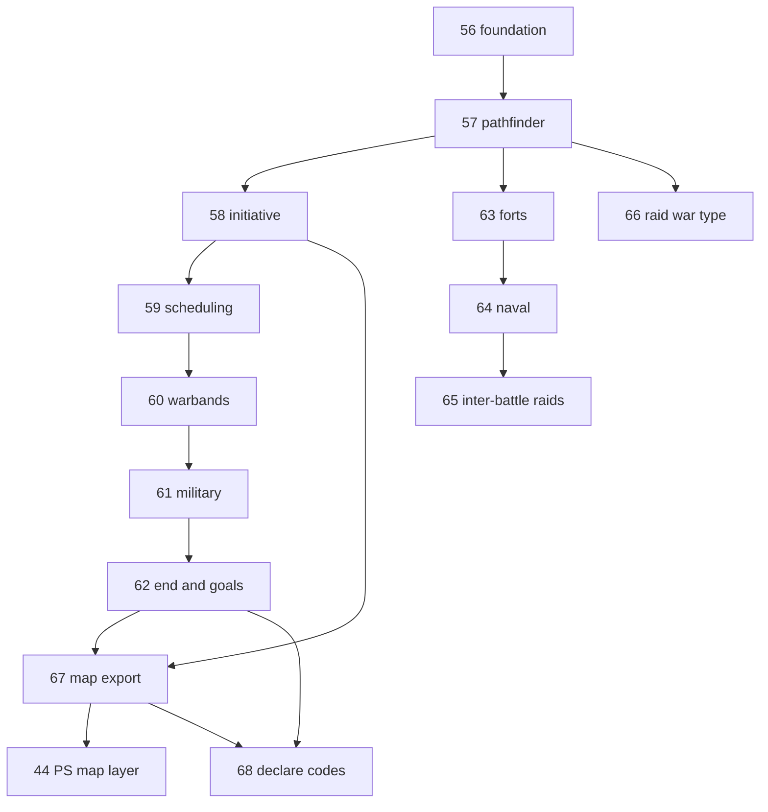

# War system — build order (locked)

**Spec:** [simplefactions/Documentation/Wars.md](../../simplefactions/Documentation/Wars.md) (planning lock v1.0)  
**Locked:** 2026-08-19 (updated: declare codes deferred to **step 68**)

## Principle

Build and test the automated war system **without declare codes** first. Staff/ticket codes gate production declare only after the full loop is proven (**step 68**).

## Steps overview

| Step | Name | Repo | Depends on | Summary |
|------|------|------|------------|---------|
| **[56](./batches/step-56/00-index.md)** | War foundation | SF | Wars.md lock | War v2 model, goals, FSM, persistence, test declare (no code), participants, `war_id` stubs |
| **[57](./batches/step-57/00-index.md)** | Pathfinder & campaign | SF | 56 | `ProvincePathfinder`, border start, route priority, campaign line, objective province |
| **[58](./batches/step-58/00-index.md)** | Initiative & occupation | SF | 57 | Initiative pools, cursor, per-battle occupation (bulge), counter-push, white peace |
| **[59](./batches/step-59/00-index.md)** | Battle scheduling | SF | 58 | Configurable vote/defender deadlines, hour voting (`min` rule), postpone (votes persist), dual-leader autoresolve, admin `warschedule` |
| **[60](./batches/step-60/00-index.md)** | Warbands merge & battle runtime | SF | 59 | Merge Warbands, templates, auto battles, join command, province-leave penalty |
| **[61](./batches/step-61/00-index.md)** | Military & casualties | SF | 60 | Lives, offense/defense by location, militia rules, levy commit, regiment losses |
| **[62](./batches/step-62/00-index.md)** | War end & goals | SF | 61 | Surrender, white peace, goal apply, reparations, retake loop |
| **[63](./batches/step-63/00-index.md)** | Forts & sieges | SF | 57, 60 | Fort ZOC on campaign line, sieges, war ZOC filter |
| **[64](./batches/step-64/00-index.md)** | Naval & installation battles | SF | 63 | Sea zones, port coverage, per-battle installation pick |
| **[65](./batches/step-65/00-index.md)** | Inter-battle raids | SF | 64 | Naval/air/fort raids between campaign battles |
| **[66](./batches/step-66/00-index.md)** | Raid war type | SF | 57, 60 | One-battle border settlement raid |
| **[67](./batches/step-67/00-index.md)** | War map export | SF | 58–62 | `wars[]` in map upload |
| **[44](./batches/step-44/00-index.md)** | War map layer | PS | 67 | Occupation tint on website |
| **[68](./batches/step-68/00-index.md)** | Declare codes & ticket gate | SF | 62+ (full loop tested) | Ticket → code → in-game declare; production gate |

**Chronicle (step 45):** war events hook in after **67**; not a separate war step.

## Dependency graph

## Minimum playable path

**56 → 57 → 58 → 59 → 60 → 61 → 62 → 67 → 44**

Steps **63–66** and **68** can follow once core campaign battles work.

## Status

| Step | Status |
|------|--------|
| 44.01 planning lock | **done** |
| 56.01 planning lock | **done** (2026-08-19) |
| 56.02 domain model | **done** (2026-08-19) |
| 56.03 goal validation | **done** (2026-08-19) |
| 56.04 persistence | **done** (2026-08-19) |
| 56.05 declare flow | **done** (2026-08-19) |
| 56.06 participants | **done** (2026-08-19) |
| 56.07 war_id stubs | **done** (2026-08-19) |
| 56.08 admin commands | **done** (2026-08-19) |
| 56.09 docs verify | **done** (2026-08-19) |
| 57.01 planning lock | **done** (2026-08-20) |
| 57.02 pathfinder | **done** (2026-08-20) |
| 57.03 campaign line | **done** (2026-08-20) |
| 57.04 integration | **done** (2026-08-20) |
| 57.05 docs verify | **done** (2026-08-20) |
| 57 | **done** — [Pathfinder & campaign](./batches/step-57/00-index.md) |
| 58.01 planning lock | **done** (2026-08-20) |
| 58.02 domain model | **done** (2026-08-20) |
| 58.03 progression core | **done** (2026-08-20) |
| 58.04 occupation zone | **done** (2026-08-20) |
| 58.05 Campaign GUI | **done** (2026-08-20) |
| 58.06 integration | **done** (2026-08-20) |
| 58.07 docs verify | **done** (2026-08-20) |
| 58 | **done** — [Initiative & occupation](./batches/step-58/00-index.md) |
| 59.01 planning lock | **done** (2026-08-20) |
| 59.02 domain model | **done** (2026-08-20) |
| 59.03–59.07 | planned |
| 59 | **59.02 done** — [Battle scheduling](./batches/step-59/00-index.md) |
| 60–68 | planned (index stubs only) |
